
# BES BHKW BIBLOC BV674 SBTLK

## Inhalt

## Übersicht über die Typenfamilie Bibloc BV
--------------------------------------------
	

<table>
<thead>
	<tr>
		<th>Ausstattung / BHKW-Typ</th>
		<th>449 SBK</th>
		<th>449 SBTK</th>
		<th>674 SBK</th>
		<th>674 SBTLK</th>
		<th>684 SBTK</th>
		<th>684 SBTLK</th>
	</tr>
</thead>
<tbody>
	<tr>
		<td>Synchrongenerator</td>
		<td>X</td>
		<td>X</td>
		<td>X</td>
		<td>X</td>
		<td>X</td>
		<td>X</td>
	</tr>
	<tr>
		<td>Gasmischer für Biogas / Klärgas</td>
		<td>X</td>
		<td>X</td>
		<td>X</td>
		<td>X</td>
		<td>X</td>
		<td>X</td>
	</tr>
	<tr>
		<td>Saugmotor</td>
		<td>X</td>
		<td></td>
		<td>X</td>
		<td></td>
		<td></td>
		<td></td>
	</tr>
	<tr>
		<td>Turbomotor</td>
		<td></td>
		<td>X</td>
		<td></td>
		<td>X</td>
		<td>X</td>
		<td>X</td>
	</tr>
	<tr>
		<td>Ladeluftkühlung</td>
		<td></td>
		<td></td>
		<td></td>
		<td>X</td>
		<td></td>
		<td>X</td>
	</tr>
	<tr>
		<td>Dreiwegkatalysator (Lambda = 1)</td>
		<td>X</td>
		<td>X</td>
		<td>X</td>
		<td>X</td>
		<td>X</td>
		<td>X</td>
	</tr>
	<tr>
		<td>Notkühlung (2-, 3-, 4-fach)</td>
		<td>2</td>
		<td>2</td>
		<td>3</td>
		<td>3</td>
		<td>4</td>
		<td>4</td>
	</tr>
	<tr>
		<td>Option Notstrom</td>
		<td>NS</td>
		<td>NS</td>
		<td>NS</td>
		<td>NS</td>
		<td>NS</td>
		<td>NS</td>
	</tr>
</tbody>
</table>

### Betriebshandbücher
----------------------
* [BIBLOC BV449 SBTK][1]
* [BIBLOC BV674 SBTLK][2]
* [BIBLOC BV684 SBTLK][3]

## Einführung
------------------	

Das nachfolgende *Betriebshandbuch* bildet eine Zusammenfassung der Informationen betreffend Konstruktion, Gebrauch und Wartung des BHKW Typ BIBLOC BV674 SBTLK . 

Aufgrund der Komplexität eines Blockheizkraftwerkes ist die folgende Anleitung als Basis zu verstehen, welche auf die spezifischen Anlagen angepasst werden können.

Das ganze Handbuch ist nach den Hauptbestandteilen der BIBLOC BV674 SBTLK in Kapitel gegliedert. 

Jedes Kapitel beschreibt den entsprechenden Teil der Anlage im Bezug auf Funktion, Komponenten und Wartung in einem für den Benutzer erforderlichen Ausmass.

Es sind keine detaillierten Wartungsarbeiten beschrieben. Das Kapitel über die Störmeldungen behandelt nur die Störungen, die der Betreiber selbst beheben kann.

Das nachfolgende Betriebshandbuch bildet eine Zusammenfassung der Informationen betreffend:

- Konstruktion, 
- Gebrauch und 
- Wartung des BHKW Typ BIBLOC BV674 SBTLK. 

Aufgrund der Komplexität eines Blockheizkraftwerkes ist die folgende Anleitung als Basis zu verstehen, welche auf die spezifischen Anlagen angepasst werden können.

Das ganze Handbuch ist nach den Hauptbestandteilen der BIBLOC BV674 SBTLK in Kapitel gegliedert. 

Jedes Kapitel beschreibt den entsprechenden Teil der Anlage im Bezug auf Funktion, Komponenten und Wartung in einem für den Benutzer erforderlichen Ausmass.

Es sind keine detaillierten Wartungsarbeiten beschrieben. Das Kapitel über die Störmeldungen behandelt nur die Störungen, die der Betreiber selbst beheben kann.
_________________________________________________________________________

  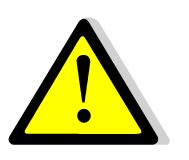

Lesen Sie vor Inbetriebnahme der BHKW-Anlage diese Anleitung aufmerksam durch. Die BHKW-Anlage ist ein elektrisches Aggregat mit drehenden Komponenten, welches mit explosiven Brenngasen und Schmierstoffen arbeitet.
 
Es ist generell mit hohen Oberflächentemperaturen, gefährlichen elektrischen Spannungen und giftigen Abgasen zu rechnen.

Durch die Einhaltung der in dieser Anleitung aufgeführten Grundsätze für die Bedienung und Wartung dieser BHKW-Anlage vermeiden Sie Personen- und Sachschäden.
_________________________________________________________________________

  

Die Durchführung von technischen Wartungen und Reparaturen, welche über den Rahmen dieser Anleitung hinausgehen und durch Personen ohne Berechtigung der Firma BES erfolgen, können einen Verlust der Garantieansprüche zur Folge haben, sofern die Schäden auf eine nicht fachgerechte Handhabung zurückzuführen sind.

Im Weiteren besteht für ungeschulte Personen die Gefahr, bei Missachtung des obigen Abschnitts sich ernsthafte Verletzungen mit Todesfolge zu zufügen oder die BHKW-Anlage und angrenzende Komponenten zu beschädigen.

Bei Eingriffen durch ungeschulte und unbefugte Personen, lehnt die Herstellerfirma BES die Verantwortung für entstandene Sach- und Personenschäden ab.
_________________________________________________________________________

#### Pflichten des Betreibers

##### vor der Inbetriebnahme

•	Er ist für die Erteilung und Weiterführung der Betriebsbewilligungen verantwortlich.

	- allfällige Baubewilligung der Gemeinde
	- allfällige Bewilligung des kantonalen Amts für Umwelt (AFU)
	- Bewilligung Eidgenössisches Starkstrominspektorat (ESTI)
	- Bewilligung kommunaler Stromlieferant (örtliches EW)

##### nach der Inbetriebnahme

•	Er ist verpflichtet, regelmässig Nachprüfungen, inkl. Gasanschluss durchzuführen,

•	Er ist für die Einhaltung der Bedienungssicherheit und aller weiteren Vorschriften und Normen, welche Auswirkungen auf den Betrieb des BHKWs haben, verantwortlich.

#### Entsorgung von Abfällen
-----------------------------	
Durch den Transport und Betrieb der BHKW-Anlage fallen Abfallstoffe mit unterschiedlichen Eigenschaften an. 

Für die Entsorgung dieser Stoffe müssen die geltenden Vorschriften eingehalten werden. 

Allenfalls kommen die gültigen EG-Richtlinie über *Verpackungen und Verpackungsabfälle* zum Tragen.

Abfälle, welche durch die Installation und den Betrieb einer BHKW-Anlage anfallen, werden in folgende 3 Gruppen aufgeteilt:

1	Abfälle durch den Transport und Installation der Anlage

2	Abfälle durch den Betrieb der Anlage (abgenutzte Verschleissteile und Betriebsstoffe wie Altöl)

3	Abfälle durch die Entsorgung der Anlage am Ende der Standzeit der BHKW-Anlage

##### Abfälle durch den Transport und Installation der BHKW-Anlage

Beim Transport und der Installation der BIBLOC BV674 SBTLK entsteht kein Abfall, welcher im Bezug auf die Umwelt und den oben genannten Normen problematisch oder sogar gefährlich ist.

Es handelt sich vor allem um:

•	Kartonpapier, Kunststofffolien auf Polyethylen-Basis (PE), durch welche einige empfindliche Maschinenteile geschützt werden.
	Papier und auch PE-Folien sind an die entsprechenden Sammelstellen zwecks Wiederverwertung zu zuführen.

•	Metall- und Kunststoffstopfen von Rohrabschlüssen sind dem Altmetall respektive dem PET-Recycling zu zuführen oder für eine weitere Verwendung aufzubewahren.

•	Die Transportsicherungen zur Fixierung der Motorgeneratoreinheit während des Transports kann zur Wiederverwendung dem Lieferanten zurückgeben oder für die eigene Wiederverwendung in der BHKW-Anlage aufbewahrt werden.

Je nach Lieferumfang der BHKW-Anlage werden Zubehör-Teile des BHKW als Einzelteile auf Euro-Paletten, eventuell auch in einem Holzverschlag transportiert und mit PE-Folie geschützt. 

•	Die Entsorgung der PE-Folie ist oben beschrieben. 

•	Euro-Palette sind zur weiteren Verwendung an eine Transportfirma zurück zugeben. 

•	Holzverschläge sind der kommunalen Abfallentsorgung zu zuführen.

•	Euro-Paletten und Holzverschläge dürfen nicht als Brennholz verwendet werden.

Die BHKW-Anlagen von BIBLOC werden standardmässig nicht mit chemischen Konservierungsmitteln behandelt und müssen vor der Inbetriebnahme nicht entsprechend gereinigt werden.

 
##### Abfälle durch den Betrieb der BHKW-Anlage

Beim Betrieb der BIBLOC BV674 SBTLK ist es erforderlich, dass alle Arbeiten, welche über die Ausführungen dieses Betriebshandbuchs hinausgehen, von Personen ausgeführt werden, welche von der Firma BES berechtigt sind entsprechende Wartungs- und Reparaturtätigkeiten auszuführen. 

Diese Personen haben Kenntnis bezüglich dem Umgang mit folgenden Stoffen:

**Betriebsstoffe aus dem unmittelbaren Betrieb der BHKW-Anlage**

 •	Kühlmittelflüssigkeit,

 •	Motoröl,

 •	Motorölreiniger

Es handelt sich hier um gefährliche Betriebsmittel. 

Diese sind entsprechend den chemischen Eigenschaften zu behandeln.

Die Art der Entsorgung ist den jeweiligen Sicherheitsdatenblättern zu entnehmen.

Im Zweifelsfall sollen die gebrauchten Betriebsmittel über diesbezüglich spezialisierte Firmen entsorgt werden.

**Abfall aus der Reinigung des Abgaswärmetauschers**

Die Reinigungsrückstände sind auf ihre chemische Zusammensetzung zu prüfen und entsprechend den geltenden Bestimmungen zu entsorgen.

**Abfälle und Betriebsstoffe aus Wartung und Reparatur der BHKW-Anlage
Bleiakkumulatoren (Batterien)**

Es handelt sich hier um gefährliche Betriebsstoffe. Diese sind den chemischen Eigenschaften entsprechend zu behandeln. 

Die Art der Entsorgung ist den jeweiligen Sicherheitsdatenblättern zu entnehmen.

Im Zweifelsfall sollen die gebrauchten Betriebsmittel über diesbezüglich spezialisierte Firmen entsorgt werden.

**gebrauchte Katalysatoren**

Es handelt sich hier um gefährliche Betriebsstoffe. Diese sind den che-mischen Eigenschaften entsprechend zu behandeln.

Die Art der Entsorgung ist den jeweiligen Sicherheitsdatenblättern zu entnehmen.

Im Zweifelsfall sollen die gebrauchten Betriebsmittel über diesbezüglich spezialisierte Firmen entsorgt werden.

Verpackungen sind gemäss den behördlichen Vorschriften zu entsorgen. Kontaminierte Verpa-ckungen sind wie der Stoff selbst zu behandeln. Sofern nicht behördlich geregelt, können nicht kontaminierte Verpackungen wie Hausmüll behandelt oder einem Recycling zugeführt werden.
_________________________________________________________________________

  

Es ist verboten, dass gefährliche Betriebsstoffe und Betriebsmittel wie Altöl, durch Öl verschmutzte Filter unsachgemäss entsorgt, sprich auf die Deponie gelegt oder frei in die Kanalisation abgelassen werden.

Zudem dürfen gefährliche Abfälle nicht an Personen oder Firmen übergegeben werden, welche nicht fähig oder bemächtigt sind die erwähnten Stoffe zu entsorgen.
_________________________________________________________________________

##### Abfälle durch die Entsorgung der Anlage am Ende der Standzeit
Die Stilllegung, der Ausbau und die Entsorgung der BHKW-Anlage hat in bestmöglichem Ein-klang zur Natur und der Umwelt zu erfolgen. Bitte wenden Sie sich an die Firma BIBLOC, BES oder eine andere Institution, welche ein fachgerechtes Entsorgen und Recyceln anbietet.
 

## Grundsätze für die sichere Bedienung der BHKW-Anlage

Der Betrieb der BHKW-Anlage ist mit bestimmten Risiken verbunden. 

Eine unsachgemässe Bedienung kann die Gesundheit oder das Leben von Personen gefährden und erhebliche Sachschaden verursachen.

Die nachfolgenden Hinweise sind als allgemein und grundsätzlich zu verstehen. Sie erfassen nicht alle mögliche Gefährdungssituationen. 

Einige der folgenden Hinweise werden in weiteren Teilen dieses Betriebshandbuchs wiederholt.

_________________________________________________________________________

  

Die Hinweise in diesem Kapitel sind in eine allfällige lokale, übergeordnete Betriebsordnung zu integrieren.
_________________________________________________________________________

### Hinweise auf mögliche Risiken

#### Bedienung der BHKW-Anlage

Die Bedienung der BHKW-Anlage dürfen nur Personen durchführen welche:

•	entsprechend instruiert und von autorisierten Service-Mitarbeitern unter Berücksichtigung der lokalen, spezifischen Betriebsbedingungen der BHKW-Anlage geschult wurden

•	neben der erwähnten Instruktion und Schulung vom Anlagebetreiber für die Betreuung der BHKW-Anlage bestimmt worden sind (meistens werden für diese Aufgaben Personen mit genügend fachmännischen und technischen Qualifikation bestimmt (Schlosser, Mechaniker, Elektromonteur etc.)

Das Bedienpersonal muss weiter folgende Kriterien erfüllen:

•	erwachsen und volljährig sein

•	genügend Sozialkompetenz zur Einschätzung von möglichen Risiken aufweisen

•	nicht unter Einfluss von Alkohol oder Rauschgiften stehen

•	in guter gesundheitlicher und seelischer Verfassung sein

•	keine schlechte Absichten hegen

•	geeignetes Schuhwerk tragen

•	in geeigneter Kleidung ohne lose herabhängende Teile gekleidet sein

•	keine langen, lose fliegende Haare haben(Kopfbedeckung verwenden)

_________________________________________________________________________

  

Die BHKW-Anlage darf nur von Personen bedient werden, die die oben genannten Kriterien und den allgemeinen rechtlichen Vorgaben bezüglich Zutritts in den Aufstellungsraum erfüllen. 

Unbefugten Personen ist der Zutritt verboten
_________________________________________________________________________

#### Verwendung des Not-Aus-Tasters

Entsteht durch den Betrieb der BHKW-Anlage eine Gefährdung von Gesundheit, Leben oder Material, kann dieses mit nachfolgenden Möglichkeiten abgeschaltet werden:

•	Drücken des Not-Aus-Tasters auf BHKW-Steuerschrank (Bedienfeld des Schaltschrank)

•	Drücken eines allfällig installierten und angeschlossenen Not-Aus-Tasters ausserhalb des Aufstellungsraumes

•	Schliessen der Gaszufuhr mit Absperrarmatur unmittelbar vor der BHKW-Anlage
_________________________________________________________________________

  

Die BHKW-Anlage darf erst wieder in Betrieb gesetzt werden wenn sicherge-stellt ist, dass die Störung ordentlich beseitigt wurde und keine weitere Gefähr-dung von Mensch und Maschine besteht.
_________________________________________________________________________

	
## Transport und Aufstellung

### Transport der BHKW-Anlage

 - Das BHKW-Aggregat stellt zusammen mit dem Schaltschrank eine Moduleinheit dar.
 
 - Durch die kompakte Bauweise und dem Schaltschrank passt das Aggregat durch jede Tür von 800 mm Breite.
 
Das BIBLOC BV674 SBTLK wird auf einem Holzrahmen transportiert und ist ab Werk nicht gegen Wet-tereinflüsse geschützt. 

Beim Transport ist dies zu berücksichtigen. Das Gewicht von *1100 kg* ermöglicht das einfache Handling mit einem Handhubwagen. 

Dabei muss das Anheben gleichzeitig über die ganze Rahmenlänge oder Rahmenbreite erfolgen, um eine eventuelle Chassisdeformation während der Verschiebung zu verhindern.

Alternativ kann die Verschiebung der BHKW-Anlage auch auf Rollen (Stahlrohre D20 bis D50 mm und Wandstärke min. 2 mm) erfolgen. Dabei ist zu achten, dass

•	die Rohre seitlich je minimal 100 mm vorstehen

•	immer mindestens 3 Rohre unter dem Chassis sind

•	der Untergrund glatt und eben ist

### Krantransport

Für das Handling mit dem Kran sind im Chassisrahmen 2 quadratische Öffnungen über die ganze Chassisbreite vorhanden. 

Die Traggurten mit je minimal 1 Tonne Tragkraft können direkt durch diese Öffnungen gezogen werden (Kantenschutz verwenden) oder an in die Öffnungen geschobene Stangen befestigt werden.

Der Haken, bei welchen die Traggurten eingeschlauft werden muss mindestens 1.5 m über der Oberkante des BHKW sein, damit die Querkräfte den Deckel der Schalldämmhaube nicht eindrücken.

Bei der Verwendung von kürzeren Trag-gurten müssen zwei Querstreben (Kanthölzer mit Kerben, damit die Gurten nicht verrutschen) verwendet werden.

### Aufstellung

Die Installation BIBLOC BV674 SBTLK muss in einem wettergeschützten, trockenen Raum erfolgen. 

Die Aufstellung erfolgt gemäss den:

•	minimalen Freihalteräumen gemäss 6.2 *Abmessungen der BHKW-Anlage*

•	aktuellen, spezifischen Projektunterlagen

Grundsätzlich ist zur Aufstellung der BIBLOC BV674 SBTLK ein Betonsockel nicht zwingend notwendig, sofern die Auflage eben ist.

Bei unebener Auflage oder bei Gefahr von Wassereinbrüchen empfehlen wir einen 100 bis 150 mm hohen Betonsockel.

Da die Motor-Generator-Einheit über Schwingungsdämpfer auf dem Chassisrahmen gelagert ist, sind die in den Rahmen und damit auch ins Fundament übertragenen Kräfte und Momente minimal. 

Um die verbliebenen Kräfte- und Momentübertragung ins Fundament (Körperschall) zu reduzieren, wird zwischen Chassisrahmen und Betonsockel eine schwingungsabsorbierende Schalldämmmatte gelegt.

Eine Verankerung der Anlage wird aufgrund der Schwingungsübertragung nicht empfohlen.

Die Freihalteräume (siehe 6.2) um die BHKW-Anlage sind für eine korrekte In-stallation und zur periodischen Wartung einzuhalten.

 
## BIBLOC Betrieb

Die BIBLOC BIBLOC BV674 SBTLKBlockheizkraftwerke sind je nach Verwendungszweck und Betriebsstoff in verschiedenen Ausführungen lieferbar.

### Betriebsarten

Aktuell ist das BHKW Typ BIBLOC BV674 SBTLK nur mit einem luftgekühlten Synchrongenerator lieferbar.

Aus diesem Grund kann die BIBLOC BV674 SBTLK BHKW-Anlage nur im Netzparallelbetrieb betrieben werden.

#### Netzparallelbetrieb

Beim Netzparallelbetrieb der BIBLOC BV674 SBTLK mit Synchrongenerator wird für den Start der Generatorschütz geschlossen, sodass der Generator als Elektromotor (Stern-Schaltung) die Funkti-on des Anlassers übernimmt.

Nach Erreichen der Nenndrehzahl wird zeitverzögert der Stern-Dreieckschütz angesteuert und gleichzeitig die Gaszufuhr und Zündung freigegeben. Der vom Verbrennungsmotor angetriebene Generator liefert nun ebenfalls die elektrische Energie ans Netz.

Bei einem BHKW mit Synchrongenerator durchläuft die Maschine den Abkühlzyklus und der Generatorschütz löst gleichzeitig mit dem Anhalten des Motors. 

#### Inselbetrieb

### Gasarten

Die Anforderungen an die jeweiligen Brenngase können dem Merkblatt **Eigenschaften von Brenngasen** entnommen werden.

### Abgasbehandlung

In der Schweiz unterliegen stationäre Verbrennungsmotoren ab einer Feuerungswärmeleistung >100 kW der Luftreinhalteverordnung (LRV). 

Einige Kantone wie ZH, BL, BS, TG und SG haben zusätzlich zur LRV einen Massnahmeplan erlassen, bei welchem die Emissionsgrenzwerte unabhängig von der Inputleistung eingehalten werden müssen.

Für mit Erd- und Flüssiggas betriebene BHKWs wird zur Reduktion der Schadstoffemissionen ein 3-Wege-Katalysator mit einer Lambda=1 Regelung eingesetzt.

Bei Verwendung von Biogas können infolge der Gasverunreinigungen Katalysatoren nur bedingt verwendet werden. Die Schadstoffemissionen werden mittels Magermotor (Verbrennung mit Luftüberschuss) auf die gemäss LRV vorgeschriebenen Grenzwerte reduziert.

Unter Verwendung eines Siloxanfilters ist ein Betrieb mit Oxidationskatalysator möglich, wodurch im Magerbetrieb die CO (Kohlenmonoxyd) zusätzlich reduziert werden.

<table>
<thead>
	<tr>
		<th>Typ der Abgasbehandlung</th>
		<th></th>
	</tr>
</thead>
<tbody>
	<tr>
		<td>Abgaswerte bezogen auf 5 % O2</td>
		<td>Reduktion der Abgasemissionen mit 3-Weg-Katalysator und Lambda-Regelung (stoechiometrisch l = 1.0).</td>
	</tr>
	<tr>
		<td>Kohlenmonoxid CO:</td>
		<td>< 650</td>
	</tr>
	<tr>
		<td>Stickoxide NOx:</td>
		<td>< 250</td>
	</tr>
</tbody>
</table>

## Beschreibung des BHKWs BIBLOC BV674 SBTLK

<table>
<tbody>
	<tr>
		<td>Fabrikat</td>
		<td>BHKW Energie-Service AG</td>
	</tr>
	<tr>
		<td>Typ:</td>
		<td>BIBLOC BV674 SBTLK</td>
	</tr>
	<tr>
		<td>Betriebsart:</td>
		<td>Netzparallel</td>
	</tr>
	<tr>
		<td>Betriebsstoff:</td>
		<td>Biogas / Klärgas</td>
	</tr>
	<tr>
		<td>Heizwert Hu:</td>
		<td>6.3  kWh/Nm3</td>
	</tr>
	<tr>
		<td>Elektrische Leistung:</td>
		<td>80  kW</td>
	</tr>
	<tr>
		<td>Thermische Leistung:</td>
		<td>121  kW</td>
	</tr>
	<tr>
		<td>Verbrauch :</td>
		<td>224  kW</td>
	</tr>
</tbody>
</table>

### Funktion und Aufbau

Das Blockheizkraftwerk BIBLOC BV674 SBTLK arbeitet nach dem Prinzip der Wärmekraftkopplung, wobei Strom und Wärme gleichzeitig produziert und genutzt werden. 

Dazu treibt der Gasmotor Typ Mamotec MAG einen luftgekühlten Synchrongenerator an. 

Diese Einheit bildet das Herzstück der BHKW-Anlage und ist hochelastisch auf einem robusten Stahl-Grundrahmen gelagert. 

Dieser dient gleichzeitig als Auffangwanne bei allfälligen Leckagen im Öl- oder Kühlsystem und verhindert ein Auslaufen der Flüssigkeiten in den Aufstellungsraum.

Die schall- und wärmedämmende Kapsel mit rundum öffenbaren Türen sorgt für bestmögliche Laufruhe und eine optimale Zugänglichkeit für Servicearbeiten. 

Durch den Einbau eines luftgekühlten Generators ist es notwendig die Schalldämmhaube zu belüften, was Einfluss auch auf den Installationsaufwand hat und aber den thermischen Wirkungsgrad erhöht.

Die Schalldämmhaube ist in einen kalten und warmen Bereich aufgeteilt. In den kalten Teil sind wärmeempfindliche Baugruppen, wie Zündung, Luftfilter und Lambdaregelventil eingebaut. Der kalte Bereich wird durch die Verbrennungsluft etwas belüftet, während der heisse Bereich gegen aussen komplett geschlossen ist.

Der Schaltschrank mit der Bedieneinheit, sowie allen notwendigen Steuer-, Regel- und Überwachungsseinrichtungen für den Netzparallel- respektive Notstrombetrieb, ist serienmässig neben der BHKW-Kapsel aufgestellt.

Die Abwärme von Motor und Schmieröl wird mittels eines geschlossenen Primärkreislaufes (Motorkühlung) mit eigener Umwälzpumpe und Expansionsgefäss über einen Plattenwärmetauscher an den Sekundärkreislauf (z.B. Heizungssystem) abgegeben. 

Eine Rücklaufhochhaltung mit 3-Weg-Ventil gewährleistet, dass auch bei tiefen Sekundärtemperaturen die minimale Motortemperatur nicht unterschritten wird. 

Der Abgaswärmetauscher ist seriell zum Plattenwärmetauscher direkt im Sekundärkreislauf eingebunden und erlaubt dadurch Heizungsvorlauftemperaturen bis 90 °C

Sämtliche Anschlüsse für Heizung, Gas und Abgas werden nach oben aus der Kapsel herausgeführt und können einfach mittels flexiblen Anschlüssen mit den entsprechenden Systemen verbunden werden.

Das betriebsbereite, anschlussfertige Kompaktgerät wird werkseitig auf dem Prüfstand getestet.

### Abmessungen der BHKW-Anlage

  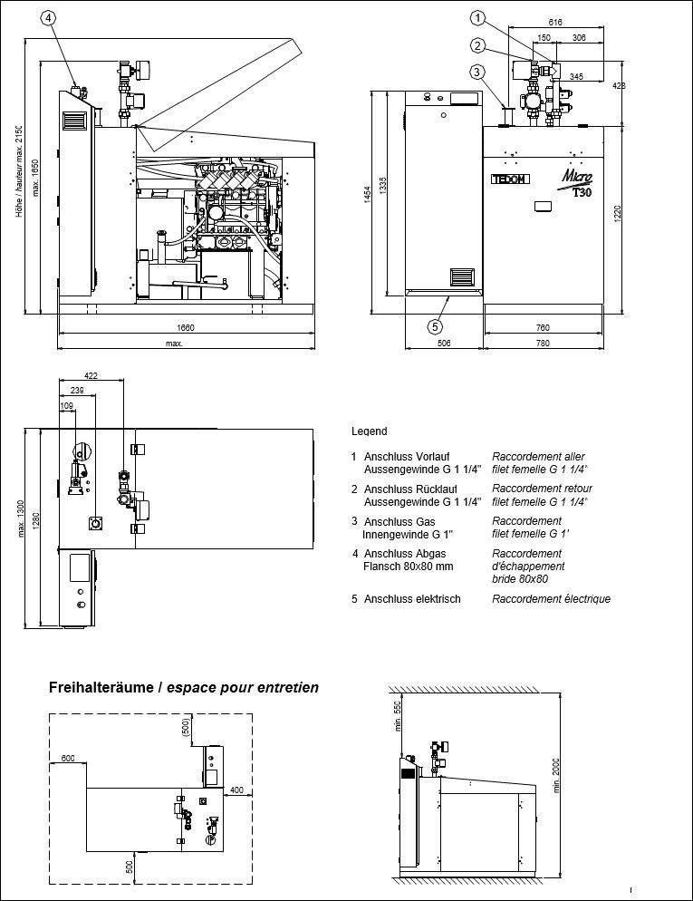

## Hauptkomponenten der BHKW-Anlage

  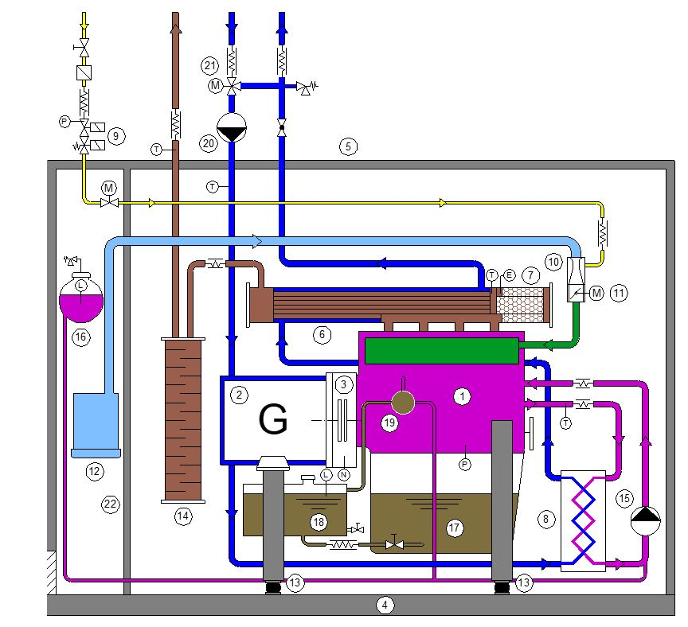

Legende :

<table>
<thead>
	<tr>
		<th>Pos.</th>
		<th>Komponente</th>
		<th>Pos.</th>
		<th>Komponente</th>
	</tr>
</thead>
<tbody>
	<tr>
		<td><ol>
<li></li>
</ol></td>
		<td>Gasmotor</td>
		<td><ol start="12">
<li></li>
</ol></td>
		<td>Luftfilter</td>
	</tr>
	<tr>
		<td><ol start="2">
<li></li>
</ol></td>
		<td>Generator</td>
		<td><ol start="13">
<li></li>
</ol></td>
		<td>Schwingungsdämpfer</td>
	</tr>
	<tr>
		<td><ol start="3">
<li></li>
</ol></td>
		<td>Kupplung</td>
		<td><ol start="14">
<li></li>
</ol></td>
		<td>AbgasDN100</td>
	</tr>
	<tr>
		<td><ol start="4">
<li></li>
</ol></td>
		<td>Chassisrahmen</td>
		<td><ol start="15">
<li></li>
</ol></td>
		<td>Umwälzpumpe Primärkreislauf</td>
	</tr>
	<tr>
		<td><ol start="5">
<li></li>
</ol></td>
		<td>Schalldämmhaube</td>
		<td><ol start="16">
<li></li>
</ol></td>
		<td>Expansionsgefäss Primärkreislauf</td>
	</tr>
	<tr>
		<td><ol start="6">
<li></li>
</ol></td>
		<td>Abgaswärmetauscher</td>
		<td><ol start="17">
<li></li>
</ol></td>
		<td>Ölwanne Motor</td>
	</tr>
	<tr>
		<td><ol start="7">
<li></li>
</ol></td>
		<td>Katalysator integriert</td>
		<td><ol start="12">
<li></li>
</ol></td>
		<td>Ölreservoir</td>
	</tr>
	<tr>
		<td><ol start="8">
<li></li>
</ol></td>
		<td>Plattenwärmetauscher</td>
		<td><ol start="13">
<li></li>
</ol></td>
		<td>Ölfilter / Ölkühler</td>
	</tr>
	<tr>
		<td><ol start="9">
<li></li>
</ol></td>
		<td>Gasregelstrecke</td>
		<td><ol start="14">
<li></li>
</ol></td>
		<td>Umwälzpumpe Sekundärkreislauf</td>
	</tr>
	<tr>
		<td><ol start="10">
<li></li>
</ol></td>
		<td>Gasmischer</td>
		<td><ol start="15">
<li></li>
</ol></td>
		<td>3-Wegventil Sekundärkreislauf</td>
	</tr>
	<tr>
		<td><ol start="11">
<li></li>
</ol></td>
		<td>Drosselklappe</td>
		<td><ol start="16">
<li></li>
</ol></td>
		<td>Zündung (nicht gezeichnet)</td>
	</tr>
</tbody>
</table>

### Gasmotor

Der Gasmotor MAMotec MAG 74.6 T213A dient als Antrieb der BHKW-Anlage. Er wandelt den Brennstoff in mechanische Energie um, welche wiederum mittels Generator in hochwertige elektrische Energie transformiert wird.

Die Abwärme von Motor und Abgas wird über Wärmetauscher zurück gewonnen und zu Heizzwecken an einen sekundären Wasserkreislauf abgegeben.

#### Konstruktion
Der Otto-Gasmotor MAMotec MAG 74.6 T213A ist ein stehender, rechts drehender Verbrennungsmotor mit unten liegender Nockenwelle. Über die Leichtmetallkolben mit Kolbenbodenkühlung wird die Kraft an die geschmiedete, dreifach gelagerte Kurbelwelle abgegeben.
 
Die Kühlung des Aggregates erfolgt durch einen geschlossenen Primärkreislauf mit Überdruck. Dabei wird das interne Kühlwasser durch eine elektrische Umwälzpumpe gefördert.

Eine Zahnradpumpe versorgt den ganzen Motor nach dem Prinzip der Druckumlaufschmierung mit Öl. 

Der Ölkreislauf ist durch ein Überdruckventil gesichert. Der Ölfilter befindet sich im Hauptstrom und fängt allfällige Partikel auf. 

Die Kurbelgehäuseentlüftung wird durch ein Rohrsystem zum Ölabscheider geführt

#### Technische Daten Motor

<table>
<tbody>
	<tr>
		<td>Fabrikat</td>
		<td>MAMotec</td>
	</tr>
	<tr>
		<td>Typ:</td>
		<td>MAG 74.6 T213A</td>
	</tr>
	<tr>
		<td>Motorart</td>
		<td>Gasmotor</td>
	</tr>
	<tr>
		<td>Arbeitsumlauf</td>
		<td>Viertakter</td>
	</tr>
	<tr>
		<td>Drehzahl:</td>
		<td>1500	U/min</td>
	</tr>
	<tr>
		<td>max. zulässige Umdrehungen</td>
		<td>1750 min-1</td>
	</tr>
	<tr>
		<td>Umdrehungssinn</td>
		<td>rechtsdrehend</td>
	</tr>
	<tr>
		<td>Hubraum:</td>
		<td>7400  cm3</td>
	</tr>
	<tr>
		<td>Kolbenhub:</td>
		<td>134  mm</td>
	</tr>
	<tr>
		<td>Mittlere Kolbengeschwindigkeit:</td>
		<td>6.7  m/s</td>
	</tr>
	<tr>
		<td>Zylinderbohrung:</td>
		<td>108  mm</td>
	</tr>
	<tr>
		<td>Zylinderzahl:</td>
		<td>6 in Reihe</td>
	</tr>
	<tr>
		<td>Zylinderanordnung</td>
		<td>stehend, einreihige</td>
	</tr>
	<tr>
		<td>Zylinderfüllung</td>
		<td>atmosphärisch/Ladedruck (T-Modell)</td>
	</tr>
	<tr>
		<td>Steuerung</td>
		<td>OHV</td>
	</tr>
	<tr>
		<td>Zündfolge</td>
		<td>Zündung_Zündfolge</td>
	</tr>
	<tr>
		<td>Vorzündung</td>
		<td>20-24 Grad(Erdgas); 26-32_ (Biogas)</td>
	</tr>
	<tr>
		<td>Verdichtung:</td>
		<td>13:1</td>
	</tr>
	<tr>
		<td>Gewicht (trocken):</td>
		<td>0  kg</td>
	</tr>
	<tr>
		<td>Grundbrennstoff</td>
		<td>Gas</td>
	</tr>
	<tr>
		<td>zugef. Brennstoffleistung :</td>
		<td>224  kW</td>
	</tr>
	<tr>
		<td>absoluter Brennstoffverbrauch</td>
		<td></td>
	</tr>
	<tr>
		<td>Wellenleistung:</td>
		<td>85  kW</td>
	</tr>
	<tr>
		<td>Drehmoment</td>
		<td>Motor_Drehmoment</td>
	</tr>
	<tr>
		<td>Wirkungsgrad Motor:</td>
		<td>36.90%</td>
	</tr>
	<tr>
		<td>Kühlungsart</td>
		<td>Wasserkühlung mit Überdruck</td>
	</tr>
	<tr>
		<td>Kühlwasserwärme:</td>
		<td>78  kW</td>
	</tr>
	<tr>
		<td>Abgaswärme nutzbar (120°C):</td>
		<td>43  kW</td>
	</tr>
	<tr>
		<td>Abgasmassenstrom:</td>
		<td>296  kg/h</td>
	</tr>
	<tr>
		<td>Ladeluftkühlung</td>
		<td>5  kW</td>
	</tr>
	<tr>
		<td>Verbrennungsluftmenge:</td>
		<td>279  m3/h</td>
	</tr>
	<tr>
		<td>max. Luft Ansaugtemperatur:</td>
		<td>25  °C</td>
	</tr>
	<tr>
		<td>relative Luftfeuchtigkeit</td>
		<td>60%</td>
	</tr>
	<tr>
		<td>Aufstellungshöhe:</td>
		<td>100  m ü. M</td>
	</tr>
	<tr>
		<td>bei 500 m.ü. Meereshöhe</td>
		<td>3%</td>
	</tr>
	<tr>
		<td>bei 1000 m.ü. Meereshöhe</td>
		<td>8%</td>
	</tr>
	<tr>
		<td>bei 1500 m.ü. Meereshöhe</td>
		<td>14%</td>
	</tr>
</tbody>
</table>

Steuerzeiten

<table>
<tbody>
	<tr>
		<td>Einlassventil geöffnet</td>
		<td>14 Grad  vor O.T.</td>
	</tr>
	<tr>
		<td>Einlassventil schliesst</td>
		<td>36 Grad  nach U.T.</td>
	</tr>
	<tr>
		<td>Auslassventil öffnet</td>
		<td>45 Grad  vor U.T</td>
	</tr>
	<tr>
		<td>Auslassventil schliesst</td>
		<td>17 Grad  nach O.T.</td>
	</tr>
	<tr>
		<td>Ventilspiel kalt</td>
		<td>20 Grad bei 3 °C</td>
	</tr>
	<tr>
		<td>Saugventil</td>
		<td>0.25</td>
	</tr>
	<tr>
		<td>Auslassventil</td>
		<td>0.25</td>
	</tr>
</tbody>
</table>

#### Motorschmierung

<table>
<tbody>
	<tr>
		<td>Ausführung</td>
		<td>Druckumlauf, durch Zahnradpumpe</td>
	</tr>
	<tr>
		<td>Zahnradpumpe</td>
		<td>einfach, mit Überdruckventil</td>
	</tr>
	<tr>
		<td>Ölfilter</td>
		<td>Volldurchflussfilter  SF</td>
	</tr>
	<tr>
		<td>Ölart</td>
		<td>BLASER BES (teilsynthetisch)</td>
	</tr>
	<tr>
		<td>Füllmenge Ölwanne u. Filter:</td>
		<td>26  Liter</td>
	</tr>
	<tr>
		<td>Füllmenge Vorratsbehälter:</td>
		<td>40  Liter</td>
	</tr>
	<tr>
		<td>Schmierölverbrauch:</td>
		<td>0.3  g/kWh</td>
	</tr>
	<tr>
		<td>min. Öldruck:</td>
		<td>1  bar</td>
	</tr>
	<tr>
		<td>Öltemperatur in Betrieb:</td>
		<td>95-100	°C</td>
	</tr>
	<tr>
		<td>Ölwechselintervall</td>
		<td>siehe spezifischen Wartungsplan</td>
	</tr>
</tbody>
</table>

#### Motorkühlung

##### Plattenwärmetauscher

<table>
<tbody>
	<tr>
		<td>Funktion</td>
		<td>Kühlwasser_Wasser_WT_Beschreibung</td>
	</tr>
	<tr>
		<td>Bauart:</td>
		<td>WT_Bauart</td>
	</tr>
	<tr>
		<td>Wärmeleistung:</td>
		<td>Wärmeleistung</td>
	</tr>
	<tr>
		<td>Temp. primär ein / aus:</td>
		<td>WT_Temp_primär_ein_aus</td>
	</tr>
	<tr>
		<td>Temp. sekundär ein / aus:</td>
		<td>WT_Temp_sekundär_ein_aus</td>
	</tr>
	<tr>
		<td>Wassermenge prim./sek.:</td>
		<td>Wassermenge_prim_sek</td>
	</tr>
	<tr>
		<td>Druckverlust prim./sek.:</td>
		<td>Druckverlust_prim_sek</td>
	</tr>
</tbody>
</table>
##### Abgaswärmetauscher

<table>
<tbody>
	<tr>
		<td>Funktion</td>
		<td>Kühlwasser_Wasser_WT_Beschreibung</td>
	</tr>
	<tr>
		<td>Bauart:</td>
		<td>WT_Bauart</td>
	</tr>
	<tr>
		<td>Wärmeleistung:</td>
		<td>Wärmeleistung</td>
	</tr>
	<tr>
		<td>Temp. primär ein / aus:</td>
		<td>WT_Temp_primär_ein_aus</td>
	</tr>
	<tr>
		<td>Temp. sekundär ein / aus:</td>
		<td>WT_Temp_sekundär_ein_aus</td>
	</tr>
	<tr>
		<td>Wassermenge prim./sek.:</td>
		<td>Wassermenge_prim_sek</td>
	</tr>
	<tr>
		<td>Druckverlust prim./sek.:</td>
		<td>Druckverlust_prim_sek</td>
	</tr>
</tbody>
</table>

#### Zündsystem

Wartungsarme, kontaktlose, mikroprozessorgesteuerte Zündanlage, bestehend aus Steuergerät, Impulsaufnehmer, Einzelzündspulen/Zylinder, Zündkabel und Zündkerzen, die nach dem Prinzip der Kondensatorentladung arbeitet.

<table>
<tbody>
	<tr>
		<td>Zündanlage</td>
		<td>Trijekt / Gas T702</td>
	</tr>
	<tr>
		<td>Zündkerzen Typ</td>
		<td>Zündkerzen_Typ</td>
	</tr>
	<tr>
		<td>Anzahl Zündkerzen</td>
		<td>Zündkerzen_Anzahl</td>
	</tr>
	<tr>
		<td>Elektrodenabstand</td>
		<td>0,4 - 0,1 mm</td>
	</tr>
</tbody>
</table>

#### Brennstoffsystem

<table>
<tbody>
	<tr>
		<td>Vermischungsart</td>
		<td>Niederdruck, am Rohrleitungseintritt</td>
	</tr>
	<tr>
		<td>Mischungsart</td>
		<td>stöchiometrisches Gemisch</td>
	</tr>
	<tr>
		<td>Bio- Klärgas</td>
		<td>(Lambda = 1)</td>
	</tr>
</tbody>
</table>

### Synchrongenerator

* Der verwendete Generator ist ein einfach gelagerter, luftgekühlter Synchrongenerator.

#### Konstruktion Synchrongenerator

Der Synchrongenerator wird im Niederspannungsbereich betrieben und für 690V in Sternschaltung ausgelegt.  Der Generator entspricht der IP23 IP21. 

Die Statorwicklung ist durch eine Isolation der Klasse F geschützt und damit gegen Feuchtigkeit, Öldämpfe und Verschmutzungen resistent.

Das Statorpaket besteht aus lammeliertem Dynamoblech und wird in das Statorgehäuse eingepresst. Das Statorgehäuse ist in Stahlguss, der hintere Lagerschild und der vordere Anschlussflansch aus Grauguss gefertigt. 

Der Rotor wird an der Hinterseite mit einem Wälzlager gelagert, dessen Nachschmierung im Rahmen der vorgeschriebenen technischen Wartung durchgeführt werden muss. An der Vorderseite wird die Kupplungsscheibe direkt auf das Schwungrad des Motors geschraubt und benötigt daher kein weiters Wälzlager.

#### Funktionsweise Synchrongenerator
Beim Startvorgang entspricht der Synchrongenerator einem Synchronelektromotor. Dabei entsteht nach der Zuführung der dreiphasigen Wechselspannung an die Ständerwicklung ein drehendes Magnetfeld. 

Dieses Feld induziert der Rotorwicklung eine Spannung, welche ihrerseits ein Magnetfeld aufbaut. 

Die Drehzahl ist durch die Polzahl gegeben und ihre Abweichung von den Synchronumdrehungen wird durch den Schlupf (1.8%) bestimmt. 

Im Betrieb wird die Statorwicklung in Dreieck umgeschaltet und der produzierte Strom ins Netz abgegeben.

#### Technische Daten

<table>
<tbody>
	<tr>
		<td>Generator synchron</tdh>
		<td>UCI 274 E</td>
	</tr>
	<tr>
		<td>Fabrikat:</td>
		<td>STAMFORD</td>
	</tr>
	<tr>
		<td>Typ:</td>
		<td>UCI 274 E</td>
	</tr>
	<tr>
		<td>max. Scheinleistung:</td>
		<td>max_Scheinleistung</td>
	</tr>
	<tr>
		<td>Nennleistung:</td>
		<td>Nennleistung</td>
	</tr>
	<tr>
		<td>Spannung:</td>
		<td>Spannung</td>
	</tr>
	<tr>
		<td>Frequenz:</td>
		<td>Frequenz</td>
	</tr>
	<tr>
		<td>Nennstrom bei cos 1:</td>
		<td>Nennstrom_bei_cos_j_1</td>
	</tr>
	<tr>
		<td>Wirkungsgrad bei cos 1:</td>
		<td>Wirkungsgrad_bei_cos_j_1</td>
	</tr>
	<tr>
		<td>Drehzahl:</td>
		<td>Nenndrehzahl</td>
	</tr>
	<tr>
		<td>Durchbrennzahl:</td>
		<td>Durchbrennzahl</td>
	</tr>
	<tr>
		<td>Gewicht:</td>
		<td>514  kg</td>
	</tr>
	<tr>
		<td>Zulassung:</td>
		<td>Zulassung</td>
	</tr>
	<tr>
		<td>IP23:</td>
		<td>IP23</td>
	</tr>
	<tr>
		<td>Isolationsklasse:</td>
		<td>Isolationsklasse</td>
	</tr>
	<tr>
		<td>Bauart:</td>
		<td>Bauart</td>
	</tr>
</tbody>
</table>

### Primärkreislauf

Zur Kühlung des Gasmotors ist ein separater, geschlossener Primärkreislauf installiert. Ein Plattenwärmetauscher übergibt die Motorabwärme an den Sekundärkreislauf. 

#### Komponenten und Schema des Primärkreislaufes

  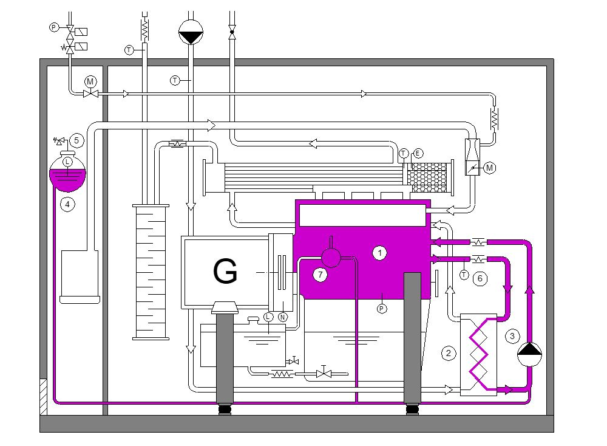

Legende :	

<table>
<tbody>
	<tr>
		<td>1</td>
		<td>Gasmotor</td>
		<td>5</td>
		<td>Sicherheits-Überdruckventil</td>
	</tr>
	<tr>
		<td>2</td>
		<td>Plattenwärmetauscher</td>
		<td>6</td>
		<td>Temperaturfühler</td>
	</tr>
	<tr>
		<td>3</td>
		<td>Umwälzpumpe</td>
		<td>7</td>
		<td>Ölkühler</td>
	</tr>
	<tr>
		<td>4</td>
		<td>Ausgleichsgefäss (Expansion)</td>
		<td></td>
		<td></td>
	</tr>
</tbody>
</table>

#### Beschreibung des Primärkreislaufes

Im Primärkreislauf zirkuliert die Kühlflüssigkeit (siehe 7.3.4) mittels separater Umwälzpumpe und durchströmt mit konstanter Wassermenge den Motor sowie Plattenwärmetauscher. Dort wird die thermische Energie aus dem Motor an den Sekundärkreislauf übertragen.

Die minimale Betriebstemperatur des Motors wird indirekt über die Rücklaufhochhaltung im Se-kundärkreislauf (siehe 7.4) garantiert. Der Sollwert zur Regulierung der Rücklaufhochhaltung beträgt minimal 60 bis maximal 70°C, idealerweise 65°C.

Die Überdruckabsicherung des Primärkreislaufes übernimmt ein im Deckel des Ausgleichsgefäss integriertes Über- und Unterdruckventil. Die Entlüftung des Primärkreislaufes erfolgt durch Schläuche zum Ausgleichsgefäss.

Die Temperaturüberwachung des Primärkreislaufes wird durch ein PT100 Temperaturfühler gewährleistet, dessen Messsignal vom Steuersystem im Schaltschrank verarbeitet wird.
 
#### Auffüllen des Primärkreislaufes
Zum Auffüllen des Primärkreislaufes wird nach folgenden Punkten vorgegangen:

•	den Deckel des Ausgleichsgefässes entfernen
•	den Primärkreislauf mit dem vorgeschriebenen Kühlmittel auf den Maximalstand auffüllen 
•	den Deckel des Ausgleichsgefässes schliessen
•	die Anlage in Betrieb setzen und auf Betriebstemperatur erwärmen lassen
•	Senkt sich das Niveau im Ausgleichsgefäss die Anlage ausschalten
•	den Deckel des Ausgleichsgefässes entfernen
_________________________________________________________________________

  

ACHTUNG! Deckel nie bei heissem Motor öffnen!
_________________________________________________________________________

•	Das Ausgleichsgefäss bis zur Niveaumarkierung MAX mit Kühlmittelflüssigkeit nachfüllen
•	den Deckel des Ausgleichsgefäss schliessen

#### Spezifikationen der Kühlflüssigkeit

Die Kühlflüssigkeit besteht aus einem Wasser- Frostschutzgemisch mit min. 40 % Ethylenglykol. Die Zugabe von Frostschutz ist auch in frostsicheren Räumen notwendig, da diese Zusätze auch die Korrosion sowie mineralische Ablagerungen verhindern.

Die Standzeit der Kühlflüssigkeit beträgt ca. *drei Jahre* und muss danach gewechselt werden.

Die Kühlflüssigkeit muss den allgemeinen Anforderungen gemäss dem Kapitel 8.2 Motorkühlflüssig entsprechen.

Alle Frostschutzmittel auf der Basis von Ethylenglykol sind grundsätzlich untereinander mischbar. Trotzdem wird empfohlen mit dem Hersteller oder Lieferan-ten Rücksprache zu nehmen.

#### Wartung des Primärkreislaufes

Die Kontrolle und Wartung des Primärkreislaufes ist grundsätzlich ein Bestandteil der technischen Anlagewartung gemäss Wartungsplan und wird durch geschulte Servicemitarbeiter der Firma BES durchgeführt. 

Dem Betriebspersonal wird empfohlen, folgende Kon-trollen wöchentlich durchzuführen:

•	Niveaukontrolle im Ausgleichsgefäss des Primärkreislaufes, eventuell Wasser nachfüllen.
•	Dichtheitskontrolle der Flansch- und Schlauchverbindungen, allfällige Leckagen beseitigen.

#### Störungen im Primärkreislauf
Störungen im Primärkreislauf äussern sich meistens in Form von zu hohen Kühlwassertemperaturen. Die Gründe dafür können im Primär- oder Sekundärkreislauf liegen.

##### Störungen im Primärkreislauf:

•	Kühlflüssigkeitsverlust infolge Leckagen
•	zu kleiner Kühlflüssigkeitsdurchsatz infolge defekter Umwälzpumpe oder verstopftem Plattenwärmetauscher
•	Fehler in der Messung der Motortemperatur 
##### Störungen im Sekundärkreislauf:
•	Heizwasserverlust infolge Leckagen
•	zu kleiner Heizwasserdurchsatz infolge defekter Umwälzpumpe oder verstopftem Schmutz-fänger oder Plattenwärmetauscher
•	schlechte Wärmeübertragung durch Ablagerungen im Plattenwärmetauscher
 
### Sekundärkreislauf

Der Sekundärkreislauf nimmt die Abwärme aus Generator, Motor (über Plattenwärmetauscher) und Abgaswärmetauscher auf und führt damit die komplette Wärmeleistung der BHKW-Anlage in ein entsprechendes Wärmesystem ab.

#### Komponenten und Schema des Sekundärkreislaufes

  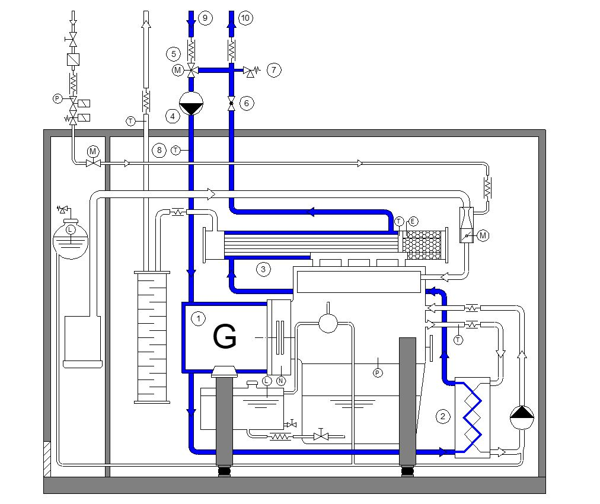

Legende :

<table>
<tbody>
	<tr>
		<td>1</td>
		<td>Generator luftgekühlt</td>
		<td>6</td>
		<td>Strangregulierventil</td>
	</tr>
	<tr>
		<td>2</td>
		<td>Plattenwärmetauscher</td>
		<td>7</td>
		<td>Sicherheitsventil 3 bar</td>
	</tr>
	<tr>
		<td>3</td>
		<td>Abgaswärmetauscher</td>
		<td>8</td>
		<td>Temperaturfühler Rücklauf</td>
	</tr>
	<tr>
		<td>4</td>
		<td>Umwälzpumpe sekundär</td>
		<td>9</td>
		<td>Rücklauf BHKW</td>
	</tr>
	<tr>
		<td>5</td>
		<td>Dreiwegventil Hochhaltung</td>
		<td>10</td>
		<td>Vorlauf BHKW</td>
	</tr>
</tbody>
</table>

#### Beschreibung des Sekundärkreislaufes

Eine Umwälzpumpe im Sekundärkreislauf fördert das Heizwasser über den wassergekühlten Mantel des Gasmotors zur Sekundärseite des Plattenwärmetauschers im BHKW, wo die Motorabwärme des Primärkreislaufes übernommen wird. Weiter gelangt das Heizwasser in den Abgaswärmetauscher, wo die Abwärme aus der Abgasrückkühlung abgeführt wird. Über den BHKW-Vorlauf gelangt die komplette Wärmeleistung zu dem oder den Wärmeverbraucher.
 
Bei Rücklauftemperaturen zum BHKW kälter als 60 °C besteht die Gefahr, dass im Abgaswärmetauscher die Abgase auskondensieren, was vor allem bei Verwendung von Bio- oder Klärgas zu Korrosionsschäden führen kann. Um dies zu verhindern empfiehlt es sich, in den BHKW-Rücklauf eine Hochhaltung zu installieren, welche die Eintrittstemperatur konstant auf minimal 60 °C und maximal 70 °C anhebt. 

Der Sekundärkreislauf ist standardmässig mit einem Sicherheitsventil ausgerüstet. Ein Sicherheitsventil 3 bar ausserhalb des BHKWs ist installiert, um die BHKW-Anlage auch bei geschlossenen Absperrarmaturen vor Überdruck zu schützen.
	
#### Auffüllen des Sekundärkreislaufes

Zum Auffüllen des Sekundärkreislaufes wird nach folgenden Punkten vorgegangen:

1. das Entlüftungsventil im Sekundärkreislauf innerhalb des Aggregats öffnen
2. die Absperrorgane ausserhalb des BHKW langsam und nur teilweise öffnen, wodurch sich der Sekundärkreislauf im BHKW mit Wasser aus dem Heizungssystem zu füllen beginnt
3. sobald Wasser aus dem Entlüftungsventil austritt, dieses schliessen
4. alle Ansperrorgane nun ganz öffnen
5. sofern auch der Primärkreislauf bereits gefüllt ist, das BHKW starten
6. nach ca. 2-3 Minuten die Anlage ausschalten
7. den Sekundärkreislauf bei allen darin vorhanden Entlüftungsventilen entlüften

Der Sekundärkreislauf muss gemäss den SWKI-Richtlinien und allgemeinen eingefüllt werden, damit die max. erlaubte Wasserhärte von 13°f (= 130 g Kalk/m3 Wasser) nicht überschritten wird.

Im BHKW-Rücklauf muss ein Schmutzfänger installiert werden.
 _________________________________________________________________________

  

Bei Missachtung dieser Vorschriften können die Wärmetauscher durch Ablagerungen verstopft werden.
_________________________________________________________________________

Der Generator und Rohrleitungen des Sekundärkreislaufs innerhalb der Schalldämmhaube dürfen nicht mit einer Wärmeisolation versehen werden. Diese Komponenten helfen die Strahlungswärme unter der Schalldämmhaube abzuführen.
	
#### Wartung des Sekundärkreislaufes

Die Kontrolle und Wartung des Sekundärkreislaufes ist grundsätzlich ein Bestandteil der technischen Anlagewartung gemäss Wartungsplan und wird durch geschulte Servicemitarbeiter der Firma BES durchgeführt. 

Dem Betriebspersonal wird empfohlen, folgende Kontrollen wöchentlich durchzuführen:

•	Druckkontrolle, eventuell Wasser nachfüllen 
•	Dichtheitskontrolle der Flansch- und Schlauchverbindungen, allfällige Leckagen beseitigen.

#### Störungen im Sekundärkreislauf
Siehe *Störungen im Primärkreislauf*.
 
### Aufbereitung des Verbrennungsgemisch

#### Komponenten und Schema der Gasregelstrecke und Luftzufuhr

  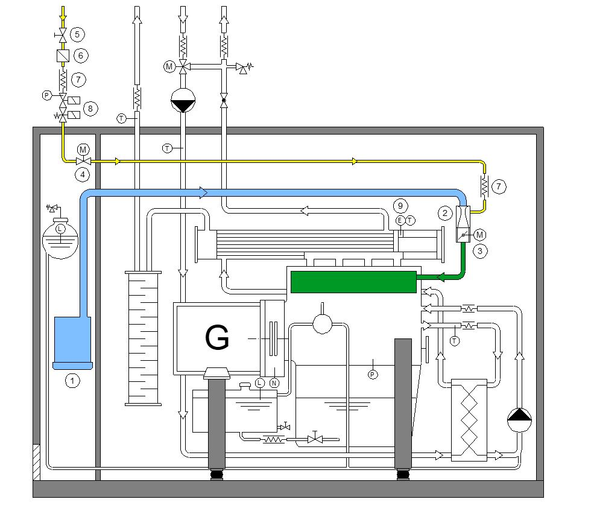

Legende :

<table>
<tbody>
	<tr>
		<td>1</td>
		<td>Luftfilter</td>
		<td>6</td>
		<td>Gasfilter</td>
	</tr>
	<tr>
		<td>2</td>
		<td>Venturimischer</td>
		<td>7</td>
		<td>flexibler Ganzmetallgasschlauch</td>
	</tr>
	<tr>
		<td>3</td>
		<td>Drosselklappe</td>
		<td>8</td>
		<td>Gasmultiblock mit Druckwächter</td>
	</tr>
	<tr>
		<td>4</td>
		<td>Schrittmotor Lambdaregelung und integriertem Gasnulldruckregler</td>
		<td>9</td>
		<td>Lambdasonde</td>
	</tr>
	<tr>
		<td>5</td>
		<td>Gaskugelhahn</td>
		<td></td>
		<td></td>
	</tr>
</tbody>
</table>

#### Gasregelstrecke
Ein Gaskugelhahn zur manuellen Absperrung der Gaszufuhr bildet den Anfang der Gasregelstrecke. Um zu verhindern, dass Festpartikel in den Motor gelangen, wird ein Gasfilter vor die Gasstrasse montiert. 

Über einen Ganzmetallschlauch wird das BHKW schwingungsarm an die Gasleitung angeschlossen. Zwei in Serie geschaltete Magnetventile sind mit einem Gasdruckwächter in einem Gasmultiblock zusammengefasst und fest auf der BIBLOC BV674 SBTLK aufgebaut. 

Diese Gasmagnetventile werden vom Steuersystem für den BHKW-Betrieb geöffnet respektive wieder geschlossen. Der im zweiten Gasventil integrierte Nulldruckregler reduziert den Gasvor-druck in der Gasleitung auf ein atmosphärisches Druckniveau. 
 
Der Gaseintritt in die Anlage erfolgt durch ein Stahlrohr, welches fest mit der Kapsel verbunden ist. 

Am anderen Ende dieses Rohrs ist ein Aluminiumblock mit dem Gasdosierventil der Lambdaregelung sowie einer Haupteinstellschraube montiert. Die Funktion des Gasdosierventils wird im nächsten Kapitel detailliert beschrieben.

Ein flexibler Ganzmetallschlauch führt das Gas zum Gasmischer, auch Venturi genannt, wo das Gas und die Luft zum Verbrennungsgemisch aufbereitet wird.

#### Einregulierung der Gasregelstrecke

Vor Inbetriebnahme der Gasregelstrecke beziehungsweise des BHKWs ist die Gasleitung bis zum Anschlussstutzen des BHKW zu entlüften. Zudem ist eine Dichtheitskontrolle der Gaskomponenten respektive deren Anschlüsse vorzunehmen (Seifenwasserspray).

Nach dem ersten Start kann der Gasvordruck, Druck nach dem Nullregler, gemessen und einreguliert werden. 

Mit der Hauptgasschraube ist eine Grobeinstellung derart vorzunehmen, dass zur Regulierung des gewünschten Verbrennungsgemisches der Schrittmotor der Lambdaregulierung ungefähr in der Mitte des möglichen Bereichs arbeitet.

Die Einregulierung der Gasregelstrecke erfolgt grundsätzlich in Kombination mit einem Abgasanalysegerät. Damit kann der Restsauerstoff im Abgas gemessen werden, welcher die Regelgrösse für eine optimale Verbrennung hinsichtlich Abgasemissionen und Wirkungsgrad ist.

Die Funktionskontrolle der Lambdaregelung und die Einstellung deren Sollwerte kann nur durch geschulte Servicetechniker und mit einem Abgasanalysegerät durchgeführt werden

Die Einstellung von Nulldruckregler, Haupteinstellschraube, Lambda-Regelung und Drehzahlregler beeinflussen sich gegenseitig. Änderungen bei einer Komponente können sich auch auf die Arbeit der anderen Komponenten auswirken.

So sind bei einer Neueinstellung einer Komponente meistens auch die anderen Regelkomponenten nachzujustieren.

#### Verbrennungsluftzufuhr

Die Verbrennungsluft wird über Lüftungsschlitze an der Hinterseite des BHKW durch den Motor in den kalten Bereich der Schalldämmhaube angesogen. Im Luftfilter werden feste Partikel in der Luft zurückgehalten. 

Vom Filter gelangt die Luft direkt zum Gasmischer (Venturi), wo es zur Vermischung mit dem Gas und damit zur Bildung der Verbrennungsmischung kommt. Über den Ansaugkollektor strömt das Gemisch in den Motor zur Verbrennung. 

#### Aufbereitung Verbrennungsgemisch

Der Motor erzeugt im Ansaugkollektor einen Unterdruck und saugt auf diese Weise die Verbrennungsluft an.

Im Venturirohr wird der Querschnitt für die Verbrennungsluftzufuhr verengt, wodurch sich die Strömungsgeschwindigkeit im Venturi erhöht und einen Unterdruck erzeugt. 

Damit wird die notwendige Gasmenge radial am engsten Querschnitt des Venturi angesogen. 

Die angesogene Gasmenge wird zum einen durch das Verhältnis der Luft- und Gasöffnung im Venturirohr vorgegeben, hauptsächlich aber durch das Dosierventil der Lambda-Regelung und der Haupteinstellschraube reguliert. 

Die Wartung der Gasregelstrecke wird durch Servicetechniker der Servicefirma durchgeführt und ist ein Bestandteil der Anlagewartung gemäss Wartungsplan.
 
#### Wartung der Gasregelstrecke

Die Kontrolle und Wartung der Gasregelstrecke ist grundsätzlich ein Bestandteil der technischen Anlagewartung gemäss Wartungsplan und wird durch geschulte Servicemitarbeiter der Firma BES durchgeführt. 

Das Betriebspersonal ist verantwortlich und angewiesen, folgende Kontrollen wöchentlich durchzuführen:

•	Kontrolle des Gasvordruckes (sofern Manometer vorhanden)

•	Dichtheitskontrolle der Flansch- und Schraubverbindungen (Lecksuchspray, Geruch)

Der Kunde ist für die Kontrolle des Gasdruckes sowie der Dichtheit der Gaskomponenten ausserhalb der Schalldämmhaube verantwortlich.

Unbefugten nicht qualifizierten Personen ist es untersagt Montage- oder Einstellarbeiten an der Gasregelstrecke ausser- und innerhalb des BHKW vorzunehmen.
 
### Leistungsregelung

Sie regelt die Leistung gemäss dem vorliegenden Sollwert.

#### Komponenten der Leistungsregulierung

  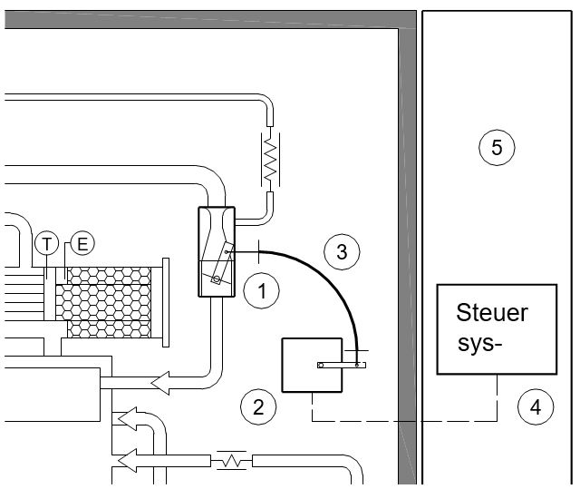

Legende:

<table>
<tbody>
	<tr>
		<td>1</td>
		<td>Drosselklappe</td>
		<td>4</td>
		<td>Steuersystem IS-GAS</td>
	</tr>
	<tr>
		<td>2</td>
		<td>Stellmotor</td>
		<td>5</td>
		<td>Steuerschrank</td>
	</tr>
	<tr>
		<td>3</td>
		<td>Kabelzug</td>
		<td></td>
		<td></td>
	</tr>
</tbody>
</table>

#### Funktionsbeschreibung der Leistungsregulierung

Die Hauptkomponenten der Leistungsregulierung bilden der vom Steuersystem IS-GAS ange-steuerte Stellmotor sowie die Drosselklappe. Diese beiden Komponenten sind über einen Seilzug verbunden.

Das Steuersystem IS-GAS öffnet oder schliesst den Stellmotor, indem es über zwei digitale Ausgänge den Auf- oder Zu-Eingang (12 VDC) des Stellmotors ansteuert. Wird kein Eingang angesteuert, bleibt der Stellmotor in der jeweiligen Position stehen (3-Punktregulierung).
Die Drehzahl bei einem Synchrongenerator ist stets konstant und ist durch die Polzahl vorgege-ben. Eine Drehzahlregulierung wie bei einem Synchrongenerator ist daher nicht notwendig. Eine Änderung der Drosselklappenstellung hat eine Änderung der Leistung zur Folge. 
Während den Startvorbereitungen öffnet der Stellmotor (Aktuator) die Drosselklappe auf die vorgegebene Startposition und regelt anschliessend auf den vorgegebenen Sollwert.
Die Stillsetzung der Anlage erfolgt in umgekehrter Reihenfolge der vorher beschriebenen Proze-dur.
 
#### Einregulierung und Wartung der Leistungsregulierung
Die Einregulierung respektive das Ändern von Parametern der Leistungsregulierung darf nur durch geschulte Servicetechniker ausgeführt werden.

#### Wartung der Leistungsregulierung
Die Kontrolle und Wartung der Leistungsregulierung ist ein Bestandteil der technischen Anlagewartung gemäss Wartungsplan und wird ausschliesslich durch geschulte Servicemitarbeiter der Firma BES durchgeführt.

Eingriffe am Hebelmechanismus und Seilzug können Störungen im BHKW-Betrieb verursachen. Vor allem sind Fehler im Startvorgang und in der Leistungsregulierung zu erwarten.
 
### Abgassystem
Durch die Verbrennung des Gas- Luftgemisches im Gasmotor entstehen Abgase. Nach der Rückkühlung im Abgaswärmetauscher werden die Abgase über eine Abgasleitung abgeführt.

#### Komponenten und Schema des Abgassystems

  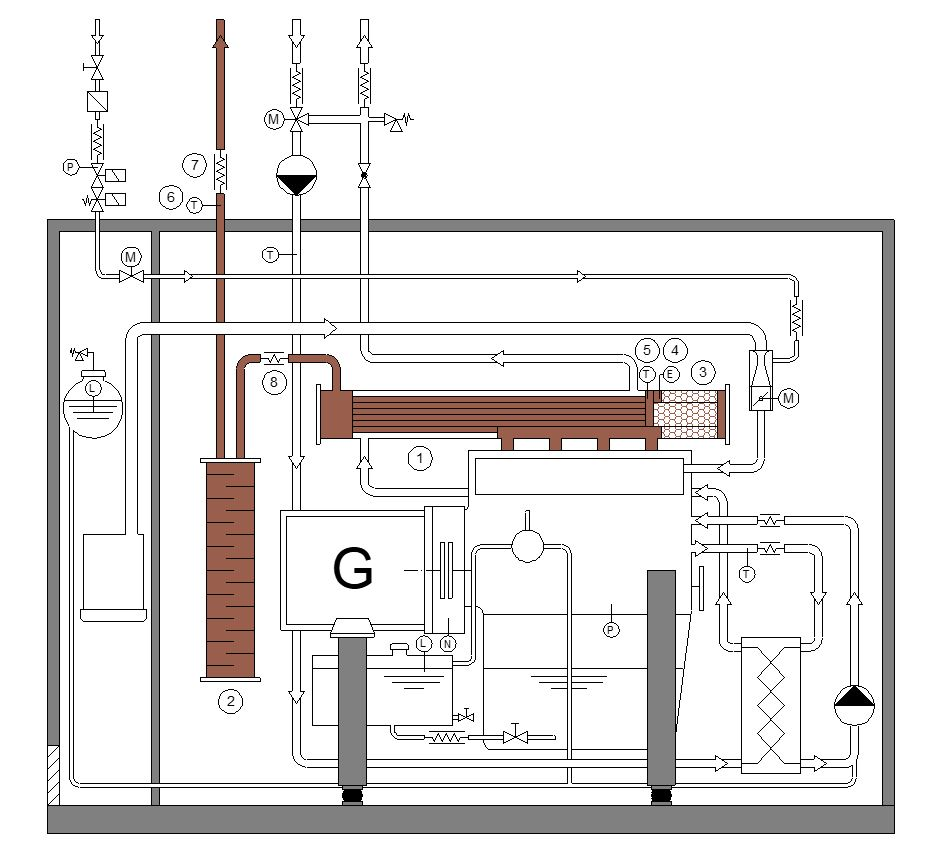

Legende :

<table>
<tbody>
	<tr>
		<td>1</td>
		<td>Abgasw&#228;rmetauscher</td>
		<td>5</td>
		<td>Thermoelement vor Abgas-WT</th>
	</tr>
	<tr>
		<td>2</td>
		<td>DN100</td>
		<td>6</td>
		<td>Thermoelement nach Abgas-WT</td>
	</tr>
	<tr>
		<td>3</td>
		<td>Katalysator</td>
		<td>7</td>
		<td>Kompensator</td>
	</tr>
	<tr>
		<td>4</td>
		<td>Lambdasonde</td>
		<td>8</td>
		<td>Kompensator</td>
	</tr>
</tbody>
</table>

#### Beschreibung der Abgassystems

Die Abgase werden über die Auslassventile im Zylinderkopf ausgestossen und gelangen direkt in oben liegenden Abgaswärmetauscher. 

Hier wird die Wärmeenergie aus den Abgasen auf den Sekundärkreislauf übertragen. 

Vor der Rückkühlung durchströmen die Abgase den im Abgaswärmetauscher integrierten Katalysator.

Über einen flexiblen Hochtemperaturschlauch, der die Übertragung der Vibrationen vom Motor auf die Abgasleitung verhindert, gelangen die Abgase in den DN100. 

Danach werden die Abgase senkrecht nach oben aus der Schalldämmhaube geführt, wo über einen weiteren Kompensator der Anschluss an die bauseitige Abgasleitung erfolgt. 

Thermoelemente vor und nach dem Abgaswärmetauscher überwachen das komplette Abgassystem.
 
#### Eigenschaften der Abgase

<table>
<tbody>
	<tr>
		<td></td>
		<td>Klär-, Biogas</td>
		<td></td>
	</tr>
	<tr>
		<td>Abgastemperatur am Austrittsflansch</td>
		<td>Abgastemperatur</td>
		<td>°C</td>
	</tr>
	<tr>
		<td>Abgaswärmeleistung</td>
		<td>Abgaswärme_nutzbar</td>
		<td>kW</td>
	</tr>
	<tr>
		<td>Abgasmassenstrom</td>
		<td>Abgasmassenstrom</td>
		<td>kg/h</td>
	</tr>
	<tr>
		<td>Abgasvolumenstrom bei 120 °C</td>
		<td>178</td>
		<td>m3/h</td>
	</tr>
	<tr>
		<td>Abgasgeschwindigkeit am Austrittsflansch (120°C)</td>
		<td>25</td>
		<td>m/s</td>
	</tr>
</tbody>
</table>

Der Abgaswärmetauscher ist so dimensioniert, dass er die Abgase bei einer Rücklauftemperatur von 70 °C von ca. 400 °C auf 120 °C abgekühlt werden. Während des Betriebs können die Abgastemperaturen ca. 110 - 160 °C betragen. Die Temperaturabweichungen gegen unten können durch eine  reduzierte Leistung oder durch niedrigere Rücklauftemperaturen verursacht werden. Höhere Abgastemperaturen werden durch Ablagerungen im Abgaswärmetauscher hervorgerufen.

#### Material der Abgasleitung
Die Abgastemperatur beim Austritt aus dem BHKW wird mit einem Thermoelement überwacht. Steigt die Abgastemperatur an dieser Stelle über 160 °C wird das BHKW abgeschaltet. 

Damit können für die Abgasleitung folgende Materialien verwendet werden:

•	Abgasleitungssystem aus rostfreiem Stahlrohr (V4A) mit einem Durchmesser von 80 mm.

•	PVDF Kunststoffrohr (z.B. Technaflon) mit einem Durchmesser von 75 mm und einer Temperaturbeständigkeit bis 160 °C

Bei zu grossen Querschnitten der Abgasleitung können Resonanzen und entsprechende Schallprobleme entstehen.

#### Konstruktion der Abgasleitung

•	Die Abgasableitung der BHKW-Anlage muss die vorgeschriebenen Normen erfüllen und eine entsprechende VKF-Zulassung aufweisen.

•	In der Abgasleitung einer BHKW-Anlage herrscht stets Überdruck. Aus diesem Grund muss die Abgasleitung gasdicht bis min. 10 mbar (1000 Pa) sein.

•	An der tiefsten Stelle der Abgasleitung, idealerweise vor Anschluss an das BHKW muss ein Kondensatabscheider mit einer Syphonierung (200 mm) montiert werden.

•	Der maximale, dynamische Abgasgegendruck des gesamten Abgassystems beträgt 50 mbar. Damit dieser Grenzwert nicht überschritten wird, darf der Druckverlust der Abgaslei-tung (Austritt BHKW bis Kaminmündung im Freien) 10 mbar nicht überschreiten.

•	Der Anschluss von mehreren BHKW-Anlagen an eine Abgasleitung ist nur unter bestimmten Voraussetzungen zu empfehlen, da bei Betrieb des einen Aggregates Abgase in den Motor des anderen, stillstehenden Moduls gelangen können. 

•	Im Aufstellungslokal müssen zugängliche Abgasleitungen aus Stahl einen Berührungsschutz aufweisen (Oberflächentemperatur < 60 °C), wodurch doppelwandige, isolierte Abgasleitun-gen zur Anwendung kommen.

 Eine nachträgliche Wärmeisolierung von einwandigen Abgasleitungen ist unter Umständen nicht erlaubt (siehe VKF-Zulassung der verwendeten Abgasleitung)
 
### Rauchgasbehandlung
Zur Reduktion der Abgasemissionen werden je nach Betriebsstoff zwei unterschiedliche Reinigungssysteme verwendet:

1.	Mittels Dreiwegkatalysator: 
Dieses System kann bei Verwendung von Erd- oder Flüssiggas erfolgen. Der Einsatz von Dreiweg- oder Oxidationskatalysatoren ist bei der Verwendung von Biogas nicht möglich, da die Verunreinigungen im Biogas Ablagerungen im Katalysator verur-sachen und damit dessen Funktion verunmöglicht.

2.	Mittels Oxidationskatalysator: 
Durch Verbrennung des Gas-Luftgemisches mit Sauerstoffüberschuss (Magermotor). Diese Methode gelangt vor allem bei der Verwendung von Bio- und Klärgas zum Einsatz.

In beiden Systemen wird eine Lambdaregelung eingesetzt, welche die Gaszufuhr zum Gasmischer derart dosiert, dass während des Betriebs im Venturi immer ein konstantes Gas- Luftgemischverhältnis entsteht.

#### Funktion der Lambdaregelung

Die Lambdaregelung ist im Steuersystem IS-GAS integriert. Sie dosiert die Gasmenge in den Venturimischer derart, dass während des Betriebs im Venturi immer ein konstantes Gas-, Luftgemischverhältnis entsteht.

Die Führungsgrösse für die Lambdaregelung bildet der Restsauerstoff O2 in den Abgasen. Dieser Sauerstoffgehalt wird mit einer Lambdasonde gemessen, welche ein entsprechendes Spannungssignal (U=700mV bei Lambda=1 mit Dreiwegkatalysator oder U= 30mV bei Lambda=1.5 mit Magermotor) an die Lambdaregelung übermittelt. Aufgrund dieses Signals erteilt das Steuersystem dem Schrittmotor des Dosierventils den Befehl zum Öffnen oder Schliessen.

Die Lambdaregelung besteht aus einem Regelalgorithmus, welcher im Steuersystem IS-GAS integriert ist. Beim START-Befehl des BHKW wird dieser Regelalgorithmus aktiviert. Dabei schliesst das Dosierventil komplett, wodurch sich die Regelung eine Referenzposition sucht. Danach öffnet das Dosierventil auf die vorgegebene Startposition und wartet den Start der Anlage ab. Nach dem Anlagestart bleibt das Ventil in dieser Position, bis die vorgegebene Aufwärmzeit für die Lambdasonde abgelaufen ist. Nach Ablauf dieser Zeit beginnt es das Gasgemisch in Abhängigkeit der Lambdasondenspannung zu regulieren.
Nach dem STOP-Befehl des BHKW wird der Regelalgorithmus gleichzeitig mit den anderen Systemen der Anlage ausgeschaltet respektive deaktiviert. Das Regelventil bleibt in der vor dem Ausschalten gehaltenen Lage.

#### Funktion des Dreiwegkatalysator

Für den Betrieb mit Dreiwegkatalysator reguliert die Lambdaregelung die Gasmenge in den Venturimischer so, dass das Verbrennungsgemisch stets stöchiometrisch verbrannt wird. Von einem stöchiometrischen Verbrennungsgemisch oder einem Gemisch Lambda = 1 spricht man, wenn in den Abgasen kein Sauerstoff O2 mehr enthalten ist. 

Dies ist die Voraussetzung für die chemische, katalytische Reaktion der Schadstoffe im Katalysator, bei welcher die giftigen Stickoxide NOx zu ungiftigem Stickstoff reduziert werden. Gleichzeitig oxidiert das giftige Kohlenmonoxid CO mit dem freiwerdenden Sauerstoff zu Kohlendioxid CO2. Dieser Vorgang wiederholt sich ständig.

Als Schutz für den Katalysator wird die Abgastemperatur nach dem Katalysator permanent mit einem Thermoelement gemessen. Übersteigt die Abgastemperatur den vorgegebenen Sollwert, wird das BHKW über das Steuersystem abgeschaltet. Ein Anstieg der Abgastemperatur nach dem Katalysator erfolgt vor allem dann, wenn das Verbrennungsgemisch durch einen Defekt in der Lambdaregelung nicht stöchiometrisch verbrennt oder infolge einer defekten Zündkerze unverbranntes Gas in den Katalysator gelangt, wo eine Nachverbrennung erfolgt.
 
#### Funktion des Oxidationskatalysator

Oxidationskatalysatoren werden ausschliesslich für den Betrieb mit Magermotoren eingesetzt. Beim Magermotor erfolgt die Verbrennung mit Luftüberschuss, wodurch sich die NOx- und CO-Emissionen stark reduzieren. Zusätzlich können die CO-Emissionen durch den Einsatz eines Oxidationskatalysators weiter reduziert werden. 

Die Lambdaregelung sorgt bei diesem Verfahren wie beim 3-Wegkatalysator für ein konstantes Verbrennungsgemisch, welches jedoch nicht stöchiometrisch verbrannt wird (Lambda = 1) ist, sondern nach der Verbrennung Restsauerstoff in den Abgasen aufweist (Lambda = 1.4 - 1.5). Im Oxidationskatalysator oxidiert nun das Kohlenmonoxid CO mit diesem Restsauerstoff O2 zu CO2.

Grundsätzlich funktioniert der 3-Wegkatalysator auch als Oxidationskatalysator. Beim Betrieb des Magermotors findet die Reduktion der Stickoxide zu Stickstoff nicht statt.

#### Wartung der Rauchgasbehandlung

Die Kontrolle und Wartung der Rauchgasbehandlung ist ein Bestandteil der technischen Anlagewartung gemäss Wartungsplan und können nur in Kombination mit einem Abgasanalysegerät durchgeführt werden.

Arbeiten bezüglich Rauchgasbehandlung können daher ausschliesslich durch geschulte Servicemitarbeiter der Firma BES durchgeführt werden.

Jede Änderung der Einstellung des Verbrennungsgemischs kann sich negativ auf die Wirtschaftlichkeit und Verfügbarkeit der Anlage auswirken. Zudem kann die Standzeit von wichtigen Anlagebestandteilen verkürzt werden.
 
### Schmierölsystem
Das Ölsystem der BIBLOC BV674 SBTLK ist mit einem zusätzlichen Ölreservoir ausgestattet, was lange Ölwechselintervalle unter Einhaltung der minimalen Schmieröleigenschaften ermöglicht.

#### Komponenten und Schema des Schmierölsystems

  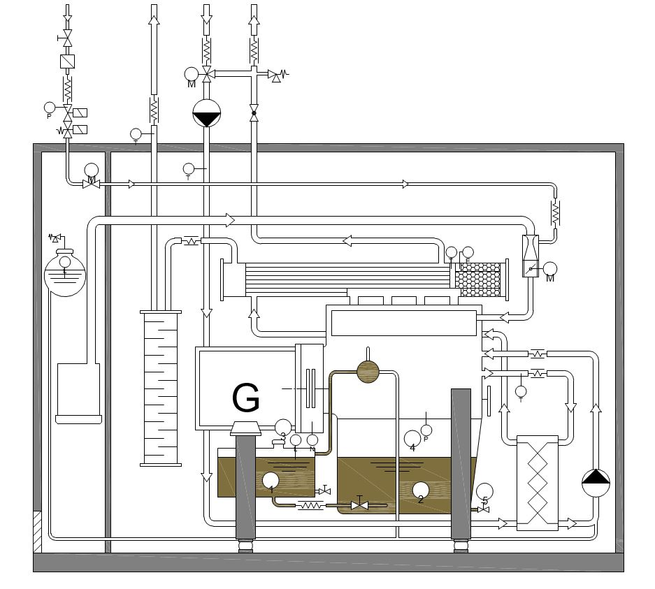

Legende :

<table>
<tbody>
	<tr>
		<td>1</td>
		<td>zusätzliches Ölreservoir</td>
		<td>4</td>
		<td>Öldrucksensor</td>
	</tr>
	<tr>
		<td>2</td>
		<td>Ölwanne Motor</td>
		<td>5</td>
		<td>Ölablasshahn</td>
	</tr>
	<tr>
		<td>3</td>
		<td>Niveauschalter Reservoir</td>
		<td></td>
		<td></td>
	</tr>
</tbody>
</table>

#### Funktionsbeschrieb des Ölsystems
Um die Schmierölkapazität der BIBLOC BV674 SBTLK und damit die Ölwechselintervalle unter Einhaltung der minimalen Schmieröleigenschaften zu erhöhen, ist das Ölsystem der BIBLOC BV674 SBTLK ist mit einem zusätzlichen Ölreservoir (20 Liter) ausgestattet worden. Das Ölreservoir ist mit einer Ausgleichsleitung mit der Ölwanne (30 Liter) des Motors verbunden. Über die Ausgleichsleitung werden Niveauunterschiede ausgeglichen. 

Diese entstehen vor allem beim Start und Stopp des Aggregats, wo der Motor mit Ölfilter gefüllt respektive entleert wird. Ein Niveauschalter im Ölre-servoir überwacht das Ölniveau im Ölsystem und schaltet das Aggregat bei Unterschreitung des minimalen Niveaus über einen binären Kontakt ab.
 
#### Ölwechsel
Das Ölwechselintervall ist von den eingesetzten Brenngasen abhängig und ist durch anfängliche, regelmässige Ölanalysen festzulegen (siehe Wartungsplan).
Um das Altöl möglichst vollständig abzulassen, wird empfohlen den Ölwechsel mit heissem Öl vorzunehmen.

Der Ölwechsel erfolgt über den Ölablasshahn im untersten Teil Motorölwanne. Die Ausgleichsleitung zum Ölreservoir ist dabei zu schliessen. 

Da sich der Ölablasshahn im unteren Bereich des BHKW-Moduls befindet, ist es notwendig das Altöl in entsprechende Altölbehältnisse zu pumpen. Es ist nicht möglich genügend grosse Altölbehälter untern Ölablasshahn zu stellen. Dazu wird ein passender Schlauch mit Überwurfmutter auf das passende Gegenstück am Ölablasshahn geschraubt.

Je nach den Ergebnissen der Ölanalysen wird das Öl im Reservoir jedes 2. Mal gewechselt.

#### Wartung des Ölsystems

Die Kontrolle und Wartung des Ölsystems ist grundsätzlich ein Bestandteil der technischen Anla-gewartung gemäss Wartungsplan und wird durch geschulte Servicemitarbeiter der Firma BES durchgeführt.
Vom Betriebspersonal können bezüglich dem Ölsystem folgende Wartungsarbeiten durchgeführt werden:

•	Dichtheitskontrolle des Ölsystems; kleinere Ölleckagen können im der technischen Möglichkeiten beseitigt werden (lose Verbindungen nachziehen).
•	Überprüfung des Ölniveaus im Ölsystem. Die Überprüfung sollte erst 10 min. nach dem Ab-schalten des Motors durchgeführt werden.
•	Nachfüllen von Schmieröl bis maximal 30 mm unter die Oberkante des Ölreservoirs, falls das Aggregat durch den Ölniveauschalter abgeschaltet wurde.

 	Es dürfen nur Motorenöle verwendet werden, welche durch die Firma BES zugelassen sind (siehe Schmieröl).
Die Verwendung von anderen Motorölen kann einen Verlust der Garantiean-sprüche zur Folge haben.

Die von der Firma BES festgelegten Wartungsintervalle dürfen nicht überschritten werden. Eine Überschreitung der Wartungsintervalle kann eine Verminderung der Schmierfähigkeiten zur Folge haben und die Standzeit vom Motor beeinträchtigen oder diesen beschädigen.

Es ist nicht erlaubt bei sichtbaren Ölleckagen die BHKW-Anlage weiter zu be-treiben.

Der Ölwechsel ist ein Bestandteil der technischen Anlagewartung und wird nach festgelegten Intervallen durchgeführt. Mit dem Ölwechsel ist gleichzeitig auch der Ölfilter zu ersetzen.

### Zündanlage
Die Zündanlage sorgt für die zeitlich geregelte Zündung des Gas-Luftgemisches im Gasmotor-Verbrennungsraum mittels eines Funkensprungs bei den Zündkerzen.

<table>
<tbody>
	<tr>
		<td>Typ der Zündanlage</td>
		<td>Trijekt / Gas T702</td>
	</tr>
</tbody>
</table>

#### Komponenten der Zündanlage

  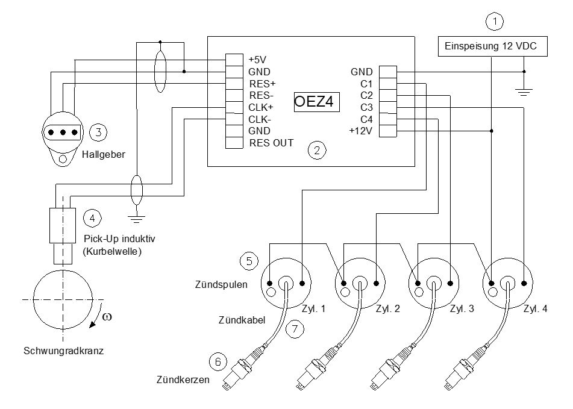

Legende :	

<table>
<tbody>
	<tr>
		<td>1</td>
		<td>Einspeisung von Batterie</td>
		<td>5</td>
		<td>Zündspulen</td>
	</tr>
	<tr>
		<td>2</td>
		<td>elektronische Zündbox</td>
		<td>6</td>
		<td>Zündkerzen</td>
	</tr>
	<tr>
		<td>3</td>
		<td>Hallgeber</td>
		<td>7</td>
		<td>Zündkabel</td>
	</tr>
	<tr>
		<td>4</td>
		<td>Pick-Up induktiv</td>
		<td></td>
		<td></td>
	</tr>
</tbody>
</table>

 
#### Funktionsbeschrieb der Zündanlage

Die Austrittsignale (Zündimpulse auf die einzelnen Zündspulen) werden wie folgt generiert:

•	Signal vom Hallgeber ab Nockenwelle für RESET (Impuls alle 720°)
•	Signal vom Pick-Up beim Schwungradkranz (Impuls alle 180°)
•	Einstellung der Vorzündung durch DIP-Schalter

Die Zündkerze zündet zwischen 90° - 180° nach Signalende des Pick-Up ab Kurbelwelle. Der Winkel um den die Zündung verschoben ist, wird gegeben durch 90° + N x 0.703°
Dabei ergibt sich N (Vorzündung) aus der Position der DIP-Schalter Nr. 1-7 (Summe aller Werte, welche gemäss nachfolgender Tabelle in ON Position stehen).

<table>
<tbody>
	<tr>
		<th>DIP</th>
		<th>1</th>
		<th>2</th>
		<th>3</th>
		<th>4</th>
		<th>5</th>
		<th>6</th>
		<th>7</th>
		<th>8</th>
	</tr>
	<tr>
		<td>ON</td>
		<td>1</td>
		<td>2</td>
		<td>4</td>
		<td>8</td>
		<td>16</td>
		<td>32</td>
		<td>64</td>
		<td></td>
	</tr>
	<tr>
		<td>OFF</td>
		<td>0</td>
		<td>0</td>
		<td>0</td>
		<td>0</td>
		<td>0</td>
		<td>0</td>
		<td>0</td>
		<td></td>
	</tr>
</tbody>
</table>

RESET-Signal und DIP-Schalter Nr. 8 definieren die Zündkerze, welche nach Ablauf des Pick-Up Signals ab Kurbelwelle gezündet wird. 
Das Ende des RESET-Signals synchronisiert die Zündung so, dass nach Ende des nächstfolgenden Pick-Up Signals ab Kurbelwelle die Zündkerze im Zylinder 1 (C1) mit der definierten Verzögerung (90° - 180°) zündet (bei DIP Nr. 8 = ON). 
Mit Hilfe des DIP-Schalter Nr. 8 kann die Zündung der Kerzen um 360° neu definiert werden.
 
 
#### Einstellung der Zündanlage

Für eine korrekte Funktion der Zündanlage müssen folgende Grundeinstellungen vorgenommen werden:
 
##### Zündkerze

Die Wahl der richtigen Zündkerze ist stark vom verwendeten Brenngas abhängig. 
Während der Betrieb mit Erdgas in den meisten Fällen unproblematisch ist, stellt der Betrieb mit Bio- oder Klärgas höhere Ansprüche an die Zündkerze.
 
Der Einsatz von Platin- oder Iridiumzündkerzen ist hier in den meisten Fällen unumgänglich. Folgende Zündkerzen können eingesetzt werden:
* Betrieb mit Erdgas:	BRISK AR12YS
* Betrieb mit Biogas:	NGK PMR8A, NGK CPR8E, DENSO IU22, DENSO IU24

-> Der Elektroden-Abstand der Zündkerzen ist generell auf 0.4 mm einzustellen.

##### Zündbox:

den Zündzeitpunkt (Vorzündung) einstellen.
* Betrieb mit Erdgas:	24° vor O.T.
* Betrieb mit Biogas:	26° bis 32° vor O.T. (abhängig von den Abgasemissionen)
* Die Vorzündung kann mit den DIP-Schaltern (ON/OFF Position) eingestellt werden. 
* Liegen die DIP-Schalter in der OFF Position vergrössert sich die Vorzündung, liegen sie in der ON Position verkleinert sich die Vorzündung (Siehe *Funktionsbeschrieb der Zündanlage*).

#### Wartung der Zündanlage
Die Kontrolle und Wartung der Zündanlage ist ein Bestandteil der technischen Anlagewartung gemäss Wartungsplan und wird ausschliesslich durch geschulte Servicemitarbeiter der Firma BES durchgeführt.

Das Zündsystem arbeitet auf der Sekundärseite (Zündspule und Zündkerze) mit Hochspannung. Das Berühren dieser Komponenten während des Betriebs kann lebensgefährliche Stromschläge zur Folge haben.

Diese Arbeiten (mit Ausnahme des Kerzenwechsels) dürfen nur von autorisiertem Fachpersonal ausgeführt werden.

Nichtautorisierten Personen ist es unter-sagt, Einstellungen an der Zündelektronik oder den Sensoren vorzunehmen.
 
Ein unsachgemässer Eingriff kann grössere Schäden beim Motor und Katalysator verursachen.
 _________________________________________________________________________

  

Das Berühren der Bauteile des Zündsystems während des Betriebs kann lebensgefährliche Stromschläge zur Folge haben.
_________________________________________________________________________
 
## Betriebsstoffe
### Brenngase

Die Blockheizkraftwerke von BES können mit verschiedenen Brenngasen betrieben werden. Nachfolgend sind die wichtigsten Brenngase und ihre minimalen Anforderungen aufgeführt.
####	Biogas
Biogase entstehen während dem Faulprozess von organischen Stoffen. Die damit gewonnen Gase sind erneuerbare Energieträger und sind daher besonders ökologisch. Nachfolgend sind die wichtigsten Biogasarten aufgeführt, welche für den Betrieb eines Blockheizkraftwerkes in Frage kommen:
•	Biogas	aus Faulprozess Jauchegruben (Viehhaltung)
•	Klärgas	aus Faulprozess Klärschlamm
•	Deponiegas	aus Faulprozess Abfalldeponie
Der Brenn- respektive Heizwert von Biogasen variiert stark, abhängig vom vorhandenen Faulgut und Faulprozess. Auch weisen Biogase oft Verunreinigungen auf, die für den Motor sehr schäd-lich sind. Deshalb müssen für Faulgase, wie sie auch genannt werden, Mindestanforderungen definiert werden.

##### Physikalische Eigenschaften

<table>
<tbody>
	<tr>
		<th>min. Heizwert Hu</td>
		<td>6</td>
		<td>kWh/m3</td>
		<td>Dichte</td>
		<td>1.1-1.37</td>
		<td>kg/m3</td>
	</tr>
	<tr>
		<td>zul. Schwankung Hu</td>
		<td>+/- 5</td>
		<td>%</td>
		<td>min. Gasdruck</td>
		<td>25</td>
		<td>mbar</td>
	</tr>
	<tr>
		<td>min. Methangeh. CH4</td>
		<td>60</td>
		<td>Vol.-%</td>
		<td>zul. Druckschwankung</td>
		<td>+/- 3</td>
		<td>mbar</td>
	</tr>
	<tr>
		<td>min. Methanzahl MZ</td>
		<td>80</td>
		<td></td>
		<td></td>
		<td></td>
		<td></td>
	</tr>
</tbody>
</table>

##### maximal zulässige Bedingungen und Verunreinigungen

<table>
<tbody>
	<tr>
		<td>max. Temperatur</td>
		<td>40</td>
		<td>°C</td>
		<td>max. Cl-Gehalt</td>
		<td>50</td>
		<td>ppm</td>
	</tr>
	<tr>
		<td>max. rel. Feuchte</td>
		<td>80</td>
		<td>%</td>
		<td>max. F-Gehalt</td>
		<td>25</td>
		<td>ppm</td>
	</tr>
	<tr>
		<td>Kondensat</td>
		<td>0</td>
		<td></td>
		<td>max. Cl+F-Gehalt</td>
		<td>50</td>
		<td>ppm</td>
	</tr>
	<tr>
		<td>max. S-Gehalt (H2S)</td>
		<td>300</td>
		<td>ppm</td>
		<td>max. NH3-Gehalt</td>
		<td>20</td>
		<td>ppm</td>
	</tr>
</tbody>
</table>

##### Bemerkungen
Während den letzten Jahren werden Siloxane (eine Verbindung von Silizium und Sauerstoff) weit verbreitet in Waschmitteln und modernen Kosmetika eingesetzt. Über diese Produkte ge-langen die Siloxane ins Abwasser, in den Klärschlamm und schlussendlich ins Klärgas.
Bei der Verbrennung dieses Gases bildet sich Siliziumoxid (nichts anderes als Sand), welches zu einem vorzeitigen Verschleiss der Verbrennungsmotoren führen kann.
Die Probleme aufgrund von Siliziumablagerungen in Motoren und in den Zylinderköpfen nehmen tendenziell zu.
Um bei Bedarf diesem Problem entgegenzutreten, empfehlen wir das Klärgas vor Eintritt in den Motor mittels Aktivkohlefilter von Siloxanen zu reinigen. Alternativ oder ergänzend zum Aktiv-kohlefilter kann das Klärgas bis unter die Kondensationstemperatur abgekühlt werden, wodurch kann ein Teil der Siloxane über das Kondensat ausgeschieden wird.
 
#### Erdgas
Das in der Schweiz angebotene Erdgas erreicht uns über Versorgungsleitungen aus Holland, der Nordsee, Deutschland, Frankreich, Italien und den GUS. Je nach Herkunft hat das Gas ver-schiedene Zusammensetzungen, was sich vor allem auf den Heizwert auswirkt. Den effektiven Brennwert Ho respektive Heizwert Hu muss bei der lokalen Gasversorgung nachgefragt werden. In unserer Dokumentation wird mit einem Gas-Heizwert Hu = 9.3 kWh/m3 (Ho = 10.3 kWh/m3) gerechnet, was dem Holland-Gas entspricht.

##### Physikalische Eigenschaften

<table>
<tbody>
	<tr>
		<td>Brennwert Ho</td>
		<td>10.3</td>
		<td>kWh/m3</td>
		<td>Metdanzahl MZ</td>
		<td>86</td>
		<td>-</td>
	</tr>
	<tr>
		<td>Heizwert Hu</td>
		<td>9.3</td>
		<td>kWh/m3</td>
		<td>Dichte</td>
		<td>0.83</td>
		<td>kg/m3</td>
	</tr>
	<tr>
		<td>Methangehalt CH4</td>
		<td>83.57</td>
		<td>Vol.-%</td>
		<td>Zündtemperatur</td>
		<td>640</td>
		<td>°C</td>
	</tr>
	<tr>
		<td>min. Methanzahl MZ</td>
		<td>80</td>
		<td></td>
		<td></td>
		<td></td>
		<td></td>
	</tr>
</tbody>
</table>

##### Bemerkungen
Manche Gaswerke mischen zur Spitzenabdeckung ein Propan/Luft-Gemisch dem Erdgasnetz bei. Dadurch verringert sich die Methanzahl (vergleichbar mit der Oktanzahl bei Benzinmotoren), was sich negativ auf die motorische Verbrennung auswirkt und zu Motorenschäden führen kann. Diesbezüglich sind Informationen beim örtlichen Gaswerk einzuholen.

#### Propangas
Propan und Butan sind leichte Kohlenwasserstoffe, die bei der Verarbeitung von Erdöl in Raffinerien gewonnen werden. Sie sind bei Atmosphärendruck gasförmig und lassen sich unter geringem Überdruck verflüssigen. Daher stammt auch die Kurzbezeichnung *LPG*, die Anfangsbuchstaben der englischen Bezeichnung *Liquified Petroleum Gases* (verflüssigte Petroleumgase).

Im Vergleich zum Erdgas, lässt sich Propan in relativ leichten, dünnwandigen Behältern transportieren und aufbewahren (erdverlegte oder oberirdische Tanks). Daher kommt Propan in den Gebieten zum Einsatz, welche nicht durch das Erdgasnetz erschlossen sind.

##### Physikalische Eigenschaften

<table>
<tbody>
	<tr>
		<td>Brennwert Ho</td>
		<td>28.30</td>
		<td>kWh/m3</td>
		<td>Methanzahl MZ</td>
		<td>35</td>
		<td>-</td>
	</tr>
	<tr>
		<td>Heizwert Hu</td>
		<td>25.88</td>
		<td>kWh/m3</td>
		<td>Dichte n</td>
		<td>2.01</td>
		<td>kg/m3</td>
	</tr>
	<tr>
		<td>Propangehalt C3H8</td>
		<td>100.00</td>
		<td>Vol.-%</td>
		<td>Zündtemperatur</td>
		<td>510</td>
		<td>°C</td>
	</tr>
</tbody>
</table>

### Motorkühlflüssigkeit

Ziel und Zweck dieser Mindestanforderungen ist es, Steinbildung (Kalkablagerungen), Schlammablagerungen, wasserseitige Korrosionsschäden und Frostschäden im Motorkühlkreislauf zu verhindern.

Aufgrund der relativ kleinen Wassermenge beschränken sich die Probleme bezüglich Kühlmittelflüssigkeit mehrheitlich auf Schlammablagerungen und Korrosion. Letztere entsteht durch unterschiedliche Spannungspotentials aufgrund von unterschiedlichen Materialien im Primärkreislauf. Diese sogenannte Spannungskorrosion kann verhindert werden, wenn der Flüssigkeit die elektrolytischen Eigenschaften entzogen werden. Dies erfolgt durch die Mischung von destilliertem Wasser und Frostschutz.

##### Physikalische Eigenschaften

<table>
<tbody>
	<tr>
		<th>Basis</td>
		<td>Ethylenglykol</td>
	</tr>
	<tr>
		<td>Hersteller</td>
		<td>BLASER AG</td>
	</tr>
	<tr>
		<td>Typ</td>
		<td>HAVOLINE XLC</td>
	</tr>
	<tr>
		<td>Farbe</td>
		<td>lila</td>
	</tr>
	<tr>
		<td>Mischverhältnis</td>
		<td>40</td>
	</tr>
</tbody>
</table>

##### Bemerkungen
Der Frostschutzzusatz muss den allgemeinen Anforderungen gemäss ASTM D3306/D4656/D4985 entsprechen.
Bezüglich Mischbarkeit von Frostschutzzusätzen mit dem Hersteller oder Lieferanten Rücksprache zu nehmen.

### Heizwasser

Ziel und Zweck dieser Mindestanforderungen ist es, Steinbildung (Kalkablagerungen), Schlammablagerungen und wasserseitige Korrosionsschäden im Heizwasserkreislauf zu verhindern. 

Die nachfolgenden Mindestanforderungen lehnen sich an die Richtlinie 97-1 des SWKI.

Blockheizkraftwerke sind mit diversen Platten- und Rohrbündelwärmetauschern ausgestattet. Diese sind empfindlich auf die oben beschriebenen Verunreinigungen. Insbesondere Kalk- und Schlammablagerungen beeinträchtigen die Wärmeübertragung massiv und sind daher hauptverantwortlich für thermische Probleme.

##### Physikalische Eigenschaften

<table>
<tbody>
	<tr>
		<td>allgemeine Anforderungen</td>
		<td>farblos, klar und frei von ungelö;sten Stoffen</td>
	</tr>
	<tr>
		<td>Gesamthärte GH</td>
		<td>0.8-1.0</td>
	</tr>
	<tr>
		<td>Leitfähigkeit LH</td>
		<td><500</td>
	</tr>
	<tr>
		<td>pH-Wert</td>
		<td>8.3-9.5</td>
	</tr>
	<tr>
		<td>Chloride CL-</td>
		<td><20</td>
	</tr>
	<tr>
		<td>Sulfate SO42-</td>
		<td><50</td>
	</tr>
	<tr>
		<td>Sauerstoff</td>
		<td><0.02</td>
	</tr>
</tbody>
</table>

### Schmieröl

Die Qualität des Motorschmieröls ist entscheidend für lange Ölwechselintervalle uns Motorstandzeiten. Folgende Motorenöle können für das BIBLOC BV674 SBTLK eingesetzt werden:

<table>
<tbody>
	<tr>
		<td>Hersteller</td>
		<td>Erd- Flüssiggas</td>
		<td>Bio- / Klärgas</td>
	</tr>
	<tr>
		<td>Blaser AG</td>
		<td>BES-spezial</td>
		<td>BES -spezial</td>
	</tr>
	<tr>
		<td>MOBIL</td>
		<td>Pegasus 1 (vollsynthetisch)</td>
		<td>Pegasus 1 (vollsynthetisch</td>
	</tr>
</tbody>
</table>

## Einspeisung der elektrischen Energie

Sie erfolgt über den BHKW-Schaltschrank und einer Absicherung in der Hauptverteilung. Der Schaltschrank mit der integrierten Steuereinheit übernimmt alle Schalt-, Steuer- und Kontrollfunktionen, die für den störungsfreien Betrieb der BHKW-Anlage notwendig sind. 

### Schaltschrank
Der Schaltschrank ist neben dem an das BIBLOC BV674 SBTLK aufgestellt. Sämtliche elektrischen und elektronischen Baugruppen (Fühler, Pumpe, Generator etc.) sind auf den Schaltschrank verdrahtet. Die Zuleitung des Leistungs- und Steuerkabel erfolgt durch M-Verschraubungen an der Unter- oder Oberseite des Schaltschranks.

### Anschluss der BHKW-Anlage ans Netz
Der Anschluss ans Netz erfolgt über ein Leistungskabel ab den Klemmen im BHKW-Schaltschrank in die zugewiesene Unter- oder Hauptverteilung. Die Anschlussleitungen auf das BHKW müssen entsprechend dem Leiterquerschnitt abgesichert werden.

### Leistungsteil
Der Leistungsteil ist vor allem in Hinsicht auf die Kurzschlussbeständigkeit berechnet. Die vorgesehene Beständigkeit gegenüber technisch bedingten Kurzschlüssen ist in den technischen Bedingungen des Schaltschrankes angeführt. Bei der Berechnung der Kurzschlussverhältnisse in der Anschlussstelle ist es manchmal nötig, mit dem Kurzschlussstrom des Generators zu rechnen. Beim verwendeten Generator ist der Kurzschlussstrom kleiner als das zehnfache des Nennstromes.

### Schutzeinrichtungen

#### Schutz vor nichtionisierender Strahlung

	
#### Generatorschutz

<table>
<thead>
	<tr>
		<th>IP23</th>
		<th>Einstellung</th>
		<th>Schutzgerät</th>
	</tr>
</thead>
<tbody>
	<tr>
		<td>Überstromthermische Auslösung</td>
		<td>Nennstrom der Anlage IN</td>
		<td>Schutzschalter</td>
	</tr>
	<tr>
		<td>Kurzschluss- magnetische Auslösung</td>
		<td>5 x IN, unverzögert</td>
		<td>Schutzschalter</td>
	</tr>
</tbody>
</table>

Der Überstromschutz sowie der Kurzschlussschutz schützen den Schaltschrank, das Modul (Generator) und teilweise auch die Zuleitung vor Überstrombelastungen.
 
#### Schutz im Parallelbetrieb mit dem Netz

Um das sofortige Abschalten bei einem Netzausfall oder Netzstörungen sicherzustellen, ist das BIBLOC BV674 SBTLK mit einer Netzüberwachungsfunktion ausgestattet, welche im Steuersystem IS-GAS integriert ist. Diese Überwachung verhindert die Rückspeisung ins öffentliche Netz, falls dieses nicht vorhanden ist.

Von der Netzüberwachung werden folgende Parameter überwacht:

<table>
<thead>
	<tr>
		<th>IP23</th>
		<th>Einstellung</th>
		<th>Schutzgerät</th>
	</tr>
</thead>
<tbody>
	<tr>
		<td>Überstromthermische Auslösung</td>
		<td>Nennstrom der Anlage IN</td>
		<td>Schutzschalter</td>
	</tr>
	<tr>
		<td>Kurzschluss- magnetische Auslösung</td>
		<td>5 x IN, unverzögert</td>
		<td>Schutzschalter</td>
	</tr>
</tbody>
</table>

Wird eine Netzstörung festgestellt, öffnet die Netzüberwachung über einen ersten Kontakt den Generatorschütz und signalisiert die Netzstörung über einen zweiten Kontakt dem Steuersystem IS-GAS. Damit wird sichergestellt, dass das BHKW unabhängig vom Steuersystem vom Netz abgekoppelt wird.
Zusätzlich werden vom Steuersystem IS-GAS folgende Parameter überwacht:

<table>
<thead>
	<tr>
		<th>IP23</th>
		<th>Einstellung</th>
		<th>Schutzgerät</th>
	</tr>
</thead>
<tbody>
	<tr>
		<td>Rückleistungschutz</td>
		<td>1500 W; verzögert 5 - 10s</td>
		<td>Steuersystem IS-GAS</td>
	</tr>
	<tr>
		<td>Drehzahlschutz</td>
		<td>105 - 115% Nennumdrehungen</td>
		<td>Steuersystem IS-GAS</td>
	</tr>
</tbody>
</table>

Der Rückleistungsschutz schützt das BHKW vor einer Beschädigung im Falle eines Leistungsverlustes des Motors. Dabei käme es zu einem motorischen Generatorbetrieb, der vor allem den Motor beschädigen könnte. Die Kontrolle der Rückleistung wird durch vergleichen des voreingestellten Grenzwertes mit der Nennwirkleistung durchgeführt.

Der Überdrehzahlschutz stoppt die Anlage und koppelt sie vom öffentlichen Netz im Falle einer Über- oder Unterdrehzahl des Generators. Die Drehzahl wird durch das Signal des Drehzahlgebers (Pick-up) und anhand der Anzahl Zähne auf dem Anlasserkranz durch das Steuersystem IS-GAS errechnet und ausgewertet.

#### Rückwirkungen der BHKW-Anlage auf das Netz

Einfluss auf den Netzanschluss:
Das BIBLOC BV674 SBTLK wird über den Generator, welcher während des Starts als Elektromotor eingesetzt wird, in Betrieb gesetzt. Um hohe Anlaufströme zu vermeiden erfolgt die Zuschaltung über eine Stern-Dreieckschaltung.
 
Oberschwingungen:
Allfällige Oberschwingungen des Generators sind konstruktionsbedingt. Für das BHKW vom Typ BIBLOC BV674 SBTLK werden moderne Generatoren verwendet, welche die geltenden EU-Normen und Vorschriften erfüllen.

Übrige Störungen:
Im BHKW-Schaltschrank sind weder Kreisläufe mit starken Nieder- oder Hochfrequenzsignalen, Zerhackern, Impulsquellen, noch andere Einrichtungen, welche Störungen im öffentlichen Netz verursachen könnten, integriert.

#### Sternpunktbehandlung
Nullleiter des Generators wird nicht herausgeführt

### Blockschema der elektrischen Einbindung
 

  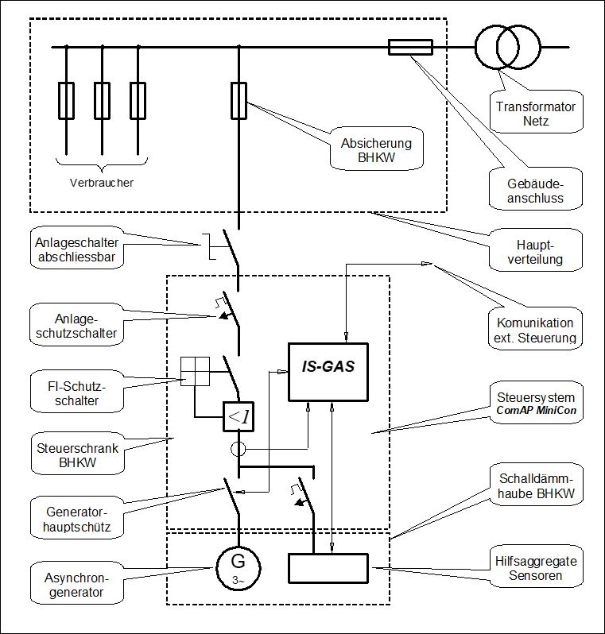

## Steuerung der BHKW-Anlage

### Bedienfeld des Schaltschrank

  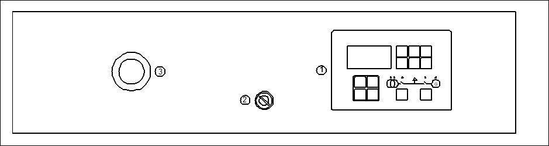

Legende :	

<table>
<tbody>
	<tr>
		<td>1</td>
		<td>Steuersystem IS-GAS mit Display, Tastatur und Signal LED</td>
	</tr>
	<tr>
		<td>2</td>
		<td>Schlüsselschalter für Zugriff in die Steuerung</td>
	</tr>
	<tr>
		<td>3</td>
		<td>Not-Aus Schalter</td>
	</tr>
</tbody>
</table>
#### Steuersystem IS-GAS
Das Steuersystem IS-GAS siehe Kapitel 11 sichert die komplette Steuerung, Überwachung und Bedienung der BIBLOC BV674 SBTLK. Sämtliche Betriebszustände, Fehlermeldungen und Parameter können über das integrierte Display abgerufen werden. Detaillierter Beschrieb siehe Pkt. 6.
#### Schlüsselschalter Steuerung Ein/Aus
Dieser Schlüsselschalter ermöglicht die komplette Sperrung der BIBLOC BV674 SBTLK indem die Ver-sorgung der Steuereinheit mit 12 VDC unterbrochen wird. Das Einschalten des Aggregats durch nichtautorisierten Personen kann damit unterbunden werden.
#### Not-Aus Schalter
Der Not-Aus Schalter dient zur Notabschaltung der BIBLOC BV674 SBTLK. Durch Drücken des Not-Aus Tasters entkoppelt sich die Anlage sofort vom Netz und schaltet unverzögert ab. 

 	Der Not-Aus Schalter darf nur im Notfall verwendet werden.
 _________________________________________________________________________

  

Der Not-Aus Schalter darf nur im Notfall verwendet werden.
_________________________________________________________________________

## Steuersystem ComAp IS GAS

### Allgemeine Beschreibung

Das Steuersystem IS-GAS (Fabrikat ComAp) ist speziell für das BIBLOC BV674 SBTLK entwickelt worden und ist direkt im Schaltschrank integriert. 

Sie ist eine kompakte SPS-Steuerung, welche die Steuerung, Überwachung und den Schutz der BHKW-Anlage mit diversen Zustand-überwachungen gewährleistet. 

Die Steuerung zeichnet sich durch hohe Beständigkeit gegen Fremdstörungen und Schwankungen der Versorgungsspannung aus. 

Das Steuersystem IS-GAS kann für die Synchronausführung (Netzparallel-Betrieb), wie auch für die Synchronaus-führung (Notstrom-Betrieb) verwendet werden. 

Dabei ist nur die Anzahl der zusätzlichen Module und die Software unterschiedlich. 

Das Steuersystem ist mit einer grafischen Anzeige ausgerüstet, was eine einfache Bedienung gewährleistet.

Sämtliche Betriebsparameter und Anlagezustände können am grafischen Display angezeigt oder visualisiert werden. Über ein Modem kann das BHKW fernüberwacht und gesteuert werden.

Das Steuerungssystem IS-GAS kennt zwei verschiedene Betriebarten des BIBLOC BV674 SBTLK: 

Den Hand- respektive Automatik-Modus. 

Bei beiden Betriebsmodi kann die Leistung manuell über die Bedieneinheit des Steuerungssystems eingestellt werden oder automatisch anhand des vorhandenen Stromverbrauchs reguliert werden (optional).

### Aufgaben des Steuersystems IS-GAS
Für den Betrieb des BIBLOC BV674 SBTLKübernimmt das Steuersystem folgende Aufgaben:

•	sammelt sämtliche gemessene Betriebsparameter und garantiert mit entsprechend vorgege-benen Grenzwerten den Schutz von Maschine und Personen

•	steuert alle notwendigen Hilfsgeräte wie Pumpen, Ventile oder Zündung und sichert damit einen korrekten Betrieb für den Netzparallel- und Ersatzstrombetrieb.

•	steuert den Startvorgang des BIBLOC mittels des Synchrongenerators.

•	ermöglicht eine Leistungsregulierung aufgrund des momentanen elektrischen Gebäudeverbrauchs

•	erhebt eine Betriebsstatistik bezüglich Betriebsstunden, Startzahl und produzierte Wirk- und Blindenergie

•	registriert die Betriebsparameter periodisch in ein History-Register (Geschichte)

•	sichert die Verbindung zu einem übergeordnetem Steuersystem mittels potentialfreien Kontakten

•	ermöglicht die Fernüberwachung und Fernmonitoring der Störungen über ein Modem (sofern Telefonanschluss vorhanden)

•	verbindet mehrere IS-GAS-Steuersysteme bei Mehrmodulanlagen.
 
### Das Operations-Panel

Das Bedienfeld des Steuersystems IS-GAS ist wie folgt eingeteilt:

•	Leuchtdioden zur Anzeige von Betriebszuständen
•	Grafisches Display
•	Funktionstasten
 
#### Leuchtdioden

Die Zustandssignalisation der wichtigsten elektrischen Komponenten erfolgt über Leuchtdioden, welche über einem einfachen Prinzipschema angeordnet sind. 

In diesem Prinzipschema sind von links nach rechts folgende Komponenten dargestellt:

•	Transformator als Symbol für das Netz
•	Netzkoppelschalter
•	Verbraucher (Pfeil nach oben)
•	Generatorschütz
•	Generator

Die Leuchtdioden zeigen folgende Zustände an:

•	grüne Diode über Generator: 
	Der Generator dreht, ist erregt und die Spannung liegt innerhalb der Toleranz.
	
•	grüne Diode über Transformator:
	Das Netz ist vorhanden und die Netzspannung liegt innerhalb der Toleranz.
	
•	grüne Diode über Generatorschütz:
	blinkt	Das Steuersystem synchronisiert zum Netz an: Der Generatorschütz ist geschlossen
	
•	rote Diode über Generator:
	Das Aggregat ist in Störung
	
•	rote Diode über Netzkoppelschalter:
	Es liegt eine Netzstörung vor
 
#### Grafisches Display
Das Display mit Hintergrundbeleuchtung hat eine Auflösung von 128 x 64 Pixel. 

Damit können sämtliche Informationen bezüglich Betriebszuständen und Parameter abgerufen werden. 
Die verschiedenen Informationen sind in Menüs eingeteilt (siehe Kapitel 6.4).

#### Funktionstasten

Um Einstellungen, Änderungen oder Messwerte abzurufen, stehen Funktionstasten zur Verfügung.
 
Nachfolgend ist eine Erläuterung zu den einzelnen Tasten aufgeführt.

Mit den MODE-Tasten erfolgt der Wechsel zwischen den verschiedenen Betriebsmodi MAN / OFF / AUT.

Durch Drücken der PAGE-Taste kann zwischen den einzelnen Menüs gewechselt werden. Innerhalb der Menüs bewegt man sich mit den PFEIL-Tasten.

Mit den PFEIL-Tasten AB und AUF wird der Pfeilbalken auf- und abbewegt. 
Damit erfolgt auch zum Beispiel die Auswahl einer bestimmten Parametergruppe.

Die PFEIL-Tasten dienen auch zum Ändern von Parameterwerten.
 
Befindet sich die Pfeilmarkierung über einer bestimmten Parametergruppe, werden durch drücken der ENTER-Taste die entsprechenden Parameterwerte angewählt und angezeigt.

Wird ein Wert verändert, muss dieser mit der ENTER-Taste bestätigt werden.

Mit der Taste FAULT RESET wird ein anstehender Fehler oder Alarm quittiert, sofern sich der entsprechende Zustand normalisiert hat. Durch die Quittierung wird auch der Ausgang STÖRUNG zurückgesetzt.

Durch die Tasten START und STOP wird das Aggregat im Modus HAND gestartet und abgeschaltet.
Im Modus OFF haben die Tasten keine Funktion und im AUTO-Modus ist nur die Taste STOP aktiv.
 
Die Tasten HORN RESET und ON/OFF werden für die Steuerung der BIBLOC Micro nicht verwendet und haben somit keine Funktion.
 
### Die Menüs

#### Menü Messung

Beim Einschalten des Steuersystems IS-GAS und einer Initialisierung wird zuerst das Menü Messung angezeigt. 
Auf der ersten Seite ist die momentane elektrische Leistung grafisch dargestellt.
Darüber wird der aktuelle Betriebsmodus angezeigt.

Das Textfeld neben der Grafik informiert über den aktuellen Betriebszustand, Betriebsart und einige relevante Messwerte.
Durch drücken der Taste wird die zweite Seite im Menü Messung ange-zeigt. Hier sind die Messwerte in Klartext sowie einem horizontalen Balkendiagramm dargestellt
Die entsprechenden Alarm- und Voralarmwerte sind im Balkendiagramm mit vertikalen Strichen eingezeichnet.
Durch weiteres drücken der Taste   gelangt man zur nächsten Seite im Menü. Wiederum werden analoge Messwerte in Klartext und Balkendiagramm angezeigt. 

Mit der Taste wird weiter zu den nachfolgenden Seiten geblättert.
Im Unterschied zu den vorhergegangenen Seiten werden hier die Messwerte tabellarisch aufgeführt. 
Digitale Messgrössen werden entweder mit 0-(Eingang inaktiv) oder mit 1-(Eingang aktiv) angegeben.

Nach der Zustandsanzeige der digitalen Eingänge wird die BHKW-Statistik angezeigt.
Hier wird total produzierte Wirk- und Blindleistung, die Zeit bis zur nächsten Wartung, die totalen Betriebsstunden sowie die Anzahl erfolgten Starts aufgelistet.
Als letzte Seite wird die Alarmliste ange-zeigt. 

Hier wird angegeben, wie viele und welche Störungen anstehen.
Wird die Taste nochmals gedrückt gelangt man wieder zur 1. Seite mit der grafischen Leistungsdarstellung.
 
Wird anstelle der Taste   (AB) die Taste   (AUF) gedrückt, werden die Seiten im Menü Messung in umgekehrter Reihenfolge abgerufen. 
Um die Alarmliste oder die Statistik schneller abzurufen empfiehlt sich daher die Taste AUF zu benutzen

#### Menü Parameter
Im Menü Parameter können sämtliche Betriebsparameter aufgerufen und eingestellt werden. Die Parameter sind in Parametergruppen unterteilt.

Die Änderung von Parameter, welche mit _ bezeichnet sind, können die Sicherheit der Anlage gefährden und dürfen nur durch geschulte Servicetechniker verändert werden. 
Der Zugriff auf diese Parameter ist codiert.

Durch drücken der Taste   wird zwischen den verschiedenen Menüs gewechselt. Vom Menü Messung wech-selt das Steuersystem ins Menü Para-meter.
Mit den PFEIL-Tasten können die Parametergruppen ausgewählt werden. Durch drücken der Taste ENTER wird die entsprechende Gruppe geöffnet.
Der gewünschte Parameter kann nun mit der PFEIL-Taste ausgewählt und mit ENTER bestätigt werden.
Sofern der Parameter nicht mit einem *bezeichnet* ist, kann der Parameterwert mit den PFEIL-Tasten verändert werden.
 
#### Menü History
Sämtliche Änderungen in der Betriebsart, Ein- oder Abschaltungen sowie Fehler- und Alarmmeldungen werden in einem History-Register gespeichert. Während dem Betrieb wird stündlich eine Kontrolle aller Parameter durchgeführt.

Dieser Vorgang wird als *Periodische Abtastung* in der History hinterlegt.

Die Eintragungen werden mit Zeit, Datum und den Messwerten im History eingetragen. Inge-samt können 118 Meldungen in diesem Register hinterlegt werden. 

Sind alle 118 Zeilen belegt, wird für eine Neueintragung stets die älteste Information gelöscht.

Das History-Register ist für den Betreiber und Servicetechniker ein geeignetes Hilfsmittel, um bei Störungen mögliche Ursachen zu finden. 
 
Mit den PFEIL-Tasten können die einzelnen Eintragungen angewählt werden. 

Jeder History-Eintrag enthält folgende, in Spalten angeordneten Informationen:

<table>
<tbody>
	<tr>
		<td>Bezeichung</td>
		<td>Beschreibung der Eintragung</td>
	</tr>
	<tr>
		<td>Grund</td>
		<td>Beschreibung des Ereignisses</td>
	</tr>
	<tr>
		<td>Zeit</td>
		<td>Uhrzeit des Ereignisses</td>
	</tr>
	<tr>
		<td>Datum</td>
		<td>Datum des Ereignisses</td>
	</tr>
	<tr>
		<td>TWp</td>
		<td>Wassertemperatur primär</td>
	</tr>
	<tr>
		<td>TWs</td>
		<td>Wassertemperatur sekundär</td>
	</tr>
	<tr>
		<td>TAbg</td>
		<td>Abgastemperatur nach Abgas-WT</td>
	</tr>
	<tr>
		<td>LS</td>
		<td>Lambdaspannung</td>
	</tr>
	<tr>
		<td>Tkop</td>
		<td>Abgastemperatur vor Abgas-WT</td>
	</tr>
	<tr>
		<td>Netz</td>
		<td>Netzmessung (Spannungen, Frequenz)</td>
	</tr>
	<tr>
		<td>Sm</td>
		<td>diverse digitale Zustände</td>
	</tr>
	<tr>
		<td>Lst</td>
		<td>elektrische Leistung</td>
	</tr>
	<tr>
		<td>Cos</td>
		<td>Cos-Phi</td>
	</tr>
	<tr>
		<td>Char</td>
		<td>Cos-Phi Regelung (L-R-C) Charakteristik</td>
	</tr>
	<tr>
		<td>Dr</td>
		<td></td>
	</tr>
	<tr>
		<td>FrG</td>
		<td>Frequenz Generator</td>
	</tr>
	<tr>
		<td>Ug1</td>
		<td>Spannung Phase 1 Genera-tor</td>
	</tr>
	<tr>
		<td>Ug2</td>
		<td>Spannung Phase 2 Genera-tor</td>
	</tr>
	<tr>
		<td>Ug3</td>
		<td>Spannung Phase 3 Genera-tor</td>
	</tr>
	<tr>
		<td>Un1</td>
		<td>Spannung Phase 1 Netz</td>
	</tr>
	<tr>
		<td>Un2</td>
		<td>Spannung Phase 2 Netz</td>
	</tr>
	<tr>
		<td>Un3</td>
		<td>Spannung Phase 3 Netz</td>
	</tr>
	<tr>
		<td>Ig1</td>
		<td>Strom Phase 1 Generator</td>
	</tr>
	<tr>
		<td>Ig2</td>
		<td>Strom Phase 2 Generator</td>
	</tr>
	<tr>
		<td>Ig3</td>
		<td>Strom Phase 3 Generator</td>
	</tr>
	<tr>
		<td>Eins</td>
		<td>Speisung Steuerung (12VDC)</td>
	</tr>
	<tr>
		<td>Pol</td>
		<td></td>
	</tr>
	<tr>
		<td>LO1</td>
		<td></td>
	</tr>
	<tr>
		<td>LWa</td>
		<td></td>
	</tr>
</tbody>
</table>

Durch drücken der Taste ENTER wer-den die einzelnen Spalten angezeigt.
 
### Ändern von Parametern

#### Service-Code eingeben

Alle Parameter, welche mit einem _ bezeichnet sind, können nur geändert werden, wenn der Servicecode gegeben wird. Diese Parameter dürfen grundsätzlich durch den Servicetechniker geändert werden.  
Durch drücken der Taste   wechselt das Steuersystem ins Menü Parameter.
Wählen Sie mit der PFEIL-Taste die Pa-rametergruppe Code an und drücken Sie die Taste ENTER um zur Code-Eingabe zu gelangen.
Mit den PFEIL-Tasten kann nun die Code-Zahl eingestellt und mit ENTER bestätigt werden. Der Code muss allen-falls bei der Servicefirma angefragt wer-den.
 
	Die Anlage wird erst dann wieder freigegeben, wenn die Wartung ausgeführt worden ist und die Betriebsstundenzahl für den nächsten Service neu eingestellt worden ist.
	
#### Einstellen der Servicestunden
Nach jedem Service muss die Betriebsstundenzahl für die nächste Wartung neu eingegeben werden. Damit wird dem Betriebspersonal über das Display angezeigt, wann die nächste periodi-sche Wartung fällig ist. 

Durch drücken der Taste   wechselt das Steuersystem ins Menü Parameter.
Wählen Sie mit der PFEIL-Tasten die Parametergruppe Grundparameter an und drücken Sie die Taste ENTER um die entsprechende Gruppe zu geöff-net.

Wählen Sie den Parameter Naechst-Wart mit der PFEIL-Taste aus und bestätigt Sie mit ENTER.
Mit den PFEIL-Tasten kann nun die Betriebsstundenzahl für den nächsten Service eingestellt werden.

Sofern der Parameter mit einem * bezeichnet ist, muss vorgängig der Servicecode eingegeben werden (siehe 6.5.1).

Beispiel:	Das Serviceintervall beträgt 800 h und das BHKW hat zur Zeit 6400 Betriebsstunden. Die nächste Wartung erfolgt daher bei 7200 Betriebsstunden.
 
#### Einstellen der maximalen Servicestundenüberschreitung
Um zu verhindern, dass die BHKW-Anlage den vorgegebenen Wartungsintervall nicht zu lange überschreitet, kann über den Parameter ServUeberschri die maximal zulässige Service-stundenüberschreitung eingestellt werden. Wird die Wartung bis zu diesem Zeitpunkt nicht durchgeführt, schaltet das BHKW ab. 

Durch drücken der Taste   wechselt das Steuersystem ins Menü Parameter.
Wählen Sie mit der PFEIL-Tasten die Parametergruppe Grundparameter an und drücken Sie die Taste ENTER um die entsprechende Gruppe zu geöff-net.

Wählen Sie den Parameter Ser-vUeberschri mit der PFEIL-Taste aus und bestätigt Sie mit ENTER.
Mit den PFEIL-Tasten kann nun die Stundenzahl für die maximale Service-stunden-überschreitung erhöht oder ge-senkt und mit ENTER bestätigt werden.
Sofern der Parameter mit einem _ be-zeichnet ist, muss vorgängig der Ser-vicecode eingegeben werden (siehe 6.5.1).
 
Beispiel:	Die maximale Servicestundenüberschreitung beträgt 100 h. Der nächste periodische Service ist bei 7200 Betriebsstunden fällig. Ist die Wartung bis 7300 Betriebsstunden nicht durchgeführt worden, schaltet das BHKW ab.
 
### Die Betriebsmodi
#### Einschalten des Steuersystem IS-GAS

Das Steuersystem wird mittels Schlüsselschalter (siehe Kapitel 5.1 Position 2) eingeschaltet. Damit erfolgt die Spannungsversorgung 12 VDC des Steuersystems.
Das Display leuchtet auf und nach einer kurzen Initialisierung, wird das Menü Messung ange-zeigt (grafische Darstellung der elektrischen Leistung). Dabei schaltet das Steuersystem in den Betriebsmodus, in dem das BHKW vor der Abschaltung war.

#### Betriebsmodus *AUT*
Dieser Modus wird im Betriebsmenü mit einer hinterleuchteten Bezeichnung *AUT* (automa-tisch) angezeigt. Sofern keine Störung aktiv ist, erscheint im rechten Textfeld *VORBEREITET* in der obersten Zeile. Damit wird signalisiert, dass die Bedingungen für einen Betrieb erfüllt sind.

START-Prozedur
Im Automatik-Betrieb wird die Anlage über eine externe Freigabe ein- bzw. ausgeschaltet. Dies erfolgt über einen potentialfreien Kontakt, welcher an Klemmen im Schaltschrank angeschlos-sen wird. Bei geschlossenem Kontakt startet die Anlage und schaltet sich wieder ab, sobald der Kontakt geöffnet wird. Die externe Freigabe kann auf Grund eines externen Wärme-, Strom- (Spitzenstromsteuerung) oder Gasmanagements erfolgen.
Wird das BHKW von der externen Steuerung freigegeben, wird der Haupt- und Sternschütz des Generators gezogen, wodurch dieser als Elektromotor betrieben wird und der Motor mit 1500 1/min. dreht. Danach wird die Zündung eingeschalten und einige Sekunden später die Gasventile geöffnet, wodurch nun der Motor den Generator antreibt. Zeitverzögert erfolgt die Stern-Dreieckumschaltung.
Nach erfolgtem Start wird das BHKW während einer Aufwärmphase mit einer vorgegebenen Minimalleistung (30 % der Nominalleistung) betrieben. Auf dem Display wird *BELASTUNG* angezeigt. Nach der Aufwärmphase (minimale Motortemperatur erreicht oder maximale Auf-wärmzeit abgelaufen) erhöht das BIBLOC BV674 SBTLKseine Leistung auf die programmierte Nominalleistung.

STOP-Prozedur
Entzieht die externe Steuerung dem BHKW die Freigabe oder wird die Taste STOP gedrückt, beginnt das Aggregat mit der Abschalt-Prozedur. Dabei wird die Leistung auf die Minimalleistung reduziert (am Display erscheint *ENTLASTET*) und öffnet den Generatorschütz.
Nach einer Auslaufzeit von einer Minute wird der Motor abgeschaltet, indem die Ausgänge für Zündung und Gasventile zurückgesetzt werden. Die Primär- und Sekundärpumpe bleiben wäh-rend der Nachkühlzeit in Betrieb, um den Motor weiter abzukühlen. Das BHKW ist in dieser Zeit bereits für den nächsten Start bereit. Am Display erscheint *VORBEREITET*.
 
 	Im Mode *AUT* bleibt die Taste STOP aktiv. Durch drücken der Taste STOP schaltet die Steuerung in den Mode *MAN* um und beginnt mit der Stoproutine. Für einen weiteren Automatik-Betrieb muss zurück in den Mode *AUT* gewech-selt werden.

 	Schaltet das BHKW in Folge einer Störung ab, startet das Aggregat nach Quit-tierung mit der Taste FAULT RESET automatisch.
 
#### Betriebsmodus *MAN*
Im Betriebsmenü ist die Bezeichnung *MAN* (manuel) hinterleuchtet. Sofern keine Störung aktiv ist, erscheint im rechten Textfeld *VORBEREITET* in der obersten Zeile. 
Damit wird signalisiert, dass die Bedingungen für einen Betrieb erfüllt sind.

START-Prozedur
Im Unterschied zum Mode *AUT* wird im Mode *MAN* das Aggregat nicht durch eine externe Freigabe gestartet, sondern durch drücken der Taste START.
Der weitere Verlauf der Startroutine entspricht jenem im Mode *AUT*.

STOP-Prozedur
Das Abschalten des BHKW erfolgt durch drücken der Taste STOP.
Der weitere Verlauf der Stopproutine entspricht jenem im Mode *AUT*. 

 	Im Mode *MAN* reagiert das Steuersystem nicht auf ein externes Freigabesig-nal oder eine externe Leistungsregulierung.
#### Betriebsmodus *AUS*
Im Betriebsmenü wird die Bezeichnung *AUS* hinterleuchtet und im rechten Textfeld erscheint *SPS Aus* in der obersten Zeile.
Ein Start des BHKW-Aggregats ist nicht möglich. Das Steuersystem IS-GAS reagiert weder auf einen externen noch internen Startbefehl. Die Ausgänge des Ausgangsmoduls werden nicht an-gesteuert (Ausnahme Rücklaufhochhaltung schliesst).

## Schutzfunktionen und Sensoren
Um einen sicheren und zuverlässigen Betrieb der BHKW-Anlage zu gewährleisten, sind im BIBLOC BV674 SBTLK diverse Schutzfunktionen eingebaut, welche die Betriebszustände des Aggrega-tes sowohl im Betrieb als auch im Stillstand überwachen.
Dazu werden alle betriebsrelevanten Daten erfasst und vom Steuersystem IS-GAS ausgewertet. Dies ist eine Voraussetzung zur Erfüllung der geltenden Vorschriften und verhindert schlussendlich auch Schäden an Mensch und Maschine.
Es bestehen zwei verschiedene IP23en der BHKW-Anlage:

•	elektrische Schutzeinrichtungen

•	technische Schutzeinrichtungen

### elektrische Schutzeinrichtungen

Siehe Punkt 9.4 *Schutzeinrichtungen*

### technische Schutzeinrichtungen
Durch die technischen Schutzeinrichtungen werden mechanische und thermische Betriebszustände des BHKW-Aggregates überwacht. Dazu sind analoge und digitale Sensoren in der Maschine eingebaut.

*Analoge Sensoren* messen konstant eine Messgrösse und geben diese über ein entsprechendes Signal dem Steuersystem weiter, welches das Signal in einen Messwert umwandelt und anzeigt.

*Digitale Sensoren* liefern dem Steuersystem ein binäres Signal (0/1), womit einzig der aktuelle Zustand (OK oder nicht OK) der entsprechenden Schutzeinrichtung signalisiert wird.

Die analogen Messwerte wie auch die digitalen Informationen können direkt auf dem Display der Bedieneinheit aufgerufen und angezeigt werden.
 
### Sensoren und ihre Positionierung

  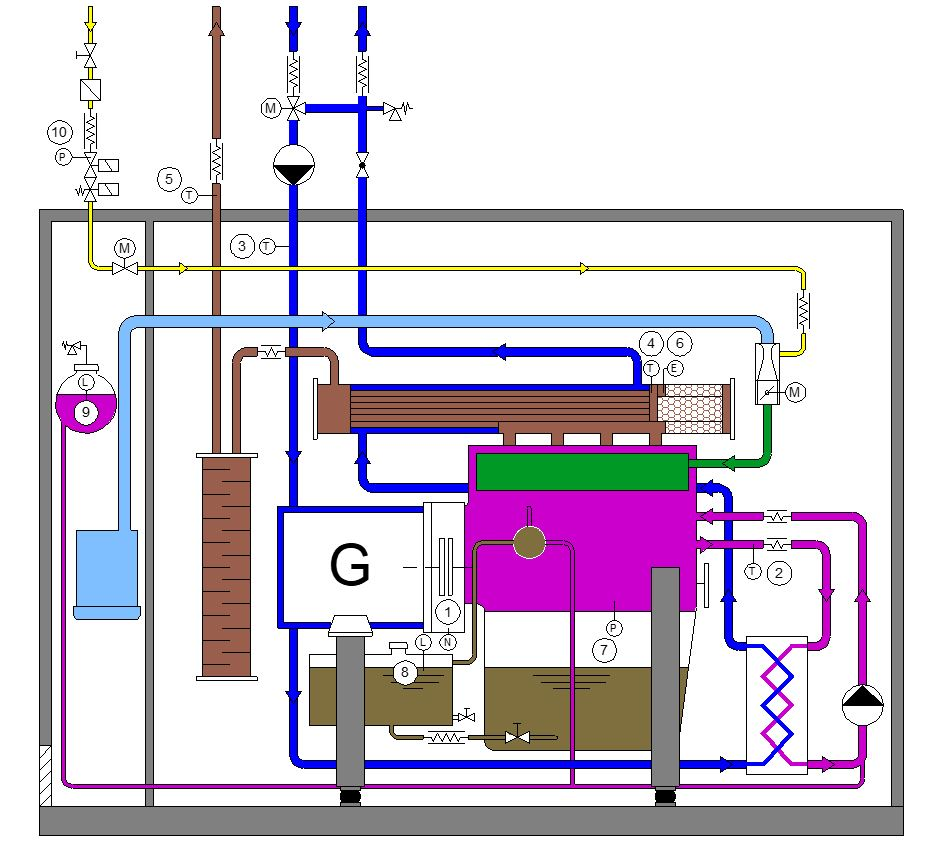

Legende :

<table>
<tbody>
	<tr>
		<td>1</td>
		<td>Drehzahlgeber Steuerung</td>
		<td>6</td>
		<td>Lambdasonde</td>
	</tr>
	<tr>
		<td>2</td>
		<td>Temperaturfühler Motorkreis</td>
		<td>7</td>
		<td>Öldruckschalter</td>
	</tr>
	<tr>
		<td>3</td>
		<td>Temperaturfühler Rücklauf</td>
		<td>8</td>
		<td>Ölniveauschalter Reservoir</td>
	</tr>
	<tr>
		<td>4</td>
		<td>Thermoelement Abgas vor WT</td>
		<td>9</td>
		<td>Wasserniveauschalter</td>
	</tr>
	<tr>
		<td>5</td>
		<td>Thermoelement Abgas nach WT</td>
		<td>10</td>
		<td>Gasdruckwächter</td>
	</tr>
</tbody>
</table>

#### Übersicht der analogen Sensoren

##### Analog-Sensor Nr. 1
<table>
<tbody>
	<tr>
		<td>gemessene Grösse</td>
		<td>Motordrehzahl</td>
	</tr>
	<tr>
		<td>Art des Fühlers</td>
		<td>Induktionsfühler</td>
	</tr>
	<tr>
		<td>Hersteller / Typ</td>
		<td>Bosch / IS 03</td>
	</tr>
	<tr>
		<td>Messbereich</td>
		<td>0 - 3500 min-1</td>
	</tr>
</tbody>
</table>

*Beschreibung:*
Der Induktionsfühler (Pick-Up) ist auf dem Schwungradgehäuse montiert, wo er die Zähne des Anlasserkranzes zählt. Diese Angaben werden durch das Steuersystem ausgewertet und für die Steuerung verschiedener Funktionen verwendet. Sicherheitsrelevant  davon ist  die Begrenzung der maximal zulässigen Drehzahl, die standardmässig auf 3300 min-1 eingestellt ist.

##### Analog-Sensor Nr. 2

<table>
<tbody>
	<tr>
		<td>gemessene Gr&#246;sse</td>
		<td>Motortemperatur</td>
	</tr>
	<tr>
		<td>Art des Fühlers</td>
		<td>PT 100</td>
	</tr>
	<tr>
		<td>Hersteller / Typ</td>
		<td>JUMO / 902004/20</td>
	</tr>
	<tr>
		<td>Messbereich</td>
		<td>-50 bis +150 °C</td>
	</tr>
</tbody>
</table>

*Beschreibung:*
Der Temperaturfühler ist in die Kühlwasser-Austrittsleitung beim Motor eingeschraubt und misst die aktuelle Motortemperatur.
Er schützt den Motor vor einer Überhitzung.
Das Steuersystem meldet einen Voralarm beim Überschreitung der Warngrenze von 93 °C und schaltet das Aggregat bei Überschreitung der maximalen Wassertemperatur von 95 °C ab.

##### Analog-Sensor Nr. 3

<table>
<tbody>
	<tr>
		<td>gemessene Grösse</td>
		<td>Rücklauf Sekundärkreislauf</td>
	</tr>
	<tr>
		<td>Art des Fühlers</td>
		<td>PT 100</td>
	</tr>
	<tr>
		<td>Hersteller / Typ</td>
		<td>JUMO / 902004/20</td>
	</tr>
	<tr>
		<td>Messbereich</td>
		<td>-50 bis +150 °C</td>
	</tr>
</tbody>
</table>

*Beschreibung:*
Der Temperaturfühler ist am Eintritt (Rücklauf) des Sekundärkreislaufes eingeschraubt und misst die aktuelle Rücklauftemperatur nach dem 3-Wegventil der Hochhaltung.
Diese Temperatur ist die Führungsgrösse zur Regulierung einer konstanten Rücklauftemperatur im Sekundärkreislauf, welche die minimale Motortemperatur und die Verhinderung von Kondensat garantiert. Der Sollwert liegt zwischen minimal 60°C und maximal 70°C.

##### Analog-Sensor Nr. 4

<table>
<tbody>
	<tr>
		<td>gemessene Grösse</td>
		<td>Abgastemperatur vor Abgaswärmetauscher</td>
	</tr>
	<tr>
		<td>Art des Fühlers</td>
		<td>Thermoelement Typ K</td>
	</tr>
	<tr>
		<td>Hersteller / Typ</td>
		<td>JUMO / 901221/34-1043</td>
	</tr>
	<tr>
		<td>Messbereich</td>
		<td>0 bis +1000 °C</td>
	</tr>
</tbody>
</table>

*Beschreibung:*
Dieses Thermoelement ist unmittelbar nach dem Katalysator in die interne Abgasleitung montiert
Es schützt den Katalysator vor einer Überhitzung infolge eines falschen Verbrennungsgemisches.
Das Steuersystem schaltet das Aggregat bei Überschreitung der maximalen Abgastemperatur von 700 °C ab.

##### Analog-Sensor Nr. 5

<table>
<tbody>
	<tr>
		<td>gemessene Grösse</td>
		<td>Abgastemperatur nach Abgaswärmetauscher</td>
	</tr>
<tbody>
	<tr>
		<td>Art des Fühlers</td>
		<td>Thermoelement Typ <em>K</em></td>
	</tr>
	<tr>
		<td>Hersteller / Typ</td>
		<td>JUMO / 901221/34-1043</td>
	</tr>
	<tr>
		<td>Messbereich</td>
		<td>0 bis +1000 °C</td>
	</tr>
</tbody>
</table>

*Beschreibung:*
Dieser Temperaturfühler ist nach dem Abgaswärmetauscher in der Abgasleitung ausserhalb des BHKW-Moduls montiert. 
Er schützt die nachfolgende Abgasleitung vor einer Überhitzung. 
Das Steuersystem schaltet das Aggregat bei Überschreitung der maximalen Abgastemperatur von 160 °C ab. 
Diese Schutzeinrichtung ist vor allem bei Verwendung von Kunststoff-Abgasleitungen wichtig.

##### Analog-Sensor Nr. 6

<table>
<tbody>
	<tr>
		<td>gemessene Grösse</td>
		<td>Sauerstoffgehalt im Abgas</td>
	</tr>
<tbody>
	<tr>
		<td>Art des Fühlers</td>
		<td>Lambdasonde</td>
	</tr>
	<tr>
		<td>Hersteller / Typ</td>
		<td>BOSCH / LSH 24 (Erdgas), LSH 11 (Biogas)</td>
	</tr>
	<tr>
		<td>Messbereich</td>
		<td>0 bis 900 mV</td>
	</tr>
</tbody>
</table>

*Beschreibung:*
Die Lambdasonde ist unmittelbar vor dem Katalysator im Abgaswärmetauscher montiert. 
Sie misst permanent den Restsauerstoff im Abgas. 
Der Sauerstoffgehalt im Abgas ist die Führungsgrösse für die Lambdaregelung, welche ein konstantes Verbrennungsgemisch reguliert.
 
#### Übersicht der digitalen Sensoren

##### Digital-Sensor Nr. 7
<table>
<tbody>
	<tr>
		<td>gemessene Grösse</td>
		<td>Öldruck</td>
	</tr>
<tbody>
	<tr>
		<td>Art des Fühlers</td>
		<td>Druckschalter</td>
	</tr>
	<tr>
		<td>Hersteller / Typ</td>
		<td>Motorbestandteil</td>
	</tr>
</tbody>
</table>

*Beschreibung:*
Der Öldruckschalter ist am Motor in den Schmierölkreislauf eingebaut und überwacht den Öldruck. 
Bei zu tiefem Öldruck öffnet der Kontakt im Druckschalter, wodurch das Steuersystem das Aggregat sofort abschaltet.
Damit wird das Aggregat vor ungenügender Schmierung geschützt.

##### Digital Sensor Nr. 8

<table>
<tbody>
	<tr>
		<td>gemessene Grösse</td>
		<td>Öllevelschalter Ölreservoir</th>
	</tr>
</thead>
<tbody>
	<tr>
		<td>Art des Fühlers</td>
		<td>Niveauschalter</td>
	</tr>
	<tr>
		<td>Hersteller / Typ</td>
		<td>Gantner NO140</td>
	</tr>
</tbody>
</table>

*Beschreibung:*
Der Ölniveauschalter ist im Ölreservoir montiert und überwacht Ölstand. 
Bei zu tiefem Ölstand öffnet der Kontakt und schaltet das BHKW-Modul ab.

##### Digital Sensor Nr. 9

<table>
<tbody>
	<tr>
		<td>gemessene Grösse</td>
		<td>Wasserdruckschalter</td>
	</tr>
</thead>
<tbody>
	<tr>
		<td>Art des Fühlers</td>
		<td>Niveauschalter</td>
	</tr>
	<tr>
		<td>Hersteller / Typ</td>
		<td>Hubacontrol</td>
	</tr>
</tbody>
</table>

*Beschreibung:*
Der Wasserdruckschalter ist im Motorkreis (Primärkreislauf) montiert und überwacht den Wasserdruck im Primärkreislauf. Bei zu tiefem Wasserdruck öffnet der Kontakt und schaltet das BHKW-Modul ab.

##### Digital Sensor Nr. 10

<table>
<tbody>
	<tr>
		<td>gemessene Grösse</td>
		<td>Gasdruck</td>
	</tr>
</thead>
<tbody>
	<tr>
		<td>Art des Fühlers</td>
		<td>Druckschalter</td>
	</tr>
	<tr>
		<td>Hersteller / Typ</td>
		<td>Kromschröder, DG40VC16W</td>
	</tr>
</tbody>
</table>

*Beschreibung:*
Der Gasdruckschalter ist am Gasmultiblock vor dem Aggregat in der Gasleitung montiert und überwacht den Gasdruck. 
Sinkt der Gasdruck unter den voreingestellten Wert, schaltet der Kontakt im Druckschalter, wodurch das Steuersystem das Aggregat sofort abschaltet. 
Damit wird das Aggregat wie auch die Gaszuleitung vor einem Gasunterdruck geschützt.

## Störungen und Diagnostik
Überschreiten ein oder mehrere Betriebsparameter ihren vorgegebenen Grenzwert, wird das Aggregat über das Steuersystem IS-GAS abgeschaltet. Die entsprechende Fehlermeldung wird ins Fehler- und Historyregister geschrieben.

### interne Störungsursachen
Unter internen Störungen versteht man Fehler des BHKW-Aggregates, welche auf mangelhafte oder defekte Bestandteile des BHKW zurückzuführen sind. Aber auch ungenügende Reglerein-stellungen können Fehler verursachen. Häufig entstehen diese durch betriebsbedingten Ver-schleiss von Bauteilen. Im Wartungsplan ist ein präventiver Austausch von diversen Bauteilen vorgesehen, was jedoch nicht ausschliesst, dass ein Bauteil seine vorgesehene Standzeit nicht erreicht.

Die Behebung dieser Störungen erfolgt durch geschulte Servicetechniker. Sie erfolgt nach Ein-gang eines Reparaturauftrages des Betreibers. Die Deckung der Reparaturkosten ist durch die im Kaufvertrag aufgeführten Garantiebestimmungen geregelt. Nach Ablauf der Garantie wird der Aufwand dem Betreiber verrechnet, sofern für die Wartung der BIBLOC BIBLOC BV674 SBTLKkein Vollwartungsvertrag abgeschlossen wurde.

### externe Störungsursachen
Darunter versteht man Störungen, welche auf Grund von Problemen in der Einbindung des BHKW verursacht werden. Sie sind oft auf regeltechnische und thermisch-hydraulische Proble-me des Sekundärkreises (Heizkreis) oder auf Störungen in der elektrischen Einbindung zurück-zuführen.
Die Behebung solcher Störungen muss nicht zwingend durch BHKW-Servicetechniker ausge-führt werden, jedoch in dessen Absprache. Solche Störungsbehebungen sind in einem allfällig abgeschlossenen Vollwartungsvertrag nicht eingeschlossen und unterliegen auch nicht der Anla-gegarantie.
Die folgende Zusammenfassung erläutert Störungen und deren mögliche Ursachen, welche nach Rücksprache mit Service-Abteilung der Firma BES gegebenenfalls durch den Betreiber selber behoben werden können. 

### Störungen, ihre Ursachen und Behebung

<table>
<thead>
	<tr>
		<th>Meldung</th>
		<th>Beschreibung</th>
		<th>mögliche Ursachen</th>
		<th>Störungsbehebung</th>
	</tr>
</thead>
<tbody>
	<tr>
		<td>Sto P Oel</td>
		<td>Sensorstörung Öldruckgeber</td>
		<td>Fühler defekt</td>
		<td>Öldruckfühler wechseln</td>
	</tr>
	<tr>
		<td></td>
		<td></td>
		<td>Kabelbruch</td>
		<td>Verkabelung kontrollieren und evtl. reparieren</td>
	</tr>
	<tr>
		<td></td>
		<td></td>
		<td></td>
		<td></td>
	</tr>
	<tr>
		<td>Sto L Oel</td>
		<td>Sensorstörung Ölstand</td>
		<td>Fühler defekt</td>
		<td>Ölniveauschalter des Ölniveaureglers wechseln</td>
	</tr>
	<tr>
		<td></td>
		<td></td>
		<td>Kabelbruch</td>
		<td>Verkabelung kontrollieren und evtl. reparieren</td>
	</tr>
	<tr>
		<td></td>
		<td></td>
		<td></td>
		<td></td>
	</tr>
	<tr>
		<td>Sto L Wasser</td>
		<td>Sensorstörung Ölstand</td>
		<td>Fühler defekt</td>
		<td>Wasserstandfühler wechseln</td>
	</tr>
	<tr>
		<td></td>
		<td></td>
		<td>Kabelbruch</td>
		<td>Verkabelung kontrollieren und evtl. reparieren</td>
	</tr>
	<tr>
		<td></td>
		<td></td>
		<td></td>
		<td></td>
	</tr>
	<tr>
		<td>Sto T Wasser</td>
		<td>Sensorstörung</td>
		<td>Fühler defekt</td>
		<td>Motorkühlwassertemperatur wechseln</td>
	</tr>
	<tr>
		<td></td>
		<td>Motorkühlwassertemperatur</td>
		<td>Kabelbruch</td>
		<td>Verkabelung kontrollieren und evtl. reparieren</td>
	</tr>
	<tr>
		<td></td>
		<td></td>
		<td></td>
		<td></td>
	</tr>
	<tr>
		<td>Sto Sek T</td>
		<td>Sensorstörung</td>
		<td>Fühler defekt</td>
		<td>Temperaturfühler wechseln</td>
	</tr>
	<tr>
		<td></td>
		<td>Rücklauftemperatur</td>
		<td>Kabelbruch</td>
		<td>Verkabelung kontrollieren und evtl. reparieren</td>
	</tr>
	<tr>
		<td></td>
		<td></td>
		<td></td>
		<td></td>
	</tr>
	<tr>
		<td>Sto Abgasfühler</td>
		<td>Sensorstörung</td>
		<td>Fühler defekt</td>
		<td>Temperaturfühler wechseln</td>
	</tr>
	<tr>
		<td></td>
		<td>Abgastemperatur</td>
		<td>Kabelbruch</td>
		<td>Verkabelung kontrollieren und evtl. reparieren</td>
	</tr>
	<tr>
		<td></td>
		<td></td>
		<td></td>
		<td></td>
	</tr>
	<tr>
		<td>Fhl P Oel</td>
		<td>Fehler</td>
		<td>Ölpumpe ist defekt</td>
		<td>Service anrufen</td>
	</tr>
	<tr>
		<td></td>
		<td>Öldruck zu niedrig</td>
		<td>Verschleiss am Motor</td>
		<td>Service anrufen</td>
	</tr>
	<tr>
		<td></td>
		<td></td>
		<td></td>
		<td></td>
	</tr>
	<tr>
		<td>Fhl L Oel</td>
		<td>Fehler</td>
		<td>Ölniveau zu tief</td>
		<td>Öl nachfühlen</td>
	</tr>
	<tr>
		<td></td>
		<td>Ölstand zu niedrig</td>
		<td></td>
		<td>Service anrufen</td>
	</tr>
	<tr>
		<td></td>
		<td></td>
		<td></td>
		<td></td>
	</tr>
	<tr>
		<td>Fhl L Wasser</td>
		<td>Fehler</td>
		<td>Wasserniveau im</td>
		<td>Wasser-Ethylenglykol ins Ausgleichgefäss</td>
	</tr>
	<tr>
		<td></td>
		<td>Ölstand zu niedrig</td>
		<td>Primärkreislauf zu tief</td>
		<td>nachfüllen, Öl nachfühlen</td>
	</tr>
	<tr>
		<td></td>
		<td></td>
		<td>Kabelbruch</td>
		<td>Verkabelung kontrollieren und evtl. reparieren</td>
	</tr>
	<tr>
		<td></td>
		<td></td>
		<td></td>
		<td></td>
	</tr>
	<tr>
		<td>T Wasser Alarm</td>
		<td>Alarm</td>
		<td>zu hohe Rücklauftemperatur im Heizkreis</td>
		<td>Ausschaltpunkt der externen Steuerung</td>
	</tr>
	<tr>
		<td></td>
		<td>Motorwassertemperatur</td>
		<td>Primärkreislauf zu tief</td>
		<td>überprüfen und wenn nötig senken</td>
	</tr>
	<tr>
		<td></td>
		<td>(Voralarm)</td>
		<td></td>
		<td>Wärmeabnahme vergrössern (evtl. Notkühlung)</td>
	</tr>
	<tr>
		<td></td>
		<td></td>
		<td>zu kleiner Wärmeverbrauch</td>
		<td>Wärmeabnahme vergrössern (evtl. Notkühlung)</td>
	</tr>
	<tr>
		<td></td>
		<td></td>
		<td>Luft in Motorkreislauf</td>
		<td>Motorkreislauf entlüften</td>
	</tr>
	<tr>
		<td></td>
		<td></td>
		<td>Dreiwegventil der Rücklaufregulierung</td>
		<td>Rücklaufhochhaltung kontrollieren, evtl. neu</td>
	</tr>
	<tr>
		<td></td>
		<td></td>
		<td>öffnet zu langsam</td>
		<td>einregulieren, wenn nötig Service anrufen</td>
	</tr>
	<tr>
		<td></td>
		<td></td>
		<td>Wasser-Wasser-Wärmetauscher verschmutzt</td>
		<td>Wärmetauscher reinigen oder austauschen</td>
	</tr>
	<tr>
		<td></td>
		<td></td>
		<td></td>
		<td></td>
	</tr>
	<tr>
		<td>Sek T  Alarm</td>
		<td>Alarm</td>
		<td>zu hohe Rücklauftemperatur im Heizkreis</td>
		<td>Ausschaltpunkt der externen Steuerung</td>
	</tr>
	<tr>
		<td></td>
		<td>Heizwassertemperatur</td>
		<td></td>
		<td>überprüfen und wenn nötig senken</td>
	</tr>
	<tr>
		<td></td>
		<td>(Voralarm)</td>
		<td></td>
		<td>Wärmeabnahme vergrössern (evtl. Notkühlung)</td>
	</tr>
	<tr>
		<td></td>
		<td></td>
		<td></td>
		<td></td>
	</tr>
	<tr>
		<td></td>
		<td></td>
		<td>Pumpe Heizkreis defekt</td>
		<td>Pumpe ersetzen</td>
	</tr>
	<tr>
		<td></td>
		<td></td>
		<td></td>
		<td></td>
	</tr>
	<tr>
		<td>T Abgas Alarm</td>
		<td>Alarm</td>
		<td>Gemisch ist zu fett oder zu mager</td>
		<td>Verbrennungsgemisch neu einstellen (Lambda)</td>
	</tr>
	<tr>
		<td></td>
		<td>Abgastemperatur ist zu hoch</td>
		<td></td>
		<td></td>
	</tr>
	<tr>
		<td></td>
		<td>(Voralarm)</td>
		<td>zu hoher Abgasgegendruck</td>
		<td>Abgasgegendruck am Austrittsstutzen messen und</td>
	</tr>
	<tr>
		<td></td>
		<td></td>
		<td></td>
		<td>Abgasleitung auf Verschmutzung kontrollieren</td>
	</tr>
	<tr>
		<td></td>
		<td></td>
		<td></td>
		<td></td>
	</tr>
	<tr>
		<td></td>
		<td></td>
		<td>falscher Zündzeitpunkt</td>
		<td>Zündzeitpunkt kontrollieren und einstellen</td>
	</tr>
	<tr>
		<td></td>
		<td></td>
		<td></td>
		<td></td>
	</tr>
	<tr>
		<td></td>
		<td></td>
		<td>Zündaussetzer</td>
		<td>Zündung kontrollieren, evtl. defekte Teile</td>
	</tr>
	<tr>
		<td></td>
		<td></td>
		<td></td>
		<td>(Zündkerzen, Zündkabel) ersetzen</td>
	</tr>
	<tr>
		<td>T Wasser Fehler</td>
		<td>Fehler</td>
		<td>zu hohe Rücklauftemperatur im Heizkreis</td>
		<td>Ausschaltpunkt der externen Steuerung</td>
	</tr>
	<tr>
		<td></td>
		<td>Motorwassertemperatur</td>
		<td>Primärkreislauf zu tief</td>
		<td>überprüfen und wenn nötig senken</td>
	</tr>
	<tr>
		<td></td>
		<td></td>
		<td></td>
		<td>Wärmeabnahme vergrössern (evtl. Notkühlung)</td>
	</tr>
	<tr>
		<td></td>
		<td></td>
		<td>zu kleiner Wärmeverbrauch</td>
		<td>Wärmeabnahme vergrössern (evtl. Notkühlung)</td>
	</tr>
	<tr>
		<td></td>
		<td></td>
		<td>Luft in Primärkreislauf</td>
		<td>Primärkreislauf entlüften</td>
	</tr>
	<tr>
		<td></td>
		<td></td>
		<td>Dreiwegventil der Rücklaufregulierung</td>
		<td>Rücklaufhochhaltung kontrollieren, evtl. neu</td>
	</tr>
	<tr>
		<td></td>
		<td></td>
		<td>öffnet nicht oder zu langsam</td>
		<td>einregulieren, wenn nötig Service anrufen</td>
	</tr>
	<tr>
		<td></td>
		<td></td>
		<td>Wasser-Wasser-Wärmetauscher verschmutzt</td>
		<td>Wärmetauscher reinigen oder austauschen</td>
	</tr>
	<tr>
		<td></td>
		<td></td>
		<td>Primärkreislauf undicht</td>
		<td>Undichtheit im Primärkreislauf suchen und</td>
	</tr>
	<tr>
		<td></td>
		<td></td>
		<td></td>
		<td>abdichten und Wasser auffüllen</td>
	</tr>
	<tr>
		<td></td>
		<td></td>
		<td>Pumpe Motorkreis defekt</td>
		<td>Pumpe ersetzen</td>
	</tr>
	<tr>
		<td></td>
		<td></td>
		<td>Thermostatventil Motorkreislauf defekt</td>
		<td>Thermostat ersetzen</td>
	</tr>
	<tr>
		<td></td>
		<td></td>
		<td></td>
		<td>(Zündkerzen, Zündkabel) ersetzen</td>
	</tr>
	<tr>
		<td></td>
		<td></td>
		<td></td>
		<td></td>
	</tr>
	<tr>
		<td>Sek T Fehler</td>
		<td>Fehler</td>
		<td>zu hohe Rücklauftemperatur im Heizkreis</td>
		<td>Ausschaltpunkt der externen Steuerung</td>
	</tr>
	<tr>
		<td></td>
		<td>Heizwassertemperatur</td>
		<td>Primärkreislauf zu tief</td>
		<td>überprüfen und wenn nötig senken</td>
	</tr>
	<tr>
		<td></td>
		<td></td>
		<td></td>
		<td>Wärmeabnahme vergrössern (evtl. Notkühlung)</td>
	</tr>
	<tr>
		<td></td>
		<td></td>
		<td>zu kleiner Wärmeverbrauch</td>
		<td>Wärmeabnahme vergrössern (evtl. Notkühlung)</td>
	</tr>
	<tr>
		<td></td>
		<td></td>
		<td></td>
		<td></td>
	</tr>
	<tr>
		<td>T Abgas Fehler</td>
		<td>Fehler</td>
		<td>Abgastemperatur nach Katalysator</td>
		<td>Verbrennungsgemisch neu einstellen (Lambda)</td>
	</tr>
	<tr>
		<td></td>
		<td>Abgastemperatur</td>
		<td>ist zu hoch</td>
		<td></td>
	</tr>
	<tr>
		<td></td>
		<td></td>
		<td>zu hoher Abgasgegendruck</td>
		<td>Abgasgegendruck am Austrittsstutzen messen und</td>
	</tr>
	<tr>
		<td></td>
		<td></td>
		<td></td>
		<td>Abgasleitung auf Verschmutzung kontrollieren</td>
	</tr>
	<tr>
		<td></td>
		<td></td>
		<td>falscher Zündzeitpunkt</td>
		<td>Zündzeitpunkt kontrollieren und einstellen</td>
	</tr>
	<tr>
		<td></td>
		<td></td>
		<td></td>
		<td></td>
	</tr>
	<tr>
		<td></td>
		<td></td>
		<td>Zündaussetzer</td>
		<td>Zündung kontrollieren, evtl. defekte Teile</td>
	</tr>
	<tr>
		<td></td>
		<td></td>
		<td></td>
		<td>(Zündkerzen, Zündkabel) ersetzen</td>
	</tr>
	<tr>
		<td></td>
		<td></td>
		<td></td>
		<td></td>
	</tr>
	<tr>
		<td>Eigenverbrauch</td>
		<td>Fehler</td>
		<td>defekter Umsetzer 4-20 mA</td>
		<td>Austausch des Umsetzers</td>
	</tr>
	<tr>
		<td></td>
		<td>Leistungsumsetzer</td>
		<td>Kabelbruch</td>
		<td>Verkabelung kontrollieren und evtl. reparieren</td>
	</tr>
	<tr>
		<td></td>
		<td></td>
		<td></td>
		<td></td>
	</tr>
	<tr>
		<td>Sto Reg Lamsonde</td>
		<td>Fehler</td>
		<td>defekte Lambdasonde</td>
		<td>Lambdasonde wechseln</td>
	</tr>
	<tr>
		<td></td>
		<td>Lambdasonde</td>
		<td>Kabelbruch</td>
		<td>Verkabelung kontrollieren und evtl. reparieren</td>
	</tr>
	<tr>
		<td></td>
		<td></td>
		<td></td>
		<td></td>
	</tr>
	<tr>
		<td>Spann LaS</td>
		<td>Alarm</td>
		<td>das Gemisch ist zu mager oder zu fett</td>
		<td>Gasnulldruckregler einstellen</td>
	</tr>
	<tr>
		<td></td>
		<td>Lambdasonde</td>
		<td></td>
		<td>Schrittmotor der Lambdaregelung kontrollieren</td>
	</tr>
	<tr>
		<td></td>
		<td></td>
		<td></td>
		<td>Funktion der Lambdaregelung überprüfen</td>
	</tr>
	<tr>
		<td></td>
		<td></td>
		<td>Sondenheizung funktioniert nicht</td>
		<td>Einspeisung kontrollieren,</td>
	</tr>
	<tr>
		<td></td>
		<td></td>
		<td></td>
		<td>Lambdasonde ersetzen</td>
	</tr>
	<tr>
		<td></td>
		<td></td>
		<td></td>
		<td></td>
	</tr>
	<tr>
		<td>StoThermoelement2</td>
		<td>Fühlerstörung</td>
		<td>Thermoelementspannung nach Start</td>
		<td>die Polarität kontrollieren oder Thermoelement</td>
	</tr>
	<tr>
		<td></td>
		<td>Stop Fehler</td>
		<td>ist Abgastemperatur kleiner -50 °C</td>
		<td>ersetzen</td>
	</tr>
	<tr>
		<td></td>
		<td></td>
		<td>Anlage wurde infolge einer Störung</td>
		<td>Möglicher Fehler aus History erkennbar</td>
	</tr>
	<tr>
		<td></td>
		<td></td>
		<td>abgeschaltet, eine der Schutzeinrichtung</td>
		<td></td>
	</tr>
	<tr>
		<td></td>
		<td></td>
		<td>hat angesprochen</td>
		<td></td>
	</tr>
	<tr>
		<td></td>
		<td></td>
		<td></td>
		<td></td>
	</tr>
	<tr>
		<td>Fehler Drehz H</td>
		<td>Fehler</td>
		<td>Hauptschalter hat ausgelöst</td>
		<td>Einstellung des Schutzschalters kontrollieren</td>
	</tr>
	<tr>
		<td></td>
		<td>Drehzahl zu hoch</td>
		<td>Netzkoppelschalter hat geöffnet</td>
		<td>Ansteuerung des Netzkoppelschalters</td>
	</tr>
	<tr>
		<td></td>
		<td></td>
		<td></td>
		<td>kontrollieren</td>
	</tr>
	<tr>
		<td></td>
		<td></td>
		<td>Drehzahl nach Start zu hoch</td>
		<td>Einstellung Drehzahlregler kontrollieren</td>
	</tr>
	<tr>
		<td></td>
		<td></td>
		<td></td>
		<td></td>
	</tr>
	<tr>
		<td></td>
		<td></td>
		<td></td>
		<td></td>
	</tr>
	<tr>
		<td>Fehler Drehz T</td>
		<td>Fehler</td>
		<td>Gemisch ist zu fett oder zu mager</td>
		<td>Verbrennungsgemisch neu einstellen:</td>
	</tr>
	<tr>
		<td></td>
		<td>Drehzahl zu niedrig</td>
		<td>Netzkoppelschalter hat geöffnet</td>
		<td><ul>
<li>Lambdaregelung,</li>
</ul></td>
	</tr>
	<tr>
		<td></td>
		<td></td>
		<td></td>
		<td><ul>
<li>Haupteinstellschraube,</li>
</ul></td>
	</tr>
	<tr>
		<td></td>
		<td></td>
		<td>Drehzahl nach Start zu hoch</td>
		<td><ul>
<li>Nulldruckregler</li>
</ul></td>
	</tr>
	<tr>
		<td></td>
		<td></td>
		<td>mangelnde Zündung</td>
		<td>Zündung kontrollieren</td>
	</tr>
	<tr>
		<td></td>
		<td></td>
		<td>Pick-up defekt</td>
		<td>Pick-up kontrollieren (Distanz) oder ersetzen</td>
	</tr>
	<tr>
		<td></td>
		<td></td>
		<td></td>
		<td></td>
	</tr>
	<tr>
		<td>Sto T Komp</td>
		<td>Kompensation Spannungsmessung</td>
		<td>Interne SPS Störung</td>
		<td>Steuersystem mit Schlüsselschalter aus- und</td>
	</tr>
	<tr>
		<td></td>
		<td>des Thermoelements</td>
		<td></td>
		<td>einschalten</td>
	</tr>
	<tr>
		<td></td>
		<td></td>
		<td></td>
		<td></td>
	</tr>
	<tr>
		<td>Sto BattSpann</td>
		<td>zu niedrige Steuerspannung</td>
		<td>Interne SPS Störung</td>
		<td>DC Einspeisung und Sicherungen kontrollieren</td>
	</tr>
	<tr>
		<td></td>
		<td></td>
		<td></td>
		<td>Steuersystem mit Schlüsselschalter aus- und</td>
	</tr>
	<tr>
		<td></td>
		<td></td>
		<td></td>
		<td>einschalten</td>
	</tr>
	<tr>
		<td></td>
		<td></td>
		<td></td>
		<td></td>
	</tr>
	<tr>
		<td>Not Aus</td>
		<td>Stop Not-Aus</td>
		<td>Kontakt auf Klemmenleiste</td>
		<td>wenn kein externer Not-Aus Stop verwendet</td>
	</tr>
	<tr>
		<td></td>
		<td></td>
		<td>X4 1,2 ist offen</td>
		<td>wird, Klemme X4 1,2 verbinden</td>
	</tr>
	<tr>
		<td></td>
		<td>Drehzahl zu niedrig</td>
		<td>Not-Aus Schalter ist gedrückt</td>
		<td>Not-Aus Schalter entriegeln</td>
	</tr>
	<tr>
		<td></td>
		<td></td>
		<td>externer Not-Aus Schalter ist gedrückt</td>
		<td>externer Not-Aus Schalter entriegeln</td>
	</tr>
	<tr>
		<td></td>
		<td></td>
		<td></td>
		<td></td>
	</tr>
	<tr>
		<td>LA Ueberstrom</td>
		<td>Generatorschutzschalter</td>
		<td>Generatorschutzschalter hat angesprochen</td>
		<td>Einstellung kontrollieren</td>
	</tr>
	<tr>
		<td></td>
		<td>hat geöffnet</td>
		<td>X4 1,2 ist offen</td>
		<td>Aggregat auf Kurzschluss überprüfen</td>
	</tr>
	<tr>
		<td></td>
		<td></td>
		<td></td>
		<td>Überstromschutz entriegeln</td>
	</tr>
	<tr>
		<td></td>
		<td></td>
		<td></td>
		<td></td>
	</tr>
	<tr>
		<td>LA NPU</td>
		<td>Abschaltung</td>
		<td>Ein oder mehrere Netzparametergrenzwerte</td>
		<td>Netzstörungen sind aufgetreten</td>
	</tr>
	<tr>
		<td></td>
		<td>durch Netzüberwachung</td>
		<td>wurden über- oder unterschritten</td>
		<td></td>
	</tr>
	<tr>
		<td></td>
		<td></td>
		<td></td>
		<td></td>
	</tr>
	<tr>
		<td>LA U1ueber</td>
		<td>Generatorüberspannung in Ph. 1</td>
		<td>Die Generatorspannung hat den oberen</td>
		<td>Spannungsregler im Generator einstellen</td>
	</tr>
	<tr>
		<td></td>
		<td></td>
		<td>Grenzwert überschritten</td>
		<td>Service anrufen</td>
	</tr>
	<tr>
		<td></td>
		<td></td>
		<td></td>
		<td></td>
	</tr>
	<tr>
		<td>LA U1unter</td>
		<td>Generatorunterspannung in Ph. 1</td>
		<td>Die Generatorspannung hat den unteren</td>
		<td>Spannungsregler im Generator einstellen</td>
	</tr>
	<tr>
		<td></td>
		<td></td>
		<td>Grenzwert unterschritten</td>
		<td>Service anrufen</td>
	</tr>
	<tr>
		<td></td>
		<td></td>
		<td></td>
		<td></td>
	</tr>
	<tr>
		<td>LA U2ueber</td>
		<td>Generatorüberspannung in Ph. 2</td>
		<td>Die Generatorspannung hat den oberen</td>
		<td>Spannungsregler im Generator einstellen</td>
	</tr>
	<tr>
		<td></td>
		<td></td>
		<td>Grenzwert überschritten</td>
		<td>Service anrufen</td>
	</tr>
	<tr>
		<td></td>
		<td></td>
		<td></td>
		<td></td>
	</tr>
	<tr>
		<td>LA U2unter</td>
		<td>Generatorunterspannung in Ph. 2</td>
		<td>Die Generatorspannung hat den unteren</td>
		<td>Spannungsregler im Generator einstellen</td>
	</tr>
	<tr>
		<td></td>
		<td></td>
		<td>Grenzwert unterschritten</td>
		<td>Service anrufen</td>
	</tr>
	<tr>
		<td></td>
		<td></td>
		<td></td>
		<td></td>
	</tr>
	<tr>
		<td>LA U3ueber</td>
		<td>Generatorüberspannung in Ph. 3</td>
		<td>Die Generatorspannung hat den oberen</td>
		<td>Spannungsregler im Generator einstellen</td>
	</tr>
	<tr>
		<td></td>
		<td></td>
		<td>Grenzwert überschritten</td>
		<td>Service anrufen</td>
	</tr>
	<tr>
		<td></td>
		<td></td>
		<td></td>
		<td></td>
	</tr>
	<tr>
		<td>LA U3unter</td>
		<td>Generatorunterspannung in Ph. 3</td>
		<td>Die Generatorspannung hat den unteren</td>
		<td>Spannungsregler im Generator einstellen</td>
	</tr>
	<tr>
		<td></td>
		<td></td>
		<td>Grenzwert unterschritten</td>
		<td>Service anrufen</td>
	</tr>
	<tr>
		<td></td>
		<td></td>
		<td></td>
		<td></td>
	</tr>
	<tr>
		<td>LA Ueberstrom1</td>
		<td>Überstrom Generator in Phase 1</td>
		<td>Die Generatorstrom in Phase 1 hat</td>
		<td>Phasenbelastung kontrollieren</td>
	</tr>
	<tr>
		<td></td>
		<td>hat geöffnet</td>
		<td>den oberen Grenzwert überschritten</td>
		<td>Anschlüsse überprüfen. Achtung Spannung!</td>
	</tr>
	<tr>
		<td></td>
		<td></td>
		<td></td>
		<td>Spannungswandler kontrollieren</td>
	</tr>
	<tr>
		<td></td>
		<td></td>
		<td></td>
		<td>Service anrufen</td>
	</tr>
	<tr>
		<td></td>
		<td></td>
		<td></td>
		<td></td>
	</tr>
	<tr>
		<td>LA Ueberstrom2</td>
		<td>Überstrom Generator in Phase 2</td>
		<td>Die Generatorstrom in Phase 2 hat</td>
		<td>Phasenbelastung kontrollieren</td>
	</tr>
	<tr>
		<td></td>
		<td>hat geöffnet</td>
		<td>den oberen Grenzwert überschritten</td>
		<td>Anschlüsse überprüfen. Achtung Spannung!</td>
	</tr>
	<tr>
		<td></td>
		<td></td>
		<td></td>
		<td>Spannungswandler kontrollieren</td>
	</tr>
	<tr>
		<td></td>
		<td></td>
		<td></td>
		<td>Service anrufen</td>
	</tr>
	<tr>
		<td></td>
		<td></td>
		<td></td>
		<td></td>
	</tr>
	<tr>
		<td>LA Ueberstrom3</td>
		<td>Überstrom Generator in Phase 3</td>
		<td>Die Generatorstrom in Phase 3 hat</td>
		<td>Phasenbelastung kontrollieren</td>
	</tr>
	<tr>
		<td></td>
		<td>hat geöffnet</td>
		<td>den oberen Grenzwert überschritten</td>
		<td>Anschlüsse überprüfen. Achtung Spannung!</td>
	</tr>
	<tr>
		<td></td>
		<td></td>
		<td></td>
		<td>Spannungswandler kontrollieren</td>
	</tr>
	<tr>
		<td></td>
		<td></td>
		<td></td>
		<td>Service anrufen</td>
	</tr>
	<tr>
		<td></td>
		<td></td>
		<td></td>
		<td></td>
	</tr>
	<tr>
		<td>LA IgenAsym</td>
		<td>Stromasymmetrie zwischen den</td>
		<td>zu grosse Stromunterschiede zwischen</td>
		<td>Phasenbelastung kontrollieren</td>
	</tr>
	<tr>
		<td></td>
		<td>Phasen</td>
		<td>den Phasen</td>
		<td>Anschlüsse überprüfen. Achtung Spannung!</td>
	</tr>
	<tr>
		<td></td>
		<td></td>
		<td></td>
		<td>Alle Schaltkontakte überprüfen</td>
	</tr>
	<tr>
		<td></td>
		<td></td>
		<td></td>
		<td>(z.B. Widerstandsmessung über Generatorschütz)</td>
	</tr>
	<tr>
		<td></td>
		<td></td>
		<td></td>
		<td>Service anrufen</td>
	</tr>
	<tr>
		<td></td>
		<td></td>
		<td></td>
		<td></td>
	</tr>
	<tr>
		<td>LA Ueberfr</td>
		<td>Generatorüberfrequenz</td>
		<td>Die Generatorfrequenz hat den oberen</td>
		<td>Drehzahl in Inselbetrieb einstellen</td>
	</tr>
	<tr>
		<td></td>
		<td>Phasen</td>
		<td>Grenzwert überschritten</td>
		<td></td>
	</tr>
	<tr>
		<td></td>
		<td></td>
		<td>Aggregat im Inselbetrieb überlastet</td>
		<td>Service anrufen</td>
	</tr>
	<tr>
		<td></td>
		<td></td>
		<td></td>
		<td></td>
	</tr>
	<tr>
		<td>LA Untfreq</td>
		<td>Generatorunterfrequenz</td>
		<td>Die Generatorfrequenz hat den unteren</td>
		<td>Drehzahl einstellen</td>
	</tr>
	<tr>
		<td></td>
		<td>Phasen</td>
		<td>Grenzwert unterschritten</td>
		<td></td>
	</tr>
	<tr>
		<td></td>
		<td></td>
		<td>Aggregat im Inselbetrieb überlastet</td>
		<td>Service anrufen</td>
	</tr>
	<tr>
		<td></td>
		<td></td>
		<td></td>
		<td></td>
	</tr>
	<tr>
		<td>N U1ueber</td>
		<td>Netzüberspannung in Phase 1</td>
		<td>zu hohe Spannung in Phase 1</td>
		<td>Netzstörung</td>
	</tr>
	<tr>
		<td></td>
		<td></td>
		<td></td>
		<td></td>
	</tr>
	<tr>
		<td>N U2ueber</td>
		<td>Netzüberspannung in Phase 2</td>
		<td>zu hohe Spannung in Phase 2</td>
		<td>Netzstörung</td>
	</tr>
	<tr>
		<td></td>
		<td></td>
		<td></td>
		<td></td>
	</tr>
	<tr>
		<td>N U3ueber</td>
		<td>Netzüberspannung in Phase 3</td>
		<td>zu hohe Spannung in Phase 3</td>
		<td>Netzstörung</td>
	</tr>
	<tr>
		<td></td>
		<td></td>
		<td></td>
		<td></td>
	</tr>
	<tr>
		<td>N U1unter</td>
		<td>Netzunterspannung in Phase 1</td>
		<td>zu niedrige Spannung in Phase 1</td>
		<td>Netzstörung</td>
	</tr>
	<tr>
		<td></td>
		<td></td>
		<td></td>
		<td></td>
	</tr>
	<tr>
		<td>N U2unter</td>
		<td>Netzunterspannung in Phase 2</td>
		<td>zu niedrige Spannung in Phase 2</td>
		<td>Netzstörung</td>
	</tr>
	<tr>
		<td></td>
		<td></td>
		<td></td>
		<td></td>
	</tr>
	<tr>
		<td>N U3unter</td>
		<td>Netzunterspannung in Phase 3</td>
		<td>zu niedrige Spannung in Phase 3</td>
		<td>Netzstörung</td>
	</tr>
	<tr>
		<td></td>
		<td></td>
		<td></td>
		<td></td>
	</tr>
	<tr>
		<td>N Asymet</td>
		<td>Netzspannungsasymmetrie</td>
		<td>Die Netzspannung hat zwischen den</td>
		<td>Netzstörung</td>
	</tr>
	<tr>
		<td></td>
		<td></td>
		<td>Phasen zu grosse Unterschiede</td>
		<td></td>
	</tr>
	<tr>
		<td></td>
		<td></td>
		<td></td>
		<td></td>
	</tr>
	<tr>
		<td>N Ueberfreq</td>
		<td>Netzüberfrequenz</td>
		<td>Die Netzfrequenz ist über dem Grenzwert</td>
		<td>Netzstörung</td>
	</tr>
	<tr>
		<td></td>
		<td></td>
		<td></td>
		<td></td>
	</tr>
	<tr>
		<td>N Unterfreq</td>
		<td>Netzüberfrequenz</td>
		<td>Die Netzfrequenz ist unter dem Grenzwert</td>
		<td>Netzstörung</td>
	</tr>
	<tr>
		<td></td>
		<td></td>
		<td></td>
		<td></td>
	</tr>
	<tr>
		<td>Gen Ueberlast</td>
		<td>Generator überlastet</td>
		<td>Generator überlastet</td>
		<td>Verbrennungsgemisch einstellen</td>
	</tr>
	<tr>
		<td></td>
		<td></td>
		<td></td>
		<td>Seil von Gaszug kontrollieren</td>
	</tr>
	<tr>
		<td></td>
		<td></td>
		<td></td>
		<td></td>
	</tr>
	<tr>
		<td>Rückleistung</td>
		<td>Die abgegebene Leistung</td>
		<td>Generator arbeitet als Elektromotor</td>
		<td>Gaszufuhr kontrollieren</td>
	</tr>
	<tr>
		<td></td>
		<td>ist negativ</td>
		<td></td>
		<td>Gasnulldruckregler einstellen</td>
	</tr>
	<tr>
		<td></td>
		<td></td>
		<td></td>
		<td>Verbrennungsgemisch einstellen</td>
	</tr>
	<tr>
		<td></td>
		<td></td>
		<td></td>
		<td></td>
	</tr>
	<tr>
		<td>Fehler kein Start</td>
		<td>Die Startdrehzahl wurde</td>
		<td>Der Anlagestart wurde unterbrochen,</td>
		<td>Gasdruck kontrollieren</td>
	</tr>
	<tr>
		<td></td>
		<td>nicht erreicht</td>
		<td>da die Startdrehzahl zu tief war</td>
		<td>Verbrennungsgemisch einstellen</td>
	</tr>
	<tr>
		<td></td>
		<td></td>
		<td></td>
		<td></td>
	</tr>
	<tr>
		<td>BinEing unstab</td>
		<td>Digitaleingänge sind nicht</td>
		<td>Digitaleingänge sind nicht stabil</td>
		<td>Alle Klemmen der digitalen Eingänge nachziehen</td>
	</tr>
	<tr>
		<td></td>
		<td>stabil</td>
		<td></td>
		<td></td>
	</tr>
	<tr>
		<td></td>
		<td></td>
		<td></td>
		<td></td>
	</tr>
	<tr>
		<td>Fehler Param</td>
		<td>Fehler in der SPS-</td>
		<td>falsch eingestellte Parameter in der SPS</td>
		<td>Parameter in der SPS kontrollieren, einstellen</td>
	</tr>
	<tr>
		<td></td>
		<td>Parametertabelle</td>
		<td></td>
		<td></td>
	</tr>
	<tr>
		<td></td>
		<td></td>
		<td></td>
		<td></td>
	</tr>
	<tr>
		<td>IOT Stoer</td>
		<td>IG - IOT nicht verbunden</td>
		<td>Keine oder unzureichende Verbindung</td>
		<td>Datenkabel IG - IOT kontrollieren</td>
	</tr>
	<tr>
		<td></td>
		<td></td>
		<td>IG- und IOT-Modul</td>
		<td></td>
	</tr>
	<tr>
		<td></td>
		<td></td>
		<td></td>
		<td></td>
	</tr>
	<tr>
		<td>Nachr.IOT-Fehler</td>
		<td>falsche Nachr.für IOT</td>
		<td>Keine oder unzureichende Verbindung</td>
		<td>Datenkabel IG - IOT kontrollieren</td>
	</tr>
	<tr>
		<td></td>
		<td>identifiziert</td>
		<td>IG- und IOT-Modul</td>
		<td></td>
	</tr>
	<tr>
		<td></td>
		<td></td>
		<td></td>
		<td></td>
	</tr>
	<tr>
		<td>Fhl LeistReg</td>
		<td>Fehler</td>
		<td>Die maximal zulässige Leistungsab-</td>
		<td>Gaszufuhr kontrollieren</td>
	</tr>
	<tr>
		<td></td>
		<td>Leistungsregulierung</td>
		<td>weichung wurde überschritten</td>
		<td>Gasnulldruckregler einstellen</td>
	</tr>
	<tr>
		<td></td>
		<td></td>
		<td></td>
		<td>Verbrennungsgemisch einstellen</td>
	</tr>
	<tr>
		<td></td>
		<td></td>
		<td></td>
		<td>Seil von Gaszug kontrollieren</td>
	</tr>
	<tr>
		<td></td>
		<td></td>
		<td></td>
		<td></td>
	</tr>
	<tr>
		<td>FehlerGenSchütz</td>
		<td>Fehler</td>
		<td>Die nach Programm verlangte  und</td>
		<td>Ansteuerung und Spule von Generatorschütz</td>
	</tr>
	<tr>
		<td></td>
		<td>Die verlangte und aktuelle</td>
		<td>effektive Generatorschützposition</td>
		<td>kontrollieren</td>
	</tr>
	<tr>
		<td></td>
		<td>Generatorschützposition ist</td>
		<td>ist verschieden</td>
		<td>Hilfskontakt von Generatorschutz</td>
	</tr>
	<tr>
		<td></td>
		<td>verschieden</td>
		<td></td>
		<td>sowie Signal auf die IG kontrollieren</td>
	</tr>
	<tr>
		<td></td>
		<td>Die verlangte und aktuelle</td>
		<td>falscher Schütz oder Relais</td>
		<td>Modul der Schützsteuerung kontrollieren</td>
	</tr>
	<tr>
		<td></td>
		<td>Schützposition ist verschieden</td>
		<td></td>
		<td></td>
	</tr>
	<tr>
		<td></td>
		<td></td>
		<td></td>
		<td></td>
	</tr>
	<tr>
		<td>FehlerNetzschütz</td>
		<td>Fehler</td>
		<td>Die nach Programm verlangte  und</td>
		<td>Ansteuerung und Spule von Netzkoppelschalter</td>
	</tr>
	<tr>
		<td></td>
		<td>Die verlangte und aktuelle</td>
		<td>effektive Netzkoppelschalterposition</td>
		<td>kontrollieren</td>
	</tr>
	<tr>
		<td></td>
		<td>Netzkoppelschalterposition ist</td>
		<td>ist verschieden</td>
		<td>Hilfskontakt von Netzkoppelschalter</td>
	</tr>
	<tr>
		<td></td>
		<td>verschieden</td>
		<td></td>
		<td>sowie Signal auf die IG kontrollieren</td>
	</tr>
	<tr>
		<td></td>
		<td>Die verlangte und aktuelle</td>
		<td>falscher Schütz oder Relais</td>
		<td>Modul der Schützsteuerung kontrollieren</td>
	</tr>
	<tr>
		<td></td>
		<td>Schützposition ist verschieden</td>
		<td></td>
		<td></td>
	</tr>
	<tr>
		<td></td>
		<td></td>
		<td></td>
		<td></td>
	</tr>
	<tr>
		<td>Fehler Erregung</td>
		<td>Generator wurde nicht erregt</td>
		<td>keine oder unzureichende Erregung</td>
		<td>Spannungsregler des Generators reparieren</td>
	</tr>
	<tr>
		<td></td>
		<td></td>
		<td></td>
		<td></td>
	</tr>
	<tr>
		<td>Fehler Erregung</td>
		<td>Die periodische Wartung</td>
		<td>Service anfordern. Ist keine Störung!</td>
		<td>Service anrufen</td>
	</tr>
	<tr>
		<td></td>
		<td>ist fällig</td>
		<td></td>
		<td></td>
	</tr>
</tbody>
</table>

Erläuterung:

**Sto**		Meldungen, welche mit *Sto* gekennzeichnet sind, signalisieren Störungen von Sensoren oder deren Verkabelung (Kabelbruch)

**Alarm**	Meldungen, welche zusätzlich mit *Alarm* bezeichnet sind, signalisieren eine Warnung bezüglich unzulässigen Zuständen oder
			Bedingungen. Diese Meldungen sind einem Voralarm gleichzustellen, da die Anlange weiter läuft
		
**Fhl**		Meldungen, welche mit *Fhl* gekennzeichnet sind, signalisieren Störungen, bei welchen die Anlage abgeschaltet wurde

## für Anlagenbenutzer
	
### Sichtkontrollen

		
## für Servicetechniker
        [...]
## für Inbetriebnahme-Techniker

### Vor-Inbetriebnahme {#vor-inbetriebnahme}

<table>
<thead>
	<tr>
		<th>Prüfpunkt</th>
		<th>Beschreibung</th>
		<th>Referenz</th>
		<th>SOLL- Wert</th>
		<th>IST- Wert</th>
		<th>OK ☑ / NOK ☒</th>
	</tr>
</thead>
<tbody>
	<tr>
		<td>1</td>
		<td>Vordruck der Expansion Heizkreis (HK) prüfen</td>
		<td></td>
		<td>Expansionsgefäss_Vordruck</td>
		<td></td>
		<td>☐</td>
	</tr>
	<tr>
		<td>2</td>
		<td>Vordruck der Expansion Motorkreis (MK) prüfen</td>
		<td></td>
		<td>Expansionsgefäss_Vordruck</td>
		<td></td>
		<td>☐</td>
	</tr>
	<tr>
		<td>3</td>
		<td>Wasserdruck Minimum mit Luft MK einstellen</td>
		<td>-120S2</td>
		<td>0.5 - 0.6 bar</td>
		<td></td>
		<td>☐</td>
	</tr>
	<tr>
		<td>4</td>
		<td>Sicherheitsthermostat MK einstellen</td>
		<td>-120S7</td>
		<td>100 - 110 °C</td>
		<td></td>
		<td>☐</td>
	</tr>
	<tr>
		<td>5</td>
		<td>Ethylenglykol-Wasser Gemisch: Gefrierpunkt kontrollieren</td>
		<td></td>
		<td>-24 °C</td>
		<td></td>
		<td>☐</td>
	</tr>
	<tr>
		<td>5.1</td>
		<td>Ethylenglykol bereitstellen</td>
		<td></td>
		<td>20 l (40%)</td>
		<td></td>
		<td>☐</td>
	</tr>
	<tr>
		<td>5.2</td>
		<td>Wasser bereitstellen</td>
		<td></td>
		<td>30 l (60%)</td>
		<td></td>
		<td>☐</td>
	</tr>
	<tr>
		<td>6</td>
		<td>Anlage mit Ethylenglykol-Wasser Gemisch befüllen</td>
		<td></td>
		<td>50 l</td>
		<td></td>
		<td>☐</td>
	</tr>
	<tr>
		<td>7</td>
		<td>Anlage mit Motorenöl befüllen</td>
		<td></td>
		<td>75 l</td>
		<td></td>
		<td>☐</td>
	</tr>
	<tr>
		<td>8</td>
		<td>Motorkreis (MK) entlüften</td>
		<td></td>
		<td></td>
		<td></td>
		<td>☐</td>
	</tr>
	<tr>
		<td>9</td>
		<td>Anlage mit Motorenöl befüllen</td>
		<td></td>
		<td>75 l</td>
		<td></td>
		<td>☐</td>
	</tr>
	<tr>
		<td>10</td>
		<td>elektrische Erstprüfung durchführen</td>
		<td><a href="#4.2">4.2</a></td>
		<td></td>
		<td></td>
		<td>☐</td>
	</tr>
	<tr>
		<td>11</td>
		<td>Netzüberwachung einstellen</td>
		<td></td>
		<td></td>
		<td></td>
		<td>☐</td>
	</tr>
	<tr>
		<td>12</td>
		<td>Batterieladegeräte kontrollieren, Poti einstellen, Jumper setzen</td>
		<td></td>
		<td></td>
		<td></td>
		<td>☐</td>
	</tr>
	<tr>
		<td>13</td>
		<td>Erstprüfung Software</td>
		<td><a href="#4.3">4.3</a></td>
		<td></td>
		<td></td>
		<td>☐</td>
	</tr>
	<tr>
		<td>14</td>
		<td>Siphon füllen</td>
		<td></td>
		<td></td>
		<td></td>
		<td>☐</td>
	</tr>
	<tr>
		<td>15</td>
		<td>Siphon füllen</td>
		<td></td>
		<td></td>
		<td></td>
		<td>☐</td>
	</tr>
	<tr>
		<td>16</td>
		<td>Stellantrieb Notkühlventil (auf &lt;&gt; zu)</td>
		<td></td>
		<td></td>
		<td></td>
		<td>☐</td>
	</tr>
	<tr>
		<td>17</td>
		<td>Stellantrieb Heizkreisventil (auf &lt;&gt; zu)</td>
		<td></td>
		<td></td>
		<td></td>
		<td>☐</td>
	</tr>
</tbody>
</table>

### elektrische Erstprüfung {#elektrische-erstprüfung}

<table>
<thead>
	<tr>
		<th>Prüfpunkt</th>
		<th>Beschreibung</th>
		<th>Referenz</th>
		<th>SOLL- Wert</th>
		<th>IST- Wert</th>
		<th>OK ☑ / NOK ☒</th>
	</tr>
</thead>
<tbody>
	<tr>
		<td>1</td>
		<td>Sichtkontrolle</td>
		<td></td>
		<td></td>
		<td></td>
		<td>☐</td>
	</tr>
	<tr>
		<td></td>
		<td></td>
		<td></td>
		<td></td>
		<td></td>
		<td></td>
	</tr>
	<tr>
		<td>1.1</td>
		<td>alle Beschriftungen vorhanden (Piktogramme, bspw. Generator)</td>
		<td></td>
		<td></td>
		<td></td>
		<td>☐</td>
	</tr>
	<tr>
		<td>1.2</td>
		<td>Aderfarben korrekt</td>
		<td></td>
		<td></td>
		<td></td>
		<td>☐</td>
	</tr>
	<tr>
		<td>1.3</td>
		<td>Leitungen korrekt verlegt und angeschlossen (v.a. Generator)</td>
		<td></td>
		<td></td>
		<td></td>
		<td>☐</td>
	</tr>
	<tr>
		<td>1.4</td>
		<td>Erde durchgehend angeschlossen</td>
		<td></td>
		<td></td>
		<td></td>
		<td>☐</td>
	</tr>
	<tr>
		<td>1.5</td>
		<td>Trennung TN-S oder TN-C</td>
		<td></td>
		<td></td>
		<td></td>
		<td>☐</td>
	</tr>
	<tr>
		<td>1.6</td>
		<td>richtige Sicherungsautomaten</td>
		<td></td>
		<td></td>
		<td></td>
		<td>☐</td>
	</tr>
	<tr>
		<td>1.7</td>
		<td>richtige Einstellungen Motorschutzschalter</td>
		<td></td>
		<td></td>
		<td></td>
		<td>☐</td>
	</tr>
	<tr>
		<td>1.8</td>
		<td>IP-IP23 passend zum Raum</td>
		<td></td>
		<td></td>
		<td></td>
		<td>☐</td>
	</tr>
	<tr>
		<td></td>
		<td></td>
		<td></td>
		<td></td>
		<td></td>
		<td></td>
	</tr>
	<tr>
		<td>2</td>
		<td>Durchgängigkeit Schutzleiter</td>
		<td></td>
		<td></td>
		<td></td>
		<td>☐</td>
	</tr>
	<tr>
		<td></td>
		<td></td>
		<td></td>
		<td></td>
		<td></td>
		<td></td>
	</tr>
	<tr>
		<td>2.1</td>
		<td>alle Metallteile mit Rlow abtasten (Haupterdung → Peripherie )</td>
		<td></td>
		<td>&lt; 1 Ω</td>
		<td></td>
		<td>☐</td>
	</tr>
	<tr>
		<td>2.2</td>
		<td>Sichtprüfung Erdverbindungen zu Haupterder (Anschluss i.O. ?)</td>
		<td></td>
		<td></td>
		<td></td>
		<td>☐</td>
	</tr>
	<tr>
		<td></td>
		<td></td>
		<td></td>
		<td></td>
		<td></td>
		<td></td>
	</tr>
	<tr>
		<td>3</td>
		<td>Isolationsmessung</td>
		<td></td>
		<td></td>
		<td></td>
		<td>☐</td>
	</tr>
	<tr>
		<td></td>
		<td></td>
		<td></td>
		<td></td>
		<td></td>
		<td></td>
	</tr>
	<tr>
		<td>3.1</td>
		<td>Spannungsfreiheit prüfen</td>
		<td>-30F1</td>
		<td></td>
		<td></td>
		<td>☐</td>
	</tr>
	<tr>
		<td>3.2</td>
		<td>Überspannungsableiter öffnen, demontieren</td>
		<td>-10F3</td>
		<td></td>
		<td></td>
		<td>☐</td>
	</tr>
	<tr>
		<td>3.3</td>
		<td>Neutralleitertrenner  öffnen</td>
		<td>-11F8</td>
		<td></td>
		<td></td>
		<td>☐</td>
	</tr>
	<tr>
		<td>3.4</td>
		<td>Spannung 500V DC Eingang Hauptschalter messen</td>
		<td>-10Q1</td>
		<td>>=1 MΩ</td>
		<td></td>
		<td>☐</td>
	</tr>
	<tr>
		<td>3.4.1</td>
		<td>Spannung 500V DC Eingang Hauptschalter → N-PE messen</td>
		<td>-10Q1</td>
		<td>>=1 MΩ</td>
		<td></td>
		<td>☐</td>
	</tr>
	<tr>
		<td>3.4.2</td>
		<td>Spannung 500V DC Eingang Hauptschalter → L1 messen</td>
		<td>-10Q1</td>
		<td>>=1 MΩ</td>
		<td></td>
		<td>☐</td>
	</tr>
	<tr>
		<td>3.4.3</td>
		<td>Spannung 500V DC Eingang Hauptschalter → L2 messen</td>
		<td>-10Q1</td>
		<td>>=1 MΩ</td>
		<td></td>
		<td>☐</td>
	</tr>
	<tr>
		<td>3.4.4</td>
		<td>Spannung 500V DC Eingang Hauptschalter → L3 messen</td>
		<td>-10Q1</td>
		<td>>=1 MΩ</td>
		<td></td>
		<td>☐</td>
	</tr>
	<tr>
		<td>3.5</td>
		<td>Spannung 500V DC L1 → PE messen</td>
		<td>-11X1</td>
		<td>>=1 MΩ</td>
		<td></td>
		<td>☐</td>
	</tr>
	<tr>
		<td>3.6</td>
		<td>Spannung 500V DC L1 → PE messen</td>
		<td>-11X1</td>
		<td>>=1 MΩ</td>
		<td></td>
		<td>☐</td>
	</tr>
	<tr>
		<td>3.7</td>
		<td>Spannung 500V DC L3 → PE messen</td>
		<td>-11X1</td>
		<td>>=1 MΩ</td>
		<td></td>
		<td>☐</td>
	</tr>
	<tr>
		<td>3.8</td>
		<td>Neutralleitertrenner  schliessen</td>
		<td>-11F8</td>
		<td></td>
		<td></td>
		<td>☐</td>
	</tr>
	<tr>
		<td>3.9</td>
		<td>Überspannungsableiter schliessen, montieren</td>
		<td>-10F3</td>
		<td></td>
		<td></td>
		<td>☐</td>
	</tr>
	<tr>
		<td>3.10</td>
		<td>Spannung wieder einschalten</td>
		<td>-30F1</td>
		<td></td>
		<td></td>
		<td>☐</td>
	</tr>
	<tr>
		<td></td>
		<td></td>
		<td></td>
		<td></td>
		<td></td>
		<td></td>
	</tr>
	<tr>
		<td>4</td>
		<td>Spannung / Drehfeld</td>
		<td></td>
		<td></td>
		<td></td>
		<td>☐</td>
	</tr>
	<tr>
		<td></td>
		<td></td>
		<td></td>
		<td></td>
		<td></td>
		<td></td>
	</tr>
	<tr>
		<td>4.1</td>
		<td>Spannungsmessung Eingangsklemme L-PE</td>
		<td>-10X1</td>
		<td></td>
		<td></td>
		<td>☐</td>
	</tr>
	<tr>
		<td>4.1</td>
		<td>Spannungsmessung Eingangsklemme L-N</td>
		<td>-10X1</td>
		<td></td>
		<td></td>
		<td>☐</td>
	</tr>
	<tr>
		<td>4.1</td>
		<td>Spannungsmessung Eingangsklemme L1 - L2</td>
		<td>-10X1</td>
		<td></td>
		<td></td>
		<td>☐</td>
	</tr>
	<tr>
		<td>4.1</td>
		<td>Spannungsmessung Eingangsklemme L1 - L3</td>
		<td>-10X1</td>
		<td></td>
		<td></td>
		<td>☐</td>
	</tr>
	<tr>
		<td>4.1</td>
		<td>Spannungsmessung Eingangsklemme L2 - L3</td>
		<td>-10X1</td>
		<td></td>
		<td></td>
		<td>☐</td>
	</tr>
	<tr>
		<td></td>
		<td></td>
		<td></td>
		<td></td>
		<td></td>
		<td></td>
	</tr>
	<tr>
		<td>5</td>
		<td>FI-Schalter prüfen</td>
		<td>-20F3</td>
		<td></td>
		<td></td>
		<td>☐</td>
	</tr>
	<tr>
		<td></td>
		<td></td>
		<td></td>
		<td></td>
		<td></td>
		<td></td>
	</tr>
	<tr>
		<td>5.1</td>
		<td>Personenschutz überprüfen</td>
		<td>-20F3</td>
		<td>30 mA</td>
		<td></td>
		<td>☐</td>
	</tr>
	<tr>
		<td>5.2</td>
		<td>Sachschutz überprüfen</td>
		<td>-20F3</td>
		<td>300 mA</td>
		<td></td>
		<td>☐</td>
	</tr>
	<tr>
		<td>5.3</td>
		<td>Auslösestrom messen</td>
		<td>-20F3</td>
		<td>über IFehler</td>
		<td></td>
		<td>☐</td>
	</tr>
	<tr>
		<td>5.4</td>
		<td>Auslösezeit  messen</td>
		<td>-20F3</td>
		<td>unter 0.03 s</td>
		<td></td>
		<td>☐</td>
	</tr>
	<tr>
		<td></td>
		<td></td>
		<td></td>
		<td></td>
		<td></td>
		<td></td>
	</tr>
	<tr>
		<td>6</td>
		<td>Funktionsprüfung</td>
		<td></td>
		<td></td>
		<td></td>
		<td>☐</td>
	</tr>
	<tr>
		<td></td>
		<td></td>
		<td></td>
		<td></td>
		<td></td>
		<td></td>
	</tr>
	<tr>
		<td>6.1</td>
		<td>Not-Aus</td>
		<td>-35S2</td>
		<td></td>
		<td></td>
		<td>☐</td>
	</tr>
	<tr>
		<td>6.2</td>
		<td>Drehrichung Heizkreispumpe</td>
		<td></td>
		<td></td>
		<td></td>
		<td>☐</td>
	</tr>
	<tr>
		<td>6.3</td>
		<td>Drehrichung Motorkreispumpe</td>
		<td></td>
		<td></td>
		<td></td>
		<td>☐</td>
	</tr>
	<tr>
		<td>6.4</td>
		<td>Drehrichung Abluftventilator</td>
		<td></td>
		<td></td>
		<td></td>
		<td>☐</td>
	</tr>
	<tr>
		<td>6.5</td>
		<td>Stellantrieb Notkühlventil (auf &lt;&gt; zu)</td>
		<td></td>
		<td></td>
		<td></td>
		<td>☐</td>
	</tr>
	<tr>
		<td>6.5</td>
		<td>Stellantrieb Heizkreisventil (auf &lt;&gt; zu)</td>
		<td></td>
		<td></td>
		<td></td>
		<td>☐</td>
	</tr>
	<tr>
		<td>6.5</td>
		<td>Stellantrieb Beleuchtung</td>
		<td></td>
		<td></td>
		<td></td>
		<td>☐</td>
	</tr>
</tbody>
</table>

### softwaretechnische Erstprüfung {#softwaretechnische_Erstprüfung}

<table>
<thead>
	<tr>
		<th>Pr&#252;fpunkt</th>
		<th>Beschreibung</th>
		<th>Referenz</th>
		<th>SOLL- Wert</th>
		<th>IST- Wert</th>
		<th>OK ☑ / NOK ☒</th>
	</tr>
</thead>
<tbody>
	<tr>
		<td>1</td>
		<td>IS-Gas Jumper richtig gesetzt ?</td>
		<td>-60D1</td>
		<td></td>
		<td></td>
		<td>☐</td>
	</tr>
	<tr>
		<td>2</td>
		<td>IGS-PTM (SK) Jumper richtig gesetzt ?</td>
		<td>-62D1</td>
		<td></td>
		<td></td>
		<td>☐</td>
	</tr>
	<tr>
		<td>3</td>
		<td>IGS-PTM (MF) Jumper richtig gesetzt ?</td>
		<td>-140D1</td>
		<td></td>
		<td></td>
		<td>☐</td>
	</tr>
	<tr>
		<td>4</td>
		<td>alle Werte vorhanden (keine roten Werte mit ###)</td>
		<td></td>
		<td></td>
		<td></td>
		<td>☐</td>
	</tr>
	<tr>
		<td>5</td>
		<td>alle Werte plausibel</td>
		<td></td>
		<td></td>
		<td></td>
		<td>☐</td>
	</tr>
	<tr>
		<td>6</td>
		<td>Spannungsregler</td>
		<td></td>
		<td></td>
		<td></td>
		<td>☐</td>
	</tr>
	<tr>
		<td>7</td>
		<td>Werte auf Motorsteuerung (Trijekt) kontrollieren</td>
		<td></td>
		<td></td>
		<td></td>
		<td>☐</td>
	</tr>
	<tr>
		<td>8</td>
		<td>Zündtest auf Motorsteuerung (Trijekt) ausführen, i.O.?</td>
		<td></td>
		<td></td>
		<td></td>
		<td>☐</td>
	</tr>
	<tr>
		<td>9</td>
		<td>Drosselklappen-Werte auf DC-Desk &lt;&gt; ComAp kontrollieren, i.O.?</td>
		<td></td>
		<td></td>
		<td></td>
		<td>☐</td>
	</tr>
	<tr>
		<td>10</td>
		<td>Lambdaventil-Werte auf DC-Desk &lt;&gt; ComAp kontrollieren, i.O.?</td>
		<td></td>
		<td></td>
		<td></td>
		<td>☐</td>
	</tr>
</tbody>
</table>

# Anleitungen
==================

Anforderungen an die Anleitung (DIN EN ISO 20607)

	** Sicherheit zuerst: Das Kapitel Sicherheit muss vor der Beschreibung stehen.
	
	** Bestimmungsgemäße Verwendung: Einschließlich vorhersehbarer Fehlanwendungen.
	
	** Sprache: Muss in der Amtssprache des Verwenderlandes verfasst sein.
	
	** Störungsbeseitigung: Tabelle mit Lösungen für Fehler. 
	

### Wartung/Instandhaltung
	

## Aufstellen des BHKWs
--------------------

### Unterlage
* Anti-Vibrations-Matte
* Maschinensockel mit Dämpfer

# Handbücher
==================

# Erklärungen
==================

## Systemübersicht

## Leistungsregler

Einführungen
============	
[Einschalten der Maschine](#einschalten-der-maschine)

[Kontrolle auf sicheren Bedienung der Maschine](#sichere-bedienung)

[Ausschalten der Maschine](#ausschalten-der-maschine)
		
Anleitungen
============
[Aufstellen des BHKWs](#aufstellen-des-bhkws)
		
Handbücher
==========

        * Benutzerinteraktion HMI-Display
        * InteliMonitor
        * Verfügbare Funktionen
        * WebsuperVisor (WSV) Portal
		
Erklärungen
==================	
[Systemübersicht](#systemübersicht)

[Leistungsregler](#leistungsregler)

\begin{figure}[H]
\centering
\includegraphics[width=0.5\textwidth]{_static/images/BHKW-Abmessungen-T30.JPG}
\caption{BHKW-Abmessungen-T30}
\label{fig:abmT30}
\end{figure}

\begin{gather*}
a_1=b_1+°C1\\
a_2=b_2+°C2-d_2+e_2
\end{gather*}

\begin{align}
a_{11}& =b_{11}&
  a_{12}& =b_{12}\\
a_{21}& =b_{21}&
  a_{22}& =b_{22}+°C{22}
\end{align}

  [1]: index.BIBLOC_BV449_SBTK_[49].md
  [2]: index.BIBLOC_BV674_SBTLK_[80].md
  [3]: index.BIBLOC_BV684_SBTLK_[120].md

